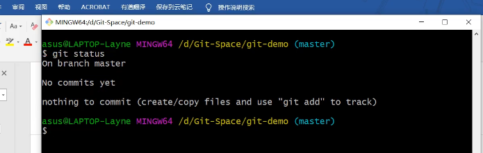
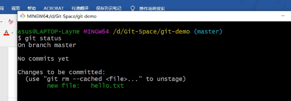
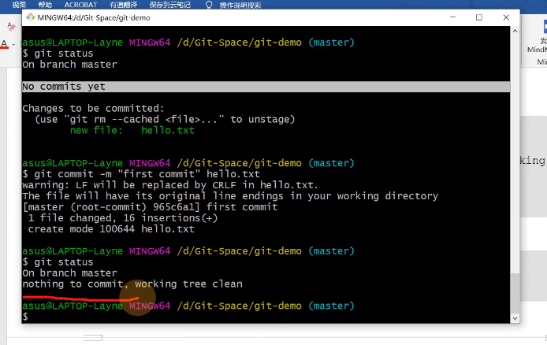
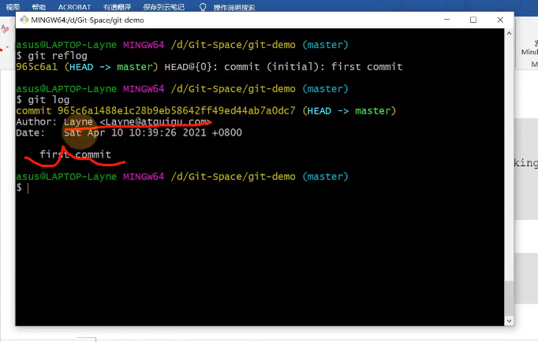
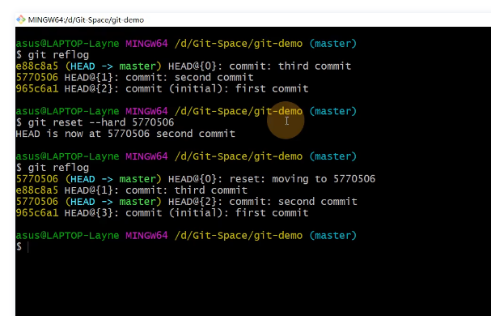
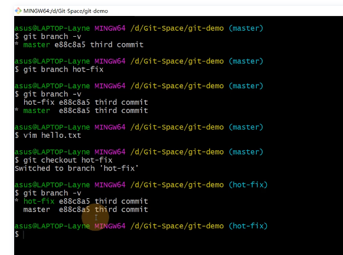
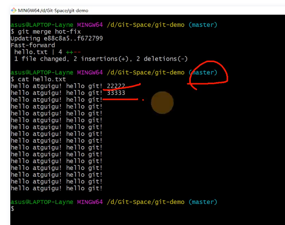
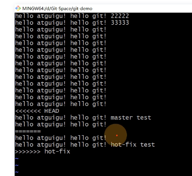
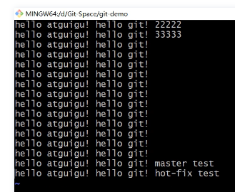
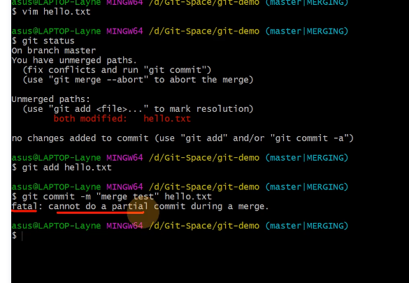

# Git学习摘要

## 1.快捷键

### 1.1 git快捷键

```git
git config -global -l(list) 查看签名
rm .git/index  清空暂存区

```

### 1.2 linux快捷键

```linux
ll 列出所有文件信息，包括隐藏文件
ls 只列出文件名或目录名
ctrl + L 或 clear 清屏
esc:wq 或 ZZ（大写/shift + zz）保存退出
cat 文件名  查看文件内容
Ctrl - Insert  复制　或　　用鼠标选中即是复制；
Shift - Insert  粘贴　或　　单击鼠标滚轮即为粘贴； 
```

### 1.3 vim快捷键

```vim
vim 直接启动vim
vim filename  打开vim并创建名为filename的文件
i 在当前位置插入
esc 退出插入模式
yy 复制
p 粘贴
```


## 2.初始提交

```git
//命令名称
git config --global user.name 用户名
git config --global user.email 邮箱
git init
git status
git add
git commit -m
git reflog
git rest --hard
```


### 2.1 初始化本地库

```git
git init
```


### 2.2 查看本地库状态

```git
git status
```




### 2.3 添加暂存区

```git
git add <path>: Stage a specific directory or file
git add .: Stage all files (that are not listed in the .gitignore) in the entire repository
暂存区文件可删除
git rm --cached hello.txt
```




### 2.4 提交本地库

```git
git commit -m "版本信息" filename
```




### 2.5 版本穿梭

```git
git reflog 刷新版本日志
git log 查看详细版本日志
```



```git
git reset --hard 版本号 回到此版本 （指针控制）
```




## 3.分支

```git
git branch 分支名  创建分支
git branch -v 查看分支
git checkout 切换分支
git merge 分支名  把指定分支合并到当前分支上
```




正常合并（无冲突）：



合并冲突：





合并完后注意重新添加提交，冲突合并手动解决后提交时不能添加文件名




