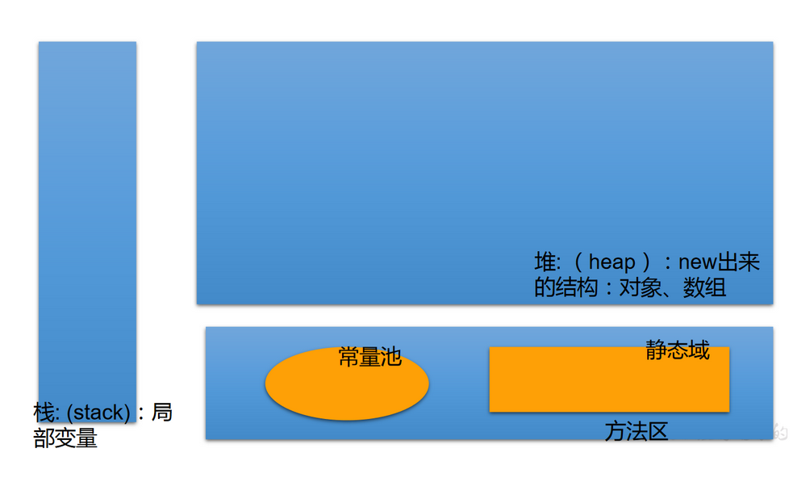
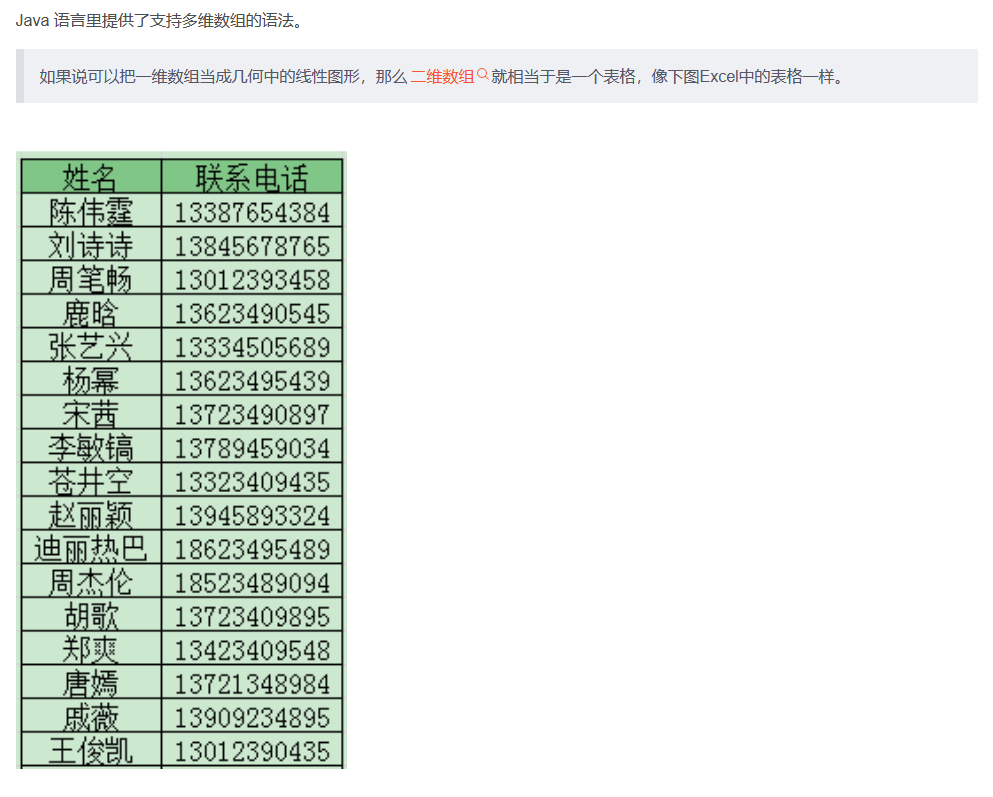
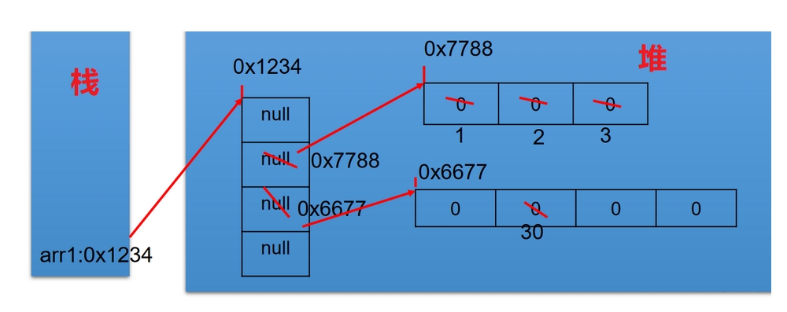

# Java Study Notes

## 01.Array

### 1.1 概述

```java
/*
 * 一、数组的概述
 * 1.数组的理解：数组(Array)，是多个相同类型数据按一定顺序排列的集合，
 * 并使用一个名字命名，并通过编号的方式对这些数据进行统一管理。
 * 
 * 2.数组的相关概念：
 * >数组名
 * >元素
 * >角标、下标、索引
 * >数组的长度：元素的个数
 * 
 * 3.数组的特点：
 * 1)数组属于引用类型的变量。数组的元素，既可以是基本数据类型，也可以是引用数据类型。
 * 2)创建数组对象会在内存中开辟一整块连续的空间；
 * 3)数组的长度一旦确定，就不能修改;
 * 4)数组是有序排列的。
 * 
 * 4.数组的分类：
 * 	① 按照维数：一维数组、二维数组、三维数组……
 *  ② 按照数组元素类型：基本数据类型元素的数组、引用类型元素的数组
 *  
 */

```

### 1.2 一维数组/one dimension array

```java
/*
 * 	① 一维数组的声明和初始化
 *  ② 如何调用数组的指定位置的元素
 *  ③ 如何获取数组的长度
 *  ④ 如何遍历数组
 *  ⑤ 数组元素的默认初始化值：见ArrayTest1.java
 *  ⑥ 数组的内存解析：见ArrayTest1.java
 */

```

#### 1.2.1 案例

```java
public class ArrayTest {
	public static void main(String[] args) {
		
		//1. 一维数组的声明和初始化
		int num;	//声明
		num = 10;	//初始化
		int id = 1001;	//声明 + 初始化
		
		int[] ids;	//声明
		//1.1静态初始化:数组的初始化和数组元素的赋值操作同时进行
		ids = new int[]{1001,1002,1003,1004};	
		//1.2动态初始化:数组的初始化和数组元素的赋值操作分开进行
		String[] names = new String[5]; 
		
		//错误的写法：
//		int[] arr1 = new int[];	//未赋值、未指明长度
//		int[5] arr2 = new int[5];
//		int[] arr3 = new int[3]{1,2,3};
		
		//也是正确的写法：
		int[] arr7 = {1,2,3,5,4};//类型推断
		
		/*总结：数组一旦初始化完成，其长度就确定了。
		*/
		
		//2.如何调用数组的指定位置的元素：通过角标的方式调用。
		//数组的角标(或索引)从0开始的，到数组的长度-1结束
		names[0] = "张郃";
		names[1] = "王陵";
		names[2] = "张学良";
		names[3] = "王传志";	//charAt(0)获取王
		names[4] = "李峰";
//		names[5] = "周礼";	//如果数组超过角标会通过编译，运行失败。
		
		//3.如何获取数组的长度
		//属性：length
		System.out.println(names.length);	//5
		System.out.println(ids.length);	//4
		
		//4.如何遍历数组
//		System.out.println(names[0]);
//		System.out.println(names[1]);
//		System.out.println(names[2]);
//		System.out.println(names[3]);
//		System.out.println(names[4]);
		
		for(int i = 0;i < names.length;i++){
			System.out.println(names[i]);
		}
		
	}
}

/*
 * ⑤ 数组元素的默认初始化值
 * 		> 数组元素是整形：0
 * 		> 数组元素是浮点型：0.0
 * 		> 数组元素是char型：0或'\u0000'，而非'0'
 * 		> 数组元素是boolean型:false
 * 
 * 		> 数组元素是引用数据类型：null，不是"null"
 */
public class ArrayTest1 {
	public static void main(String[] args) {
		//5.数组元素的默认初始化值
		int[] arr = new int[4];
		for(int i = 0;i < arr.length;i++){
			System.out.println(arr[i]);
		}
		System.out.println("*****************");
		
		short[] arr1 = new short[4];
		for(int i = 0;i < arr1.length;i++){
			System.out.println(arr1[i]);
		}
		System.out.println("*****************");
		
		float[] arr2 = new float[5]; 
		for(int i = 0;i < arr2.length;i++){
			System.out.println(arr2[i]);
		}
		System.out.println("*****************");
		
		char[] arr3 = new char[5]; 
		for(int i = 0;i < arr3.length;i++){
			System.out.println("----" + arr3[i] + "****");
		}
		
		if(arr3[0] == 0){
			System.out.println("你好！");
		}
		System.out.println("*****************");
		
		boolean[] arr4 = new boolean[5];
		System.out.println(arr4[0]);
		
		System.out.println("*****************");
		String[] arr5 = new String[5];
		System.out.println(arr5[0]);
		//验证
		if(arr5[0] == null){
			System.out.println("北京天气好差！");
		}
		
	}
}

```

#### 1.2.2 内存解析



- 栈纵向排列，类似一维，堆上下左右都能存放
- 方法区里有**常量池**和**静态域**

#### 1.2.3 一维数组内存解析

```java
int[] arr = new int[]{1,2,3};//放在main方法中的都是局部变量，arr在stack中，所创造的变量在heap中有一个十六进制数的首地址值，地址值会赋给arr
String[] arr1 = new String[4];//开创一个连续的变量
arr1[1] = “刘德华”;
arr1[2] = “张学友”;
arr1 = new String[3];//之前的指针关系就没有了
System.out.println(arr1[1]);//null

```


#### 1.2.3 练习

```java
/*
 * 升景坊单间短期出租4个月，550元/月（水电煤公摊，网费35元/月），空调、卫生间、厨房齐全。
 * 屋内均是IT行业人士，喜欢安静。所以要求来租者最好是同行或者刚毕业的年轻人，爱干净、安静。
 * eclipse代码一键格式规范化：Ctrl+Shift+F
 */
public class ArrayDemo {
	public static void main(String[] args) {
		int[] arr = new int[] { 8, 2, 1, 0, 3 };
		int[] index = new int[] { 2, 0, 3, 2, 4, 0, 1, 3, 2, 3, 3 };
		String tel = "";
		for (int i = 0; i < index.length; i++) {
			tel += arr[index[i]];
		}
		System.out.println("联系方式：" + tel);//18013820100
	}
}

/*
 * 2. 从键盘读入学生成绩，找出最高分，并输出学生成绩等级。
 * 成绩>=最高分-10    等级为’A’   
 * 成绩>=最高分-20    等级为’B’
 * 成绩>=最高分-30    等级为’C’   
 * 其余等级为’D’
 * 提示：先读入学生人数，根据人数创建int数组，存放学生成绩。
 */
import java.util.Scanner;
public class ArrayDemo2 {
	public static void main(String[] args) {
		//1.使用Scanner，读取学生的个数
		Scanner scan = new Scanner(System.in);
		System.out.print("请输入学生人数：");
		int num = scan.nextInt();
		
		//2.创建数组，存储学生成绩，动态初始化
		int[] str = new int[num];
		System.out.println("请输入" + num + "个学生成绩");
				
		//3.给数组中的元素赋值
		int maxnum = 0;
		for(int i = 0;i < str.length;i++){
			str[i] = scan.nextInt();
			//4.获取数组元素中的最大值：最高分
			if(maxnum < str[i]){
				maxnum = str[i];
			}
		}
		
		//5.根据每个学生成绩与最高分的差值，得到每个学生的等级，并输出等级和成绩	
		char Grade;	//成绩等级
		for(int i = 0;i < str.length;i++){
			if(maxnum - str[i] <= 10){
				Grade = 'A';
			}else if(maxnum - str[i] <= 20){
				Grade = 'B';
			}else if(maxnum - str[i] <= 30){
				Grade = 'C';
			}else{
				Grade = 'D';
			}
			
			System.out.println("student " + i + "score is" + str[i] + 
					" grade is " + Grade);
		}
	}
}


```

### 1.3多维数组




#### 1.3.1 二维数组/two dimension array

```java
/*
 * 二维数组的使用
 * 
 * 1.理解
 * 对于二维数组的理解，我们可以看成是一维数组array1又作为另一个一维数组array2的元素而存在。
 * 其实，从数组底层的运行机制来看，其实没有多维数组。
 * 
 * 2.二维数组的使用：
 * 	① 二维数组的初始化
 *  ② 如何调用数组的指定位置的元素
 *  ③ 如何获取数组的长度
 *  ④ 如何遍历数组
 *  ⑤ 数组元素的默认初始化值:见ArrayTest3.java
 *  ⑥ 数组的内存解析:见ArrayTest3.java
 * 
 */
public class ArrayTest2 {
	public static void main(String[] args) {
		//1.二维数组的声明和初始化
		int[] arr = new int[]{1,2,3};
		//静态初始化
		int[][] arr1 = new int[][]{{1,2,3},{4,5},{6, 7,8}};
		//动态初始化1
		String[][] arr2 = new String[3][2];
		//动态初始化2
		String[][] arr3 = new String[3][];
		
		//错误的情况
//		String[][] arr4 = new String[][];
//		String[][] arr5 = new String[][4];
//		String[][] arr6 = new String[4][3]{{1,2,3},{4,5,6},{7,8,9}};
		
		//正确的情况：
		int arr4[][] = new int[][]{{1,2,3},{4,5,12,6},{7,8,9}};
		int[] arr5[] = new int[][]{{1,2,3},{4,5,6},{7,8,9}};
		int[][] arr6 = {{1,2,3},{4,5,6},{7,8,9}};	
        int[] arr7 = {1,2,3,4,5} //类型推断
		
		//2.如何调用数组的指定位置的元素
		System.out.println(arr1[0][1]);	//2
		System.out.println(arr2[1][1]);	//null
        System.out.println(arr2[1]);//地址值
		
		arr3[1] = new String[4];	//定义arr3的[1]为长度为4的字符数组
		System.out.println(arr3[1][0]);	//没有上句，会报错
		
		//3.获取数组的长度
		System.out.println(arr4.length);	//3
		System.out.println(arr4[0].length);	//3
		System.out.println(arr4[1].length);	//4
		
		//4.如何遍历二维数组
		for(int i = 0;i < arr4.length;i++){
			for(int j = 0;j < arr4[i].length;j++){
				System.out.print(arr4[i][j] + " ");
			}
			System.out.println();
		}
	}
}

/*
 * 二维数组的使用：
 * 	规定：二维数组分为外层数组的元素，内层数组的元素
 * 	int[][] arr = new int[4][3]; 
 *  外层元素:arr[0],arr[1]等
 *  内层元素:arr[0][0],arr[1][2]等
 *  
 * 	⑤ 数组元素的默认初始化值
 * 	针对于初始化方式一：比如：int[][] arr = new int[4][3];
 * 		外层元素的初始化值为：地址值
 * 		内层元素的初始化值为：与一维数组初始化情况相同
 * 	
 * 针对于初始化方式而：比如：int[][] arr = new int[4][];
 * 		外层元素的初始化值为：null
 * 		内层元素的初始化值为：不能调用，否则报错。
 * 
 * 	⑥ 数组的内存解析
 */
public class ArrayTest3 {
	public static void main(String[] args) {
		
		int[][] arr = new int[4][3];
		System.out.println(arr[0]);	//[I@15db9742
		System.out.println(arr[0][0]);	//0
		
//		System.out.println(arr);	//ArrayTest3.java
		
		System.out.println("***********************");
		float[][] arr1 = new float[4][3];
		System.out.println(arr1[0]);	//地址值
		System.out.println(arr1[0][0]);	//0.0
		
		System.out.println("***********************");
		
		String[][] arr2 = new String[4][2];
		System.out.println(arr2[1]);	//地址值
		System.out.println(arr2[1][1]);	//null
		
		System.out.println("*********************");
		double[][] arr3 = new double[4][];//没有初始化外层元素，因为内层是引用型，所以默认为null
		System.out.println(arr3[1]);	//null
//		System.out.println(arr3[1][0]);	//报错
	}
}

```

#### 1.3.2 二位数组的内存解析

```java
int[][] arr1 = new int[4][];
arr1[1] = new int[]{1,2,3};
arr1[2] = new int[4];
arr1[2][1] = 30;

```




```java
int[] arr1 = new int[4];
int[] arr2 = new int[]{1,2,3}

int[][] arr3 = new int[2][2];
int[][] arr4 = new int[][]{{1,2,3},{4,5}}

for(int i=0; i<arr.length; i++){
    for(int j=0; j<arr[i].length; j++){
        System.out.print(arr[i][j] + "\t")
    }
    System.out.println();
}
```

