# Java Study Notes

## Collection

### 01、Java 集合框架概述

#### 1.1 集合框架与数组的对比及概述

```java
/**
 * 一、集合的框架
 *
 * 1.集合、数组都是对多个数据进行存储操作的结构，简称Java容器。
 *   说明；此时的存储，主要是指能存层面的存储，不涉及到持久化的存储（.txt,.jpg,.avi,数据库中）
 *
 * 2.1数组在存储多个数据封面的特点：
 *      》一旦初始化以后，它的长度就确定了。
 *      》数组一旦定义好，它的数据类型也就确定了。我们就只能操作指定类型的数据了。
 *      比如：String[] arr;int[] str;
 * 2.2数组在存储多个数据方面的缺点：
 *      》一旦初始化以后，其长度就不可修改。
 *      》数组中提供的方法非常有限，对于添加、删除、插入数据等操作，非常不便，同时效率不高。
 *      》获取数组中“实际”元素的个数的需求，数组没有现成的属性或方法可用
 *      》数组存储数据的特点：有序、可重复。对于无序、不可重复的需求，不能满足。
 *
 */

```

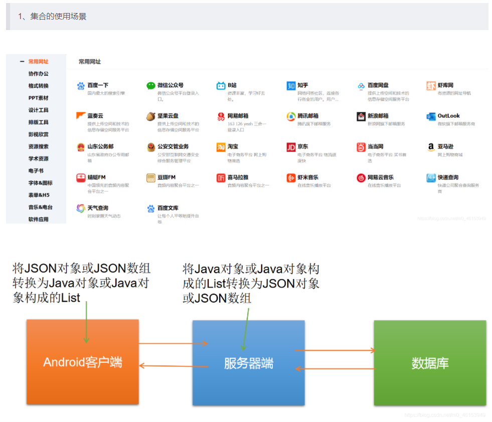


#### 1.2 集合框架涉及到的API

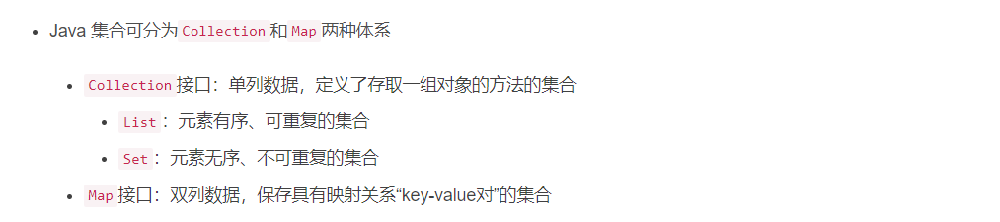

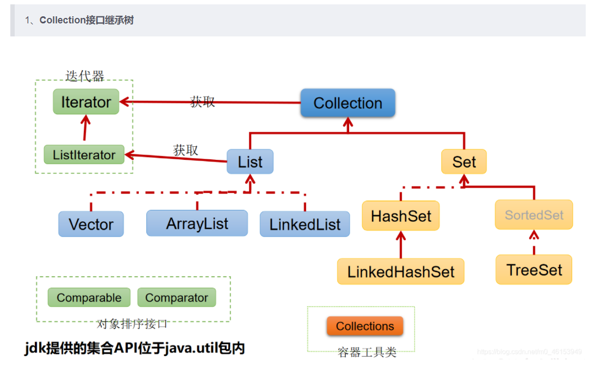

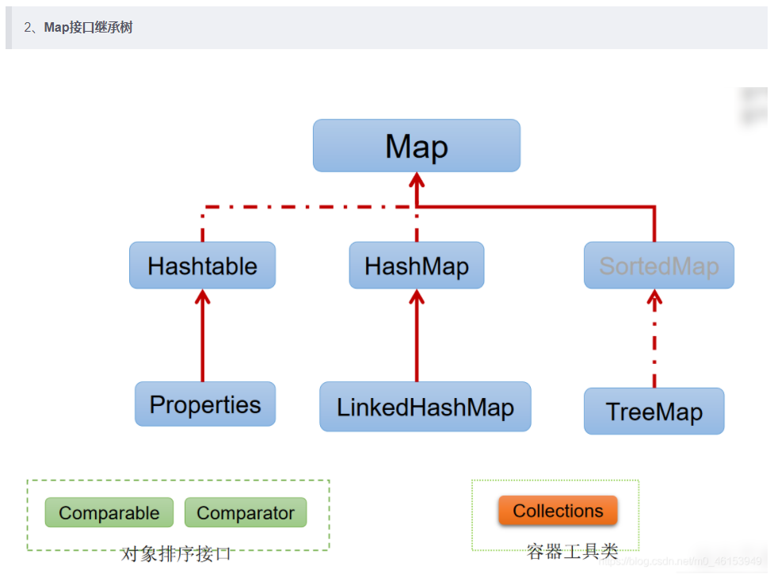

```java
/**
 *
 * 二、集合框架
 *      &---Collection接口：单列集合，用来存储一个一个的对象
 *          &---List接口：存储有序的、可重复的数据。  -->“动态”数组
 *              &---ArrayList、LinkedList、Vector
 *
 *          &---Set接口：存储无序的、不可重复的数据   -->高中讲的“集合”
 *              &---HashSet、LinkedHashSet、TreeSet
 *
 *      &---Map接口：双列集合，用来存储一对(key - value)一对的数据   -->高中函数：y = f(x)
 *          &---HashMap、LinkedHashMap、TreeMap、Hashtable、Properties
 *
 */

```


### 02、Collection接口方法

- Collection 接口是List、Set 和Queue 接口的父接口，该接口里定义的方法既可用于操作Set 集合，也可用于操作List 和Queue 集合。
- JDK不提供此接口的任何直接实现，而是提供更具体的子接口(如：Set和List)实现。
- 在Java5 之前，Java 集合会丢失容器中所有对象的数据类型，把所有对象都当成Object 类型处理；从JDK 5.0 增加了泛型以后，Java 集合可以记住容器中对象的数据类型

#### 2.2 Collection接口中的常用方法1

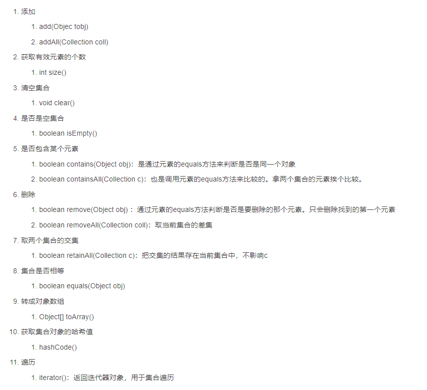

```java
import org.junit.Test;
import java.util.ArrayList;
import java.util.Collection;
import java.util.Date;

/**
 *
 * 三、Collection接口中的方法的使用
 *
 */
public class CollectionTest {

    @Test
    public void test1(){
        Collection coll = new ArrayList();

        //add(Object e):将元素e添加到集合coll中
        coll.add("AA");
        coll.add("BB");
        coll.add(123);  //自动装箱
        coll.add(new Date());

        //size():获取添加的元素的个数
        System.out.println(coll.size());    //4

        //addAll(Collection coll1):将coll1集合中的元素添加到当前的集合中
        Collection coll1 = new ArrayList();
        coll1.add(456);
        coll1.add("CC");
        coll.addAll(coll1);

        System.out.println(coll.size());    //6
        System.out.println(coll);

        //clear():清空集合元素
        coll.clear();

        //isEmpty():判断当前集合是否为空
        System.out.println(coll.isEmpty());
    }
}

```

#### 2.3 Collection接口中的常用方法2

```java
import java.util.Objects;

public class Person {

    private String name;
    private int age;

    public Person() {
        super();
    }

    public Person(String name, int age) {
        this.name = name;
        this.age = age;
    }

    public String getName() {
        return name;
    }

    public void setName(String name) {
        this.name = name;
    }

    public int getAge() {
        return age;
    }

    public void setAge(int age) {
        this.age = age;
    }

    @Override
    public String toString() {
        return "Person{" +
                "name='" + name + '\'' +
                ", age=" + age +
                '}';
    }

    @Override
    public boolean equals(Object o) {
        System.out.println("Person equals()....");
        if (this == o) return true;
        if (o == null || getClass() != o.getClass()) return false;
        Person person = (Person) o;
        return age == person.age &&
                Objects.equals(name, person.name);
    }

    @Override
    public int hashCode() {

        return Objects.hash(name, age);
    }
}


import org.junit.Test;

import java.util.ArrayList;
import java.util.Arrays;
import java.util.Collection;

/**
 * Collection接口中声明的方法的测试
 *
 * 结论：
 * 向Collection接口的实现类的对象中添加数据obj时，要求obj所在类要重写equals().
 */
public class CollectinoTest {

    @Test
    public void test(){
        Collection coll = new ArrayList();
        coll.add(123);
        coll.add(456);

//        Person p = new Person("Jerry",20);
//        coll.add(p);
        coll.add(new Person("Jerry",20));

        coll.add(new String("Tom"));
        coll.add(false);

        //1.contains(Object obj):判断当前集合中是否包含obj
        //我们在判断时会调用obj对象所在类的equals()。
        boolean contains = coll.contains(123);
        System.out.println(contains);
        System.out.println(coll.contains(new String("Tam")));
//        System.out.println(coll.contains(p));//true
        System.out.println(coll.contains(new Person("Jerry",20)));//false -->true

        //2.containsAll(Collection coll1):判断形参coll1中的所有元素是否都存在于当前集合中。
        Collection coll1 = Arrays.asList(123,4567);
        System.out.println(coll.containsAll(coll1));
    }

}

```

#### 2.4 Collection接口中的常用方法3

```java
import org.junit.Test;

import java.util.ArrayList;
import java.util.Arrays;
import java.util.Collection;

/**
 * Collection接口中声明的方法的测试
 *
 * 结论：
 * 向Collection接口的实现类的对象中添加数据obj时，要求obj所在类要重写equals().
 *
 */
public class CollectinoTest {

    @Test
    public void test2(){
        //3.remove(Object obj):从当前集合中移除obj元素。
        Collection coll = new ArrayList();
        coll.add(123);
        coll.add(456);
        coll.add(new Person("Jerry",20));
        coll.add(new String("Tom"));
        coll.add(false);

        coll.remove(1234);
        System.out.println(coll);

        coll.remove(new Person("Jerry",20));
        System.out.println(coll);

        //4. removeAll(Collection coll1):差集：从当前集合中移除coll1中所有的元素。
        Collection coll1 = Arrays.asList(123,456);
        coll.removeAll(coll1);
        System.out.println(coll);
    }

    @Test
    public void test3(){
        Collection coll = new ArrayList();
        coll.add(123);
        coll.add(456);
        coll.add(new Person("Jerry",20));
        coll.add(new String("Tom"));
        coll.add(false);

        //5.retainAll(Collection coll1):交集：获取当前集合和coll1集合的交集，并返回给当前集合
//        Collection coll1 = Arrays.asList(123,456,789);
//        coll.retainAll(coll1);
//        System.out.println(coll);

        //6.equals(Object obj):要想返回true，需要当前集合和形参集合的元素都相同。
        Collection coll1 = new ArrayList();
        coll1.add(456);
        coll1.add(123);
        coll1.add(new Person("Jerry",20));
        coll1.add(new String("Tom"));
        coll1.add(false);

        System.out.println(coll.equals(coll1));
    }

}

```

#### 2.5 Collection接口中的常用方法4

```java
import org.junit.Test;

import java.util.ArrayList;
import java.util.Arrays;
import java.util.Collection;
import java.util.List;

/**
 * Collection接口中声明的方法的测试
 *
 * 结论：
 * 向Collection接口的实现类的对象中添加数据obj时，要求obj所在类要重写equals().
 * 集合不能存基本数据类型
 */
public class CollectinoTest {

    @Test
    public void test4(){
        Collection coll = new ArrayList();
        coll.add(123);
        coll.add(456);
        coll.add(new Person("Jerry",20));
        coll.add(new String("Tom"));
        coll.add(false);

        //7.hashCode():返回当前对象的哈希值
        System.out.println(coll.hashCode());

        //8.集合 --->数组：toArray()
        Object[] arr = coll.toArray();
        for(int i = 0;i < arr.length;i++){
            System.out.println(arr[i]);
        }

        //拓展：数组 --->集合:调用Arrays类的静态方法asList()
        List<String> list = Arrays.asList(new String[]{"AA", "BB", "CC"});
        System.out.println(list);

        List arr1 = Arrays.asList(123, 456);
        System.out.println(arr1);//[123, 456]

        List arr2 = Arrays.asList(new int[]{123, 456});
        System.out.println(arr2.size());//1

        List arr3 = Arrays.asList(new Integer[]{123, 456});
        System.out.println(arr3.size());//2

        //9.iterator():返回Iterator接口的实例，用于遍历集合元素。放在IteratorTest.java中测试
    }
}

```


### 03、Iterator迭代器接口

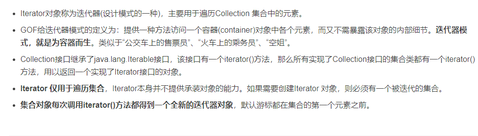

#### 3.1 使用Iterator遍历Collection

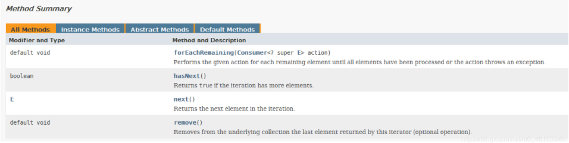

```java
import org.junit.Test;

import java.util.ArrayList;
import java.util.Collection;
import java.util.Iterator;

/**
 * 集合元素的遍历操作，使用迭代器Iterator接口
 * 内部的方法：hasNext()和 next()
 *
 */
public class IteratorTest {

    @Test
    public void test(){
        Collection coll = new ArrayList();
        coll.add(123);
        coll.add(456);
        coll.add(new Person("Jerry",20));
        coll.add(new String("Tom"));
        coll.add(false);

        Iterator iterator = coll.iterator();

        //方式一：
//        System.out.println(iterator.next());
//        System.out.println(iterator.next());
//        System.out.println(iterator.next());
//        System.out.println(iterator.next());
//        System.out.println(iterator.next());
//        //报异常：NoSuchElementException
//        //因为：在调用it.next()方法之前必须要调用it.hasNext()进行检测。若不调用，且下一条记录无效，直接调用it.next()会抛出NoSuchElementException异常。
//        System.out.println(iterator.next());

        //方式二：不推荐
//        for(int i = 0;i < coll.size();i++){
//            System.out.println(iterator.next());
//        }

        //方式三：推荐
        while(iterator.hasNext()){
            System.out.println(iterator.next());
        }
    }
}

```


#### 3.2 迭代器Iterator的执行原理

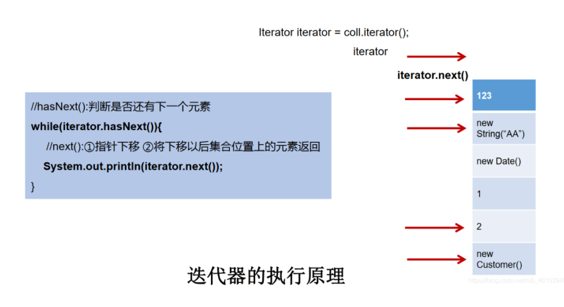


#### 3.3 Iterator遍历集合的两种错误写法

```java
import org.junit.Test;

import java.util.ArrayList;
import java.util.Collection;
import java.util.Iterator;

/**
 * 集合元素的遍历操作，使用迭代器Iterator接口
 * 1.内部的方法：hasNext()和 next()
 * 2.集合对象每次调用iterator()方法都得到一个全新的迭代器对象，默认游标都在集合的第一个元素之前。
 */
public class IteratorTest {

    @Test
    public void test2(){
        Collection coll = new ArrayList();
        coll.add(123);
        coll.add(456);
        coll.add(new Person("Jerry",20));
        coll.add(new String("Tom"));
        coll.add(false);

        //错误方式一：
//        Iterator iterator = coll.iterator();
//        while(iterator.next() != null){
//            System.out.println(iterator.next());
//        }

        //错误方式二：
        //集合对象每次调用iterator()方法都得到一个全新的迭代器对象，默认游标都在集合的第一个元素之前。
        while(coll.iterator().hasNext()){
            System.out.println(coll.iterator().next());
        }
    }
}

```


#### 3.4 Iterator迭代器remove()的使用

```java
import org.junit.Test;

import java.util.ArrayList;
import java.util.Collection;
import java.util.Iterator;

/**
 * 集合元素的遍历操作，使用迭代器Iterator接口
 * 1.内部的方法：hasNext()和 next()
 * 2.集合对象每次调用iterator()方法都得到一个全新的迭代器对象，默认游标都在集合的第一个元素之前。
 * 3.内部定义了remove(),可以在遍历的时候，删除集合中的元素。此方法不同于集合直接调用remove()
 */
public class IteratorTest {

    //测试Iterator中的remove()方法
    @Test
    public void test3(){
        Collection coll = new ArrayList();
        coll.add(123);
        coll.add(456);
        coll.add(new Person("Jerry",20));
        coll.add(new String("Tom"));
        coll.add(false);

        //删除集合中”Tom”
        //如果还未调用next()或在上一次调用 next 方法之后已经调用了 remove 方法，
        // 再调用remove都会报IllegalStateException。
        Iterator iterator = coll.iterator();
        while(iterator.hasNext()){
//            iterator.remove();//此时指针还没下移
            Object obj = iterator.next();
            if("Tom".equals(obj)){
                iterator.remove();
//                iterator.remove();                
            }
        }

        //遍历集合
        iterator = coll.iterator();
        while(iterator.hasNext()){
            System.out.println(iterator.next());
        }

    }
}

```

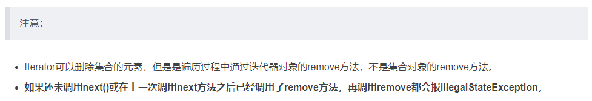


#### 3.5 新特性for-each循环遍历集合或数组

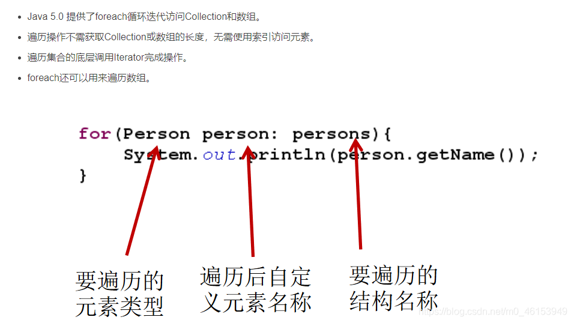

```java
import org.junit.Test;

import java.util.ArrayList;
import java.util.Collection;

/**
 * jdk 5.0 新增了foreach循环，用于遍历集合、数组
 *
 */
public class ForTest {

    @Test
    public void test(){
        Collection coll = new ArrayList();
        coll.add(123);
        coll.add(456);
        coll.add(new Person("Jerry",20));
        coll.add(new String("Tom"));
        coll.add(false);

        //for(集合元素的类型 局部变量 : 集合对象),内部仍然调用了迭代器。
        for(Object obj : coll){
            System.out.println(obj);
        }
    }

    @Test
    public void test2(){
        int[] arr = new int[]{1,2,3,4,5,6};
        //for(数组元素的类型 局部变量 : 数组对象)
        for(int i : arr){
            System.out.println(i);
        }
    }

    //练习题
    @Test
    public void test3(){
        String[] arr = new String[]{"SS","KK","RR"};

//        //方式一：普通for赋值
//        for(int i = 0;i < arr.length;i++){
//            arr[i] = "HH";
//        }

        //方式二：增强for循环
        for(String s : arr){//这里还是会输出原值，s相当于新的对象
            s = "HH";
        }

        for(int i = 0;i < arr.length;i++){
            System.out.println(arr[i]);
        }
    }
}

```


### 04、Collection子接口之一：List接口

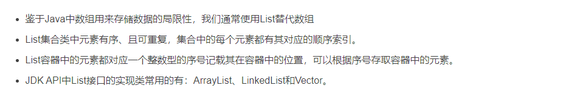


#### 4.1 List接口常用实现类的对比

```java
/**
 * 1. List接口框架
 *
 *    |----Collection接口：单列集合，用来存储一个一个的对象
 *          |----List接口：存储有序的、可重复的数据。  -->“动态”数组,替换原有的数组
 *              |----ArrayList：作为List接口的主要实现类；线程不安全的，效率高；底层使用Object[] elementData存储
 *              |----LinkedList：对于频繁的插入、删除操作，使用此类效率比ArrayList高；底层使用双向链表存储
 *              |----Vector：作为List接口的古老实现类；线程安全的，效率低；底层使用Object[] elementData存储
 *
 *
 * 面试题：比较ArrayList、LinkedList、Vector三者的异同？
 *        同：三个类都是实现了List接口，存储数据的特点相同：存储有序的、可重复的数据
 *        不同：见上
 *
 */

```


#### 4.2 ArrayList的源码分析

- ArrayList是List 接口的典型实现类、主要实现类
- 本质上，ArrayList是对象引用的一个”变长”数组

```java
/** 
 * 2.ArrayList的源码分析：
 *   2.1 jdk 7情况下
 *      ArrayList list = new ArrayList();//底层创建了长度是10的Object[]数组elementData
 *      list.add(123);//elementData[0] = new Integer(123);
 *      ...
 *      list.add(11);//如果此次的添加导致底层elementData数组容量不够，则扩容。
 *      默认情况下，扩容为原来的容量的1.5倍，同时需要将原有数组中的数据复制到新的数组中。
 *
 *      结论：建议开发中使用带参的构造器：ArrayList list = new ArrayList(int capacity)
 *
 *   2.2 jdk 8中ArrayList的变化：
 *      ArrayList list = new ArrayList();//底层Object[] elementData初始化为{}.并没有创建长度为10的数组
 *
 *      list.add(123);//第一次调用add()时，底层才创建了长度10的数组，并将数据123添加到elementData[0]
 *      ...
 *      后续的添加和扩容操作与jdk 7 无异。
 *   2.3 小结：jdk7中的ArrayList的对象的创建类似于单例的饿汉式，而jdk8中的ArrayList的对象
 *            的创建类似于单例的懒汉式，延迟了数组的创建，节省内存。
 * 
 */

```


#### 4.3 LinkedList的源码分析

- 对于频繁的插入或删除元素的操作，建议使用LinkedList类，效率较高
- LinkedList：双向链表，内部没有声明数组，而是定义了Node类型的first和last，用于记录首末元素。同时，定义内部类Node，作为LinkedList中保存数据的基本结构。

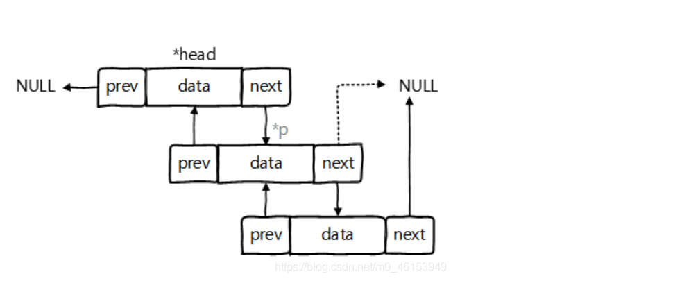

```java
/**
  * 3.LinkedList的源码分析：
  *       LinkedList list = new LinkedList(); 内部声明了Node类型的first和last属性，默认值为null
  *       list.add(123);//将123封装到Node中，创建了Node对象。
  *
  *       其中，Node定义为：体现了LinkedList的双向链表的说法
  *       private static class Node<E> {
  *            E item;
  *            Node<E> next;
  *            Node<E> prev;
  *
  *            Node(Node<E> prev, E element, Node<E> next) {
  *            this.item = element;
  *            this.next = next;     //next变量记录下一个元素的位置
  *            this.prev = prev;     //prev变量记录前一个元素的位置
  *            }
  *        }
  */

```


#### 4.4 Vector的源码分析

- Vector 是一个古老的集合，JDK1.0就有了。大多数操作与ArrayList相同，区别之处在于Vector是线程安全的。
- 在各种list中，最好把ArrayList作为缺省选择。当插入、删除频繁时，使用LinkedList；Vector总是比ArrayList慢，所以尽量避免使用。

```java
/** 
  * 4.Vector的源码分析：jdk7和jdk8中通过Vector()构造器创建对象时，底层都创建了长度为10的数组。
  *      在扩容方面，默认扩容为原来的数组长度的2倍。
  */ 

```


#### 4.5 List接口中的常用方法测试

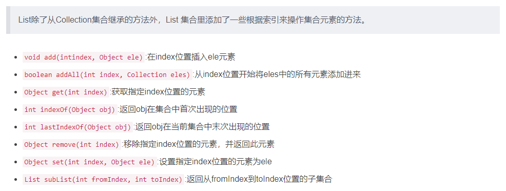

```java
import org.junit.Test;
import java.util.ArrayList;
import java.util.Arrays;
import java.util.Iterator;
import java.util.List;

/**
 *
 * 5.List接口的常用方法
 */
public class ListTest {
    /**
     *
     * void add(int index, Object ele):在index位置插入ele元素
     * boolean addAll(int index, Collection eles):从index位置开始将eles中的所有元素添加进来
     * Object get(int index):获取指定index位置的元素
     * int indexOf(Object obj):返回obj在集合中首次出现的位置
     * int lastIndexOf(Object obj):返回obj在当前集合中末次出现的位置
     * Object remove(int index):移除指定index位置的元素，并返回此元素
     * Object set(int index, Object ele):设置指定index位置的元素为ele
     * List subList(int fromIndex, int toIndex):返回从fromIndex到toIndex位置的子集合
     *
     * 总结：常用方法
     * 增：add(Object obj)
     * 删：remove(int index) / remove(Object obj)
     * 改：set(int index, Object ele)
     * 查：get(int index)
     * 插：add(int index, Object ele)
     * 长度：size()
     * 遍历：① Iterator迭代器方式
     *      ② 增强for循环
     *      ③ 普通的循环
     *
     */

    @Test
    public void test3(){
        ArrayList list = new ArrayList();
        list.add(123);
        list.add(456);
        list.add("AA");

        //方式一：Iterator迭代器方式
        Iterator iterator = list.iterator();
        while(iterator.hasNext()){
            System.out.println(iterator.next());
        }

        System.out.println("***************");

        //方式二：增强for循环
        for(Object obj : list){
            System.out.println(obj);
        }

        System.out.println("***************");

        //方式三：普通for循环
        for(int i = 0;i < list.size();i++){
            System.out.println(list.get(i));
        }
    }

    @Test
    public void tets2(){
        ArrayList list = new ArrayList();
        list.add(123);
        list.add(456);
        list.add("AA");
        list.add(new Person("Tom",12));
        list.add(456);
        //int indexOf(Object obj):返回obj在集合中首次出现的位置。如果不存在，返回-1.
        int index = list.indexOf(4567);
        System.out.println(index);

        //int lastIndexOf(Object obj):返回obj在当前集合中末次出现的位置。如果不存在，返回-1.
        System.out.println(list.lastIndexOf(456));

        //Object remove(int index):移除指定index位置的元素，并返回此元素
        Object obj = list.remove(0);
        System.out.println(obj);
        System.out.println(list);

        //Object set(int index, Object ele):设置指定index位置的元素为ele
        list.set(1,"CC");
        System.out.println(list);

        //List subList(int fromIndex, int toIndex):返回从fromIndex到toIndex位置的左闭右开区间的子集合
        List subList = list.subList(2, 4);
        System.out.println(subList);
        System.out.println(list);
    }

    @Test
    public void test(){
        ArrayList list = new ArrayList();
        list.add(123);
        list.add(456);
        list.add("AA");
        list.add(new Person("Tom",12));
        list.add(456);

        System.out.println(list);

        //void add(int index, Object ele):在index位置插入ele元素
        list.add(1,"BB");
        System.out.println(list);

        //boolean addAll(int index, Collection eles):从index位置开始将eles中的所有元素添加进来
        List list1 = Arrays.asList(1, 2, 3);
        list.addAll(list1);
//        list.add(list1);//这会把list1当成一个元素插入
        System.out.println(list.size());//9

        //Object get(int index):获取指定index位置的元素
        System.out.println(list.get(2));

    }
}

```


#### 4.6 List的一个面试小题

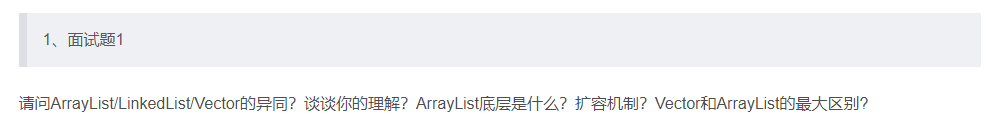

```java
import org.junit.Test;

import java.util.ArrayList;
import java.util.List;

public class ListEver {
    /**
     * 区分List中remove(int index)和remove(Object obj)
     */

    @Test
    public void testListRemove() {
        List list = new ArrayList();
        list.add(1);
        list.add(2);
        list.add(3);
        updateList(list);
        System.out.println(list);//
    }

    private void updateList(List list) {
//        list.remove(2);//默认为索引
        list.remove(new Integer(2));//这里把2当成对象
    }
}

```


### 05、Collection子接口之二：Set接口

- Set接口是Collection的子接口，set接口没有提供额外的方法
- Set 集合不允许包含相同的元素，如果试把两个相同的元素加入同一个Set 集合中，则添加操作失败。
- Set 判断两个对象是否相同不是使用`==`运算符，而是根据`equals()`方法


#### 5.1 Set接口实现类的对比

```java
/**
 * 1.Set接口的框架：
 * |----Collection接口：单列集合，用来存储一个一个的对象
 *          |----Set接口：存储无序的、不可重复的数据   -->高中讲的“集合”
 *             |----HashSet：作为Set接口的主要实现类；线程不安全的；可以存储null值
 *             		|----LinkedHashSet：作为HashSet的子类；遍历其内部数据时，可以按照添加的顺序遍历
 *                                    对于频繁的遍历操作，LinkedHashSet效率高于HashSet.
 *             |----TreeSet：可以按照添加对象的指定属性，进行排序。
 */

```


#### 5.2 Set的无序性与不可重复性的理解

```java
import org.junit.Test;

import java.util.HashSet;
import java.util.Iterator;
import java.util.Set;

/**
 *
 * 1.Set接口中没有定义额外的方法，使用的都是Collection中声明过的方法。
 *
 */
public class SetTest {

    /**
     * 一、Set:存储无序的、不可重复的数据
     *      1.无序性：不等于随机性。存储的数据在底层数组中并非按照数组索引的顺序添加，而是根据数据的哈希值决定的。
     *
     *      2.不可重复性：保证添加的元素按照equals()判断时，不能返回true.即：相同的元素只能添加一个。
     *
     * 二、添加元素的过程：以HashSet为例：
     *
     *
     */
    @Test
    public void test(){
        Set set = new HashSet();
        set.add(123);
        set.add(456);
        set.add("fgd");
        set.add("book");
        set.add(new User("Tom",12));
        set.add(new User("Tom",12));
        set.add(129);

        Iterator iterator = set.iterator();
        while(iterator.hasNext()){
            System.out.println(iterator.next());
        }
    }
}


public class User{
    private String name;
    private int age;

    public User() {
    }

    public User(String name, int age) {
        this.name = name;
        this.age = age;
    }

    public String getName() {
        return name;
    }

    public void setName(String name) {
        this.name = name;
    }

    public int getAge() {
        return age;
    }

    public void setAge(int age) {
        this.age = age;
    }

    @Override
    public String toString() {
        return "User{" +
                "name='" + name + '\'' +
                ", age=" + age +
                '}';
    }

    @Override
    public boolean equals(Object o) {
        System.out.println("User equals()....");
        if (this == o) return true;
        if (o == null || getClass() != o.getClass()) return false;

        User user = (User) o;

        if (age != user.age) return false;
        return name != null ? name.equals(user.name) : user.name == null;
    }

    @Override
    public int hashCode() { 
        int result = name != null ? name.hashCode() : 0;
        result = 31 * result + age;
        return result;
    }
}

```


#### 5.3 HashSet中元素的添加过程

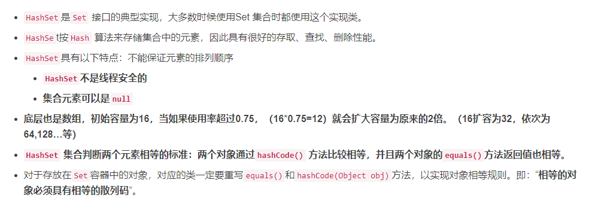

```java
/**
     * 一、Set:存储无序的、不可重复的数据
     *      1.无序性：不等于随机性。存储的数据在底层数组中并非按照数组索引的顺序添加，而是根据数据的哈希值决定的。
     *
     *      2.不可重复性：保证添加的元素按照equals()判断时，不能返回true.即：相同的元素只能添加一个。
     *
     * 二、添加元素的过程：以HashSet为例：
     *      我们向HashSet中添加元素a,首先调用元素a所在类的hashCode()方法，计算元素a的哈希值，
     *      此哈希值接着通过某种算法计算出在HashSet底层数组中的存放位置（即为：索引位置），判断
     *      数组此位置上是否已经有元素：
     *          如果此位置上没有其他元素，则元素a添加成功。 --->情况1
     *          如果此位置上有其他元素b(或以链表形式存在的多个元素），则比较元素a与元素b的hash值：
     *              如果hash值不相同，则元素a添加成功。--->情况2
     *              如果hash值相同，进而需要调用元素a所在类的equals()方法：
     *                    equals()返回true,元素a添加失败
     *                    equals()返回false,则元素a添加成功。--->情况3
     *
     *      对于添加成功的情况2和情况3而言：元素a 与已经存在指定索引位置上数据以链表的方式存储。
     *      jdk 7 :元素a放到数组中，指向原来的元素。
     *      jdk 8 :原来的元素在数组中，指向元素a
     *      总结：七上八下
     *
     * HashSet底层：数组+链表的结构。
     *
     */

```

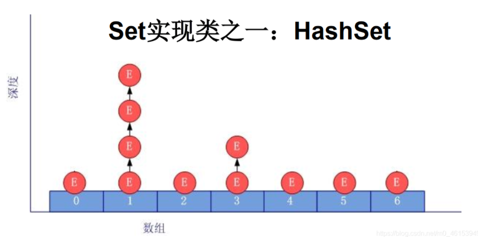

#### 5.4 关于hashCode()和equals()的重写

##### 5.4.1、重写hashCode() 方法的基本原则

- 在程序运行时，同一个对象多次调用`hashCode()`方法应该返回相同的值。
- 当两个对象的`equals()`方法比较返回`true`时，这两个对象的`hashCode()`方法的返回值也应相等。
- 对象中用作`equals()` 方法比较的`Field`，都应该用来计算`hashCode`值。


##### 5.4.2、重写equals() 方法的基本原则

以自定义的Customer类为例，何时需要重写equals()？

- 当一个类有自己特有的“逻辑相等”概念,当改写equals()的时候，总是要改写hashCode()，根据一个类的equals方法（改写后），两个截然不同的实例有可能在逻辑上是相等的，但是，根据Object.hashCode()方法，它们仅仅是两个对象。
- 因此，违反了“相等的对象必须具有相等的散列码”。
- 结论：复写equals方法的时候一般都需要同时复写hashCode方法。通常参与计算hashCode的对象的属性也应该参与到equals()中进行计算。


##### 5.4.3、Eclipse/IDEA工具里hashCode()的重写

以Eclipse/IDEA为例，在自定义类中可以调用工具自动重写equals和hashCode。问题：为什么用Eclipse/IDEA复写hashCode方法，有31这个数字？

- 选择系数的时候要选择尽量大的系数。因为如果计算出来的hash地址越大，所谓的“冲突”就越少，查找起来效率也会提高。（减少冲突）
- 并且31只占用5bits,相乘造成数据溢出的概率较小。
- 31可以由i*31== (i<<5)-1来表示,现在很多虚拟机里面都有做相关优化。（提高算法效率）
- 31是一个素数，素数作用就是如果我用一个数字来乘以这个素数，那么最终出来的结果只能被素数本身和被乘数还有1来整除！(减少冲突)

```java
/**
  * 2.要求：向Set(主要指：HashSet、LinkedHashSet)中添加的数据，其所在的类一定要重写hashCode()和equals()
  *   要求：重写的hashCode()和equals()尽可能保持一致性：相等的对象必须具有相等的散列码
  *        重写两个方法的小技巧：对象中用作 equals() 方法比较的 Field，都应该用来计算 hashCode 值。
 */

```


#### 5.5 LinkedHashSet的使用

- LinkedHashSet是HashSet的子类
- LinkedHashSet根据元素的hashCode值来决定元素的存储位置，但它同时使用双向链表维护元素的次序，这使得元素看起来是以插入顺序保存的。
- LinkedHashSet插入性能略低于HashSet，但在迭代访问Set 里的全部元素时有很好的性能。
- LinkedHashSet不允许集合元素重复。

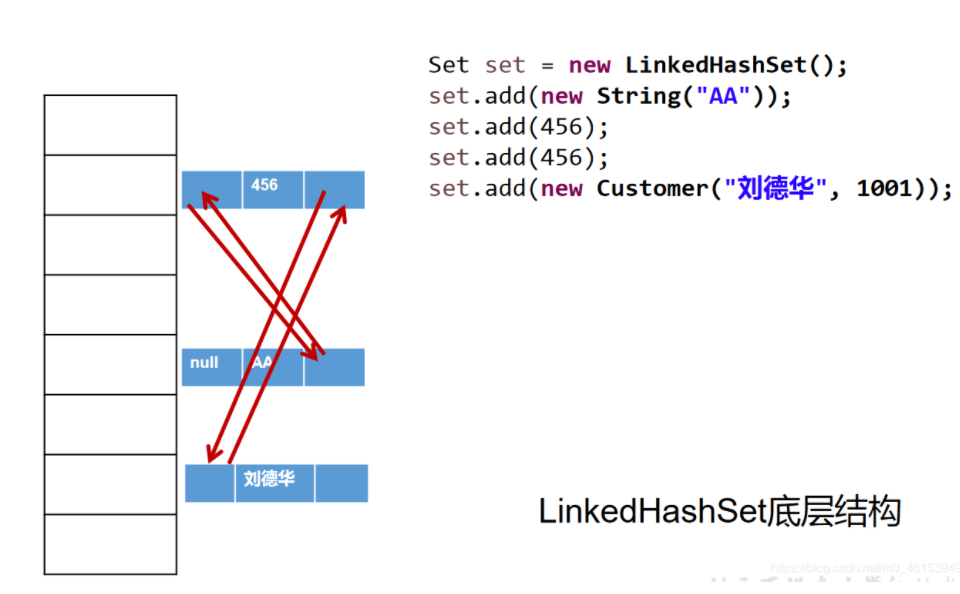

```java
import org.junit.Test;

import java.util.Iterator;
import java.util.LinkedHashSet;
import java.util.Set;

public class SetTest {

    /**
     * LinkedHashSet的使用
     * LinkedHashSet作为HashSet的子类，在添加数据的同时，每个数据还维护了两个引用，记录此数据前一个
     * 数据和后一个数据。
     * 优点：对于频繁的遍历操作，LinkedHashSet效率高于HashSet
     */
    @Test
    public void test2(){
        Set set = new LinkedHashSet();
        set.add(456);
        set.add(123);
        set.add(123);
        set.add("AA");
        set.add("CC");
        set.add(new User("Tom",12));
        set.add(new User("Tom",12));
        set.add(129);

        Iterator iterator = set.iterator();
        while(iterator.hasNext()){
            System.out.println(iterator.next());
        }
    }
}


public class User{
    private String name;
    private int age;

    public User() {
    }

    public User(String name, int age) {
        this.name = name;
        this.age = age;
    }

    public String getName() {
        return name;
    }

    public void setName(String name) {
        this.name = name;
    }

    public int getAge() {
        return age;
    }

    public void setAge(int age) {
        this.age = age;
    }

    @Override
    public String toString() {
        return "User{" +
                "name='" + name + '\'' +
                ", age=" + age +
                '}';
    }

    @Override
    public boolean equals(Object o) {
        System.out.println("User equals()....");
        if (this == o) return true;
        if (o == null || getClass() != o.getClass()) return false;

        User user = (User) o;

        if (age != user.age) return false;
        return name != null ? name.equals(user.name) : user.name == null;
    }

    @Override
    public int hashCode() { //return name.hashCode() + age;
        int result = name != null ? name.hashCode() : 0;
        result = 31 * result + age;
        return result;
    }
}

```


#### 5.6 TreeSet的自然排序

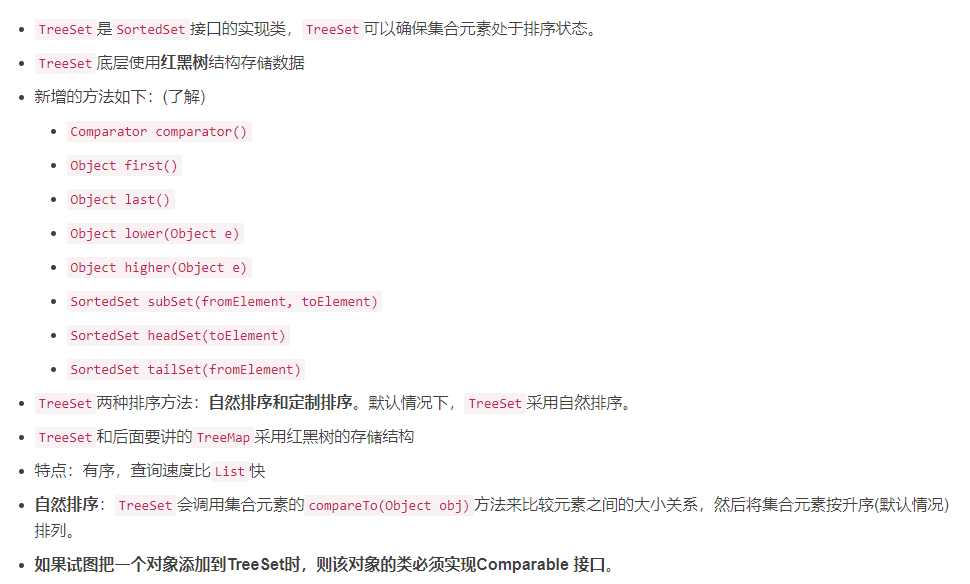

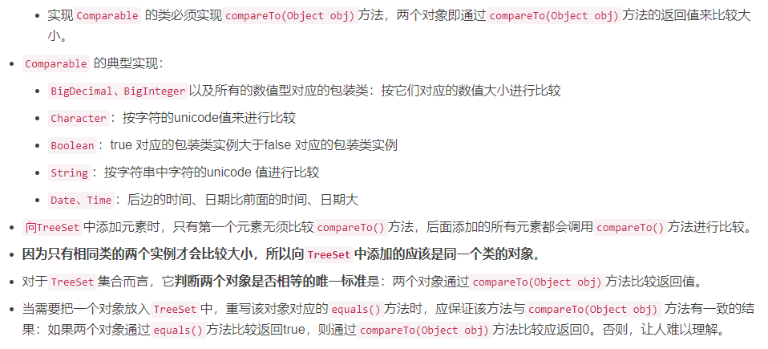

```java
import org.junit.Test;

import java.util.Iterator;
import java.util.TreeSet;

/**
 * 1.向TreeSet中添加的数据，要求是相同类的对象。
 * 2.两种排序方式：自然排序（实现Comparable接口） 和 定制排序（Comparator）
 * 3.自然排序中，比较两个对象是否相同的标准为：compareTo()返回0.不再是equals().
 * 4.定制排序中，比较两个对象是否相同的标准为：compare()返回0.不再是equals().
 */
public class TreeSetTest {

    @Test
    public void test() {
        TreeSet set = new TreeSet();

        //失败：不能添加不同类的对象
//        set.add(123);
//        set.add(456);
//        set.add("AA");
//        set.add(new User("Tom",12));

        //举例一：
//        set.add(34);
//        set.add(-34);
//        set.add(43);
//        set.add(11);
//        set.add(8);

        //举例二：
        set.add(new User("Tom",12));
        set.add(new User("Jerry",32));
        set.add(new User("Jim",2));
        set.add(new User("Mike",65));
        set.add(new User("Jack",33));
        set.add(new User("Jack",56));

        Iterator iterator = set.iterator();
        while(iterator.hasNext()){
            System.out.println(iterator.next());
        }
    }
}

public class User implements Comparable{
    private String name;
    private int age;

    public User() {
    }

    public User(String name, int age) {
        this.name = name;
        this.age = age;
    }

    public String getName() {
        return name;
    }

    public void setName(String name) {
        this.name = name;
    }

    public int getAge() {
        return age;
    }

    public void setAge(int age) {
        this.age = age;
    }

    @Override
    public String toString() {
        return "User{" +
                "name='" + name + '\'' +
                ", age=" + age +
                '}';
    }

    @Override
    public boolean equals(Object o) {
        System.out.println("User equals()....");
        if (this == o) return true;
        if (o == null || getClass() != o.getClass()) return false;

        User user = (User) o;

        if (age != user.age) return false;
        return name != null ? name.equals(user.name) : user.name == null;
    }

    @Override
    public int hashCode() { //return name.hashCode() + age;
        int result = name != null ? name.hashCode() : 0;
        result = 31 * result + age;
        return result;
    }

    //按照姓名从大到小排列,年龄从小到大排列
    @Override
    public int compareTo(Object o) {
        if (o instanceof User) {
            User user = (User) o;
//            return this.name.compareTo(user.name);  //按照姓名从小到大排列
//            return -this.name.compareTo(user.name);  //按照姓名从大到小排列
            int compare = -this.name.compareTo(user.name);  //按照姓名从大到小排列
            if(compare != 0){   //年龄从小到大排列
                return compare;
            }else{
                return Integer.compare(this.age,user.age);
            }
        } else {
            throw new RuntimeException("输入的类型不匹配");
        }
    }
}

```

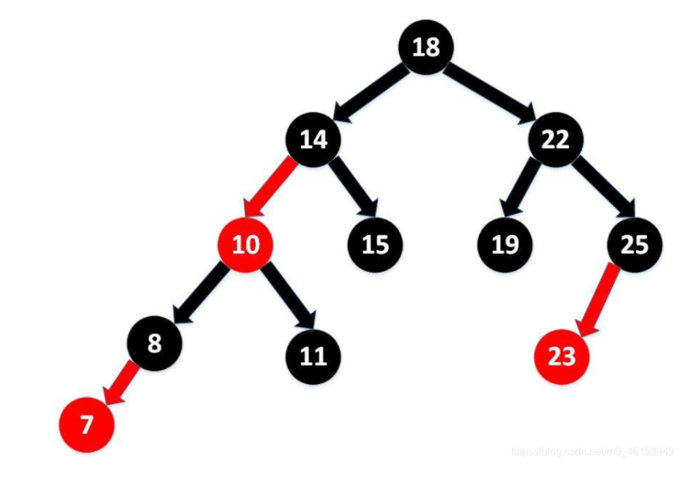

#### 5.7 TreeSet的定制排序

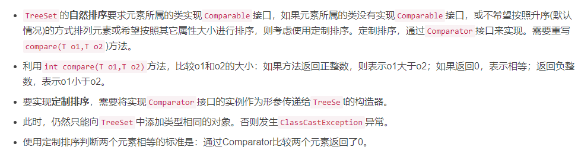

```java
import org.junit.Test;

import java.util.Comparator;
import java.util.Iterator;
import java.util.TreeSet;

/**
 * 1.向TreeSet中添加的数据，要求是相同类的对象。
 * 2.两种排序方式：自然排序（实现Comparable接口） 和 定制排序（Comparator）
 * 3.自然排序中，比较两个对象是否相同的标准为：compareTo()返回0.不再是equals().
 * 4.定制排序中，比较两个对象是否相同的标准为：compare()返回0.不再是equals().
 */
public class TreeSetTest {

    @Test
    public void tets2(){
        Comparator com = new Comparator() {
            //按照年龄从小到大排列
            @Override
            public int compare(Object o1, Object o2) {
                if(o1 instanceof User && o2 instanceof User){
                    User u1 = (User)o1;
                    User u2 = (User)o2;
                    return Integer.compare(u1.getAge(),u2.getAge());
                }else{
                    throw new RuntimeException("输入的数据类型不匹配");
                }
            }
        };

        TreeSet set = new TreeSet(com);
        set.add(new User("Tom",12));
        set.add(new User("Jerry",32));
        set.add(new User("Jim",2));
        set.add(new User("Mike",65));
        set.add(new User("Mary",33));//有Mary没Jack因为Jack年龄一样不能重复就不加
        set.add(new User("Jack",33));
        set.add(new User("Jack",56));


        Iterator iterator = set.iterator();
        while(iterator.hasNext()){
            System.out.println(iterator.next());
        }
    }
}


public class User implements Comparable{
    private String name;
    private int age;

    public User() {
    }

    public User(String name, int age) {
        this.name = name;
        this.age = age;
    }

    public String getName() {
        return name;
    }

    public void setName(String name) {
        this.name = name;
    }

    public int getAge() {
        return age;
    }

    public void setAge(int age) {
        this.age = age;
    }

    @Override
    public String toString() {
        return "User{" +
                "name='" + name + '\'' +
                ", age=" + age +
                '}';
    }

    @Override
    public boolean equals(Object o) {
        System.out.println("User equals()....");
        if (this == o) return true;
        if (o == null || getClass() != o.getClass()) return false;

        User user = (User) o;

        if (age != user.age) return false;
        return name != null ? name.equals(user.name) : user.name == null;
    }

    @Override
    public int hashCode() { //return name.hashCode() + age;
        int result = name != null ? name.hashCode() : 0;
        result = 31 * result + age;
        return result;
    }

    //按照姓名从大到小排列,年龄从小到大排列
    @Override
    public int compareTo(Object o) {
        if (o instanceof User) {
            User user = (User) o;
//            return this.name.compareTo(user.name);  //按照姓名从小到大排列
//            return -this.name.compareTo(user.name);  //按照姓名从大到小排列
            int compare = -this.name.compareTo(user.name);  //按照姓名从大到小排列
            if(compare != 0){   //年龄从小到大排列
                return compare;
            }else{
                return Integer.compare(this.age,user.age);
            }
        } else {
            throw new RuntimeException("输入的类型不匹配");
        }
    }
}

```


#### 5.8 TreeSet的课后练习

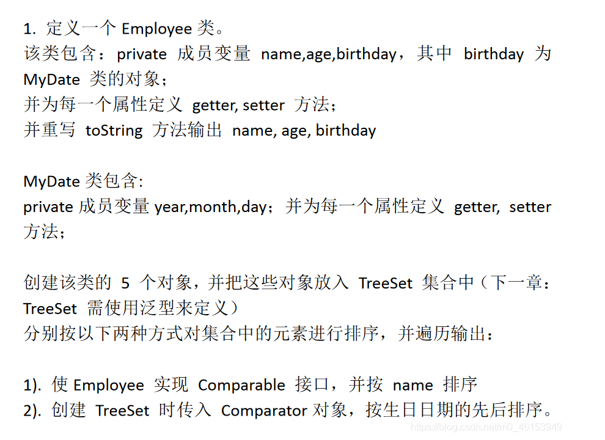

```java
package exer;

/**
 * MyDate类包含:
 * private成员变量year,month,day；并为每一个属性定义getter,  setter 方法；
 *
 * @author zihan
 * @create 2022-04-04 16:25
 */
public class MyDate implements Comparable{
    private int year;
    private int month;
    private int day;

    public MyDate() {
    }

    public MyDate(int year, int month, int day) {
        this.year = year;
        this.month = month;
        this.day = day;
    }

    public int getYear() {
        return year;
    }

    public void setYear(int year) {
        this.year = year;
    }

    public int getMonth() {
        return month;
    }

    public void setMonth(int month) {
        this.month = month;
    }

    public int getDay() {
        return day;
    }

    public void setDay(int day) {
        this.day = day;
    }

    @Override
    public String toString() {
        return "MyDate{" +
                "year=" + year +
                ", month=" + month +
                ", day=" + day +
                '}';
    }

    @Override
    public int compareTo(Object o) {
        if (o instanceof MyDate) {
            MyDate b = (MyDate) o;
            if (this.getYear() - b.getYear() != 0) {
                return this.getYear() - b.getYear();
            }
            //比较月
            if (this.getMonth() - b.getMonth() != 0) {
                return this.getMonth() - b.getMonth();
            }
            //比较日
            return this.getDay() - b.getDay();
        }
        throw new RuntimeException("传入的数据类型不一样");
    }
}


package exer;

/**
 * 定义一个Employee类。
 * 该类包含：private成员变量name,age,birthday，
 * 其中birthday 为MyDate 类的对象；
 * 并为每一个属性定义getter, setter 方法；
 * 并重写toString 方法输出name, age, birthday
 *
 * @author zihan
 * @create 2022-04-04 16:27
 */
public class Employee implements Comparable{
    private String name;
    private int age;
    private MyDate birthday;

    public Employee() {
    }

    public Employee(String name, int age, MyDate birthday) {
        this.name = name;
        this.age = age;
        this.birthday = birthday;
    }

    public String getName() {
        return name;
    }

    public void setName(String name) {
        this.name = name;
    }

    public int getAge() {
        return age;
    }

    public void setAge(int age) {
        this.age = age;
    }

    public MyDate getBirthday() {
        return birthday;
    }

    public void setBirthday(MyDate birthday) {
        this.birthday = birthday;
    }

    @Override
    public String toString() {
        return "Employee{" +
                "name='" + name + '\'' +
                ", age=" + age +
                ", birthday=" + birthday +
                '}';
    }

    @Override
    public int compareTo(Object o) {
        if (o instanceof Employee) {
            Employee e = (Employee) o;
            return this.name.compareTo(e.name);
        }
        return 0;
    }
}


package exer;

import org.junit.Test;

import java.util.Comparator;
import java.util.Iterator;
import java.util.TreeSet;

/**
 * 创建该类的5 个对象，并把这些对象放入TreeSet 集合中
 * （下一章：TreeSet 需使用泛型来定义）分别按以下两种方式
 * 对集合中的元素进行排序，并遍历输出：
 *
 * 1). 使Employee 实现Comparable 接口，并按name 排序
 * 2). 创建TreeSet 时传入Comparator对象，按生日日期的先后排序。
 * @author zihan
 * @create 2022-04-04 16:29
 */
public class EmployeeTest {
    //问题一：自然排序
    @Test
    public void test1() {
        TreeSet set = new TreeSet();
        Employee e1 = new Employee("wang", 34, new MyDate(1998,3,2));
        Employee e2 = new Employee("lei", 24, new MyDate(1943,1,24));
        Employee e3 = new Employee("he", 38, new MyDate(1965,7,12));
        Employee e4 = new Employee("zhang", 26, new MyDate(1975,10,15));
        Employee e5 = new Employee("yan", 67, new MyDate(1988,5,18));

        set.add(e1);
        set.add(e2);
        set.add(e3);
        set.add(e4);
        set.add(e5);

        Iterator iterator = set.iterator();
        while (iterator.hasNext()) {
            System.out.println(iterator.next());
        }
    }

    //问题二：按生日排
    @Test
    public void test2() {
        TreeSet set = new TreeSet(new Comparator() {
            @Override
            public int compare(Object o1, Object o2) {
                if (o1 instanceof Employee && o2 instanceof Employee) {
                    Employee e1 = (Employee) o1;
                    Employee e2 = (Employee) o2;

                    MyDate b1 = e1.getBirthday();
                    MyDate b2 = e2.getBirthday();
                    //方式一：
//                    //比较年
//                    if (b1.getYear() - b2.getYear() != 0) {
//                        return b1.getYear() - b2.getYear();
//                    }
//                    //比较月
//                    if (b1.getMonth() - b2.getMonth() != 0) {
//                        return b1.getMonth() - b2.getMonth();
//                    }
//                    //比较日
//                    return b1.getDay() - b2.getDay();

                    //方式二：
                    return b1.compareTo(b2);
                }
                throw new RuntimeException("传入的数据类型不一样");
            }
        });
        Employee e1 = new Employee("wang", 34, new MyDate(1998,3,2));
        Employee e2 = new Employee("lei", 24, new MyDate(1943,1,24));
        Employee e3 = new Employee("he", 38, new MyDate(1965,7,12));
        Employee e4 = new Employee("zhang", 26, new MyDate(1975,10,15));
        Employee e5 = new Employee("yan", 67, new MyDate(1988,5,18));

        set.add(e1);
        set.add(e2);
        set.add(e3);
        set.add(e4);
        set.add(e5);

        Iterator iterator = set.iterator();
        while (iterator.hasNext()) {
            System.out.println(iterator.next());
        }
    }
}

```


#### 5.9 Set课后两道面试题

练习：在List内去除重复数字值，要求尽量简单

```java
import org.junit.Test;

import java.util.ArrayList;
import java.util.Collection;
import java.util.HashSet;
import java.util.List;

public class CollectionTest {

    //练习：在List内去除重复数字值，要求尽量简单
    public static List duplicateList(List list) {
        HashSet set = new HashSet();
        set.addAll(list);//HashSet自动过滤重复值
        return new ArrayList(set);
    }
    @Test
    public void test2(){
        List list = new ArrayList();
        list.add(new Integer(1));
        list.add(new Integer(2));
        list.add(new Integer(2));
        list.add(new Integer(4));
        list.add(new Integer(4));
        List list2 = duplicateList(list);
        for (Object integer : list2) {
            System.out.println(integer);
        }
    }
}

```

2、面试题

```java
import org.junit.Test;

import java.util.ArrayList;
import java.util.Collection;
import java.util.HashSet;
import java.util.List;

public class CollectionTest {

    @Test
    public void test3(){
        HashSet set = new HashSet();
        Person p1 = new Person(1001,"AA");
        Person p2 = new Person(1002,"BB");

        set.add(p1);
        set.add(p2);
        System.out.println(set);

        p1.name = "CC";
        set.remove(p1);
        System.out.println(set);//BB CC
        set.add(new Person(1001,"CC"));
        System.out.println(set);//BB CC CC
        set.add(new Person(1001,"AA"));
        System.out.println(set);//BB CC CC AA 加入时虽然位置上有CC，但因为equals不等，依然可以加进去

    }
}

public class Person {

    int id;
    String name;

    public Person(int id, String name) {
        this.id = id;
        this.name = name;
    }

    public Person() {

    }

    @Override
    public String toString() {
        return "Person{" +
                "id=" + id +
                ", name='" + name + '\'' +
                '}';
    }

    @Override
    public boolean equals(Object o) {
        if (this == o) return true;
        if (o == null || getClass() != o.getClass()) return false;

        Person person = (Person) o;

        if (id != person.id) return false;
        return name != null ? name.equals(person.name) : person.name == null;
    }

    @Override
    public int hashCode() {
        int result = id;
        result = 31 * result + (name != null ? name.hashCode() : 0);
        return result;
    }
}

```


### 06、Map接口

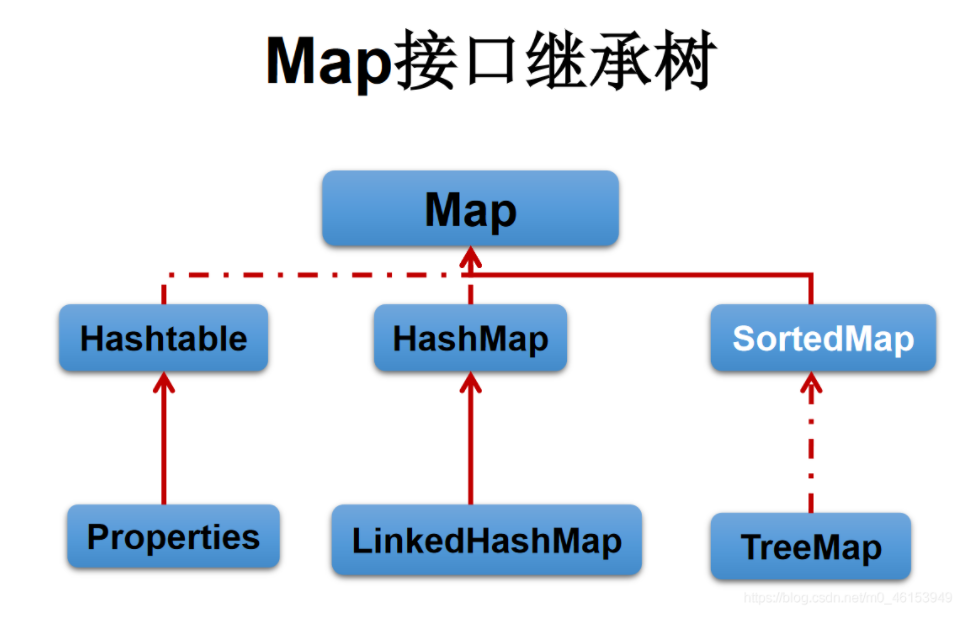

#### 6.1 Map接口及其多个实现类的对比

```java
import org.junit.Test;

import java.util.HashMap;
import java.util.Map;

/**
 * 一、Map的实现类的结构：
 *  |----Map:双列数据，存储key-value对的数据   ---类似于高中的函数：y = f(x)
 *         |----HashMap:作为Map的主要实现类；线程不安全的，效率高；存储null的key和value
 *              |----LinkedHashMap:保证在遍历map元素时，可以按照添加的顺序实现遍历。
 *                      原因：在原有的HashMap底层结构基础上，添加了一对指针，指向前一个和后一个元素。
 *                      对于频繁的遍历操作，此类执行效率高于HashMap。
 *         |----TreeMap:保证按照添加的key-value对进行排序，实现排序遍历。此时考虑key的自然排序或定制排序
 *                      底层使用红黑树
 *         |----Hashtable:作为古老的实现类；线程安全的，效率低；不能存储null的key和value
 *              |----Properties:常用来处理配置文件。key和value都是String类型
 *
 *
 *      HashMap的底层：数组+链表  （jdk7及之前）
 *                    数组+链表+红黑树 （jdk 8）
 *
 *  面试题：
 *  1. HashMap的底层实现原理？
 *  2. HashMap 和 Hashtable的异同？
 *  3. CurrentHashMap 与 Hashtable的异同？（暂时不讲）
 *
 */
public class MapTest {
    @Test
    public void test(){
        Map map = new HashMap();
//        map = new Hashtable();
        map.put(null,123);
    }
}

```


#### 6.2 Map中存储的key-value的特点

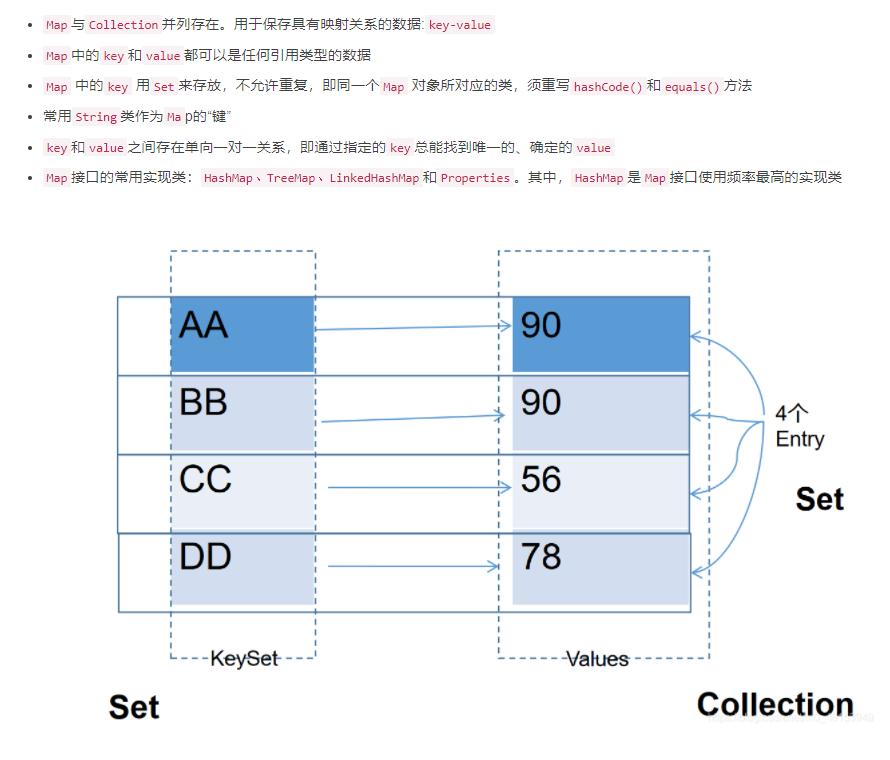

```java
 /**
   *  二、Map结构的理解：
   *    Map中的key:无序的、不可重复的，使用Set存储所有的key  ---> key所在的类要重写equals()和hashCode() （以HashMap为例）
   *    Map中的value:无序的、可重复的，使用Collection存储所有的value --->value所在的类要重写equals()
   *    一个键值对：key-value构成了一个Entry对象。
   *    Map中的entry:无序的、不可重复的，使用Set存储所有的entry
   *
   */   

```


#### 6.3 Map实现类之一：HashMap

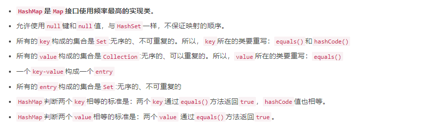

#### 6.4 HashMap的底层实现原理

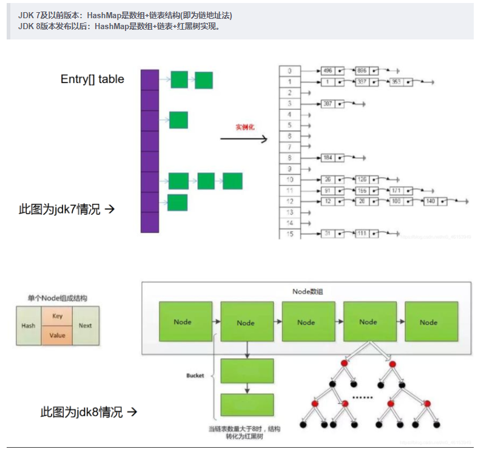

```java
/*      HashMap源码中的重要常量
 *      DEFAULT_INITIAL_CAPACITY : HashMap的默认容量，16
 *      DEFAULT_LOAD_FACTOR：HashMap的默认加载因子：0.75
 *      threshold：扩容的临界值，=容量*填充因子：16 * 0.75 => 12
 *      TREEIFY_THRESHOLD：Bucket中链表长度大于该默认值，转化为红黑树:8
 *      MIN_TREEIFY_CAPACITY：桶中的Node被树化时最小的hash表容量:64
*/

```


##### 6.4.1 HashMap在JDK7中的底层实现原理

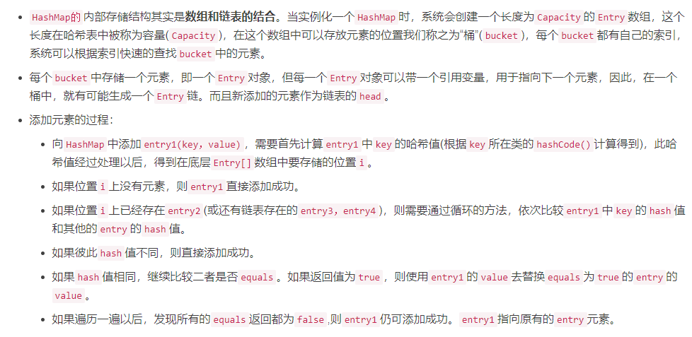

```java
/*
 * 三、HashMap的底层实现原理？以jdk7为例说明：
 *    HashMap map = new HashMap():
 *    在实例化以后，底层创建了长度是16的一维数组Entry[] table。
 *    ...可能已经执行过多次put...
 *    map.put(key1,value1):
 *    首先，调用key1所在类的hashCode()计算key1哈希值，此哈希值经过某种算法计算以后，得到在Entry数组中的存放位置。
 *    如果此位置上的数据为空，此时的key1-value1添加成功。 ----情况1
 *    如果此位置上的数据不为空，(意味着此位置上存在一个或多个数据(以链表形式存在)),比较key1和已经存在的一个或多个数据
 *    的哈希值：
 *           如果key1的哈希值与已经存在的数据的哈希值都不相同，此时key1-value1添加成功。----情况2
 *           如果key1的哈希值和已经存在的某一个数据(key2-value2)的哈希值相同，继续比较：调用key1所在类的equals(key2)方法，比较：
 *                如果equals()返回false:此时key1-value1添加成功。----情况3
 *                如果equals()返回true:使用value1替换value2。
 *
 *   补充：关于情况2和情况3：此时key1-value1和原来的数据以链表的方式存储。
 *
 *   在不断的添加过程中，会涉及到扩容问题，当超出临界值(且要存放的位置非空)时，扩容。默认的扩容方式：扩容为原来容量的2倍，并将原有的数据复制过来。
 *
 */

/**
  * HashMap的扩容
  *     当HashMap中的元素越来越多的时候，hash冲突的几率也就越来越高，
  *     因为数组的长度是固定的。所以为了提高查询的效率，
  *     就要对HashMap的数组进行扩容，而在HashMap数组扩容之后，
  *     最消耗性能的点就出现了：原数组中的数据必须重新计算其在新数组中的位置，
  *     并放进去，这就是resize。
  *     
  * 那么HashMap什么时候进行扩容呢？
  *      当HashMap中的元素个数超过数组大小(数组总大小length,
  *      不是数组中个数size)*loadFactor时，就 会 进 行 数 组 扩 容，
  *      loadFactor的默认值(DEFAULT_LOAD_FACTOR)为0.75，这是一个折中的取值。
  *      也就是说，默认情况下，数组大小(DEFAULT_INITIAL_CAPACITY)为16，
  *      那么当HashMap中元素个数超过16*0.75=12（这个值就是代码中的threshold值，
  *      也叫做临界值）的时候，就把数组的大小扩展为2*16=32，即扩大一倍，
  *      然后重新计算每个元素在数组中的位置，而这是一个非常消耗性能的操作，
  *      所以如果我们已经预知HashMap中元素的个数，
  *      那么预设元素的个数能够有效的提高HashMap的性能。
  */


```


##### 6.4.2 HashMap在JDK8中的底层实现原理

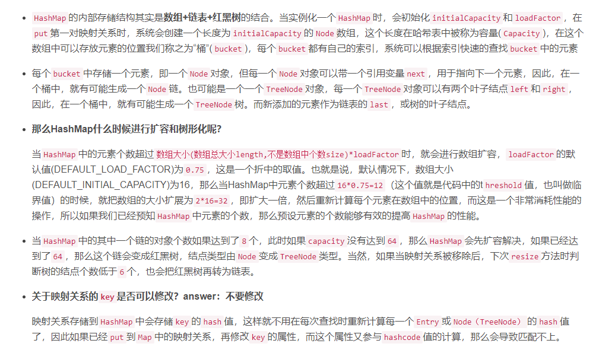

```java
/* 总结：
 *   jdk8 相较于jdk7在底层实现方面的不同：
 *      1.new HashMap():底层没有创建一个长度为16的数组
 *      2.jdk 8底层的数组是：Node[],而非Entry[]
 *      3.首次调用put()方法时，底层创建长度为16的数组
 *      4.jdk7底层结构只有：数组+链表。jdk8中底层结构：数组+链表+红黑树。
 *         4.1形成链表时，七上八下（jdk7:新的元素指向旧的元素。jdk8：旧的元素指向新的元素）
 *         4.2当数组的某一个索引位置上的元素以链表形式存在的数据个数 > 8 且当前数组的长度 > 64时，此时此索引位置上的所数据改为使用红黑树存储。
 */

```


#### 6.5 LinkedHashMap的底层实现原理（了解）

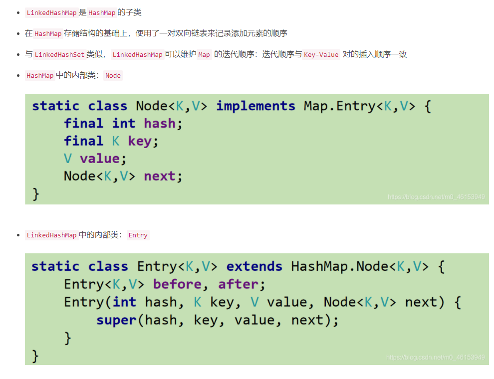

```java
/*
 *  四、LinkedHashMap的底层实现原理（了解）
 *      源码中：
 *      static class Entry<K,V> extends HashMap.Node<K,V> {
 *            Entry<K,V> before, after;//能够记录添加的元素的先后顺序
 *            Entry(int hash, K key, V value, Node<K,V> next) {
 *               super(hash, key, value, next);
 *            }
 *        } 
 */
import org.junit.Test;

import java.util.HashMap;
import java.util.LinkedHashMap;
import java.util.Map;

public class MapTest {

    @Test
    public void test2(){
        Map map = new HashMap();
        map = new LinkedHashMap();
        map.put(123,"AA");
        map.put(345,"BB");
        map.put(12,"CC");

        System.out.println(map);
    }
}

```


#### 6.6 Map中的常用方法1

```java
import org.junit.Test;

import java.util.*;
/**
 *  五、Map中定义的方法：
 *      添加、删除、修改操作：
 *      Object put(Object key,Object value)：将指定key-value添加到(或修改)当前map对象中
 *      void putAll(Map m):将m中的所有key-value对存放到当前map中
 *      Object remove(Object key)：移除指定key的key-value对，并返回value
 *      void clear()：清空当前map中的所有数据
 *      元素查询的操作：
 *      Object get(Object key)：获取指定key对应的value
 *      boolean containsKey(Object key)：是否包含指定的key
 *      boolean containsValue(Object value)：是否包含指定的value
 *      int size()：返回map中key-value对的个数
 *      boolean isEmpty()：判断当前map是否为空
 *      boolean equals(Object obj)：判断当前map和参数对象obj是否相等
 *      元视图操作的方法：
 *      Set keySet()：返回所有key构成的Set集合
 *      Collection values()：返回所有value构成的Collection集合
 *      Set entrySet()：返回所有key-value对构成的Set集合
 *
 */
public class MapTest {

    /**
     *  元素查询的操作：
     *  Object get(Object key)：获取指定key对应的value，若不存在返回null
     *  boolean containsKey(Object key)：是否包含指定的key
     *  boolean containsValue(Object value)：是否包含指定的value
     *  int size()：返回map中key-value对的个数
     *  boolean isEmpty()：判断当前map是否为空
     *  boolean equals(Object obj)：判断当前map和参数对象obj是否相等
     */
    @Test
    public void test4(){
        Map map = new HashMap();
        map.put("AA",123);
        map.put(45,123);
        map.put("BB",56);
        // Object get(Object key)
        System.out.println(map.get(45));
        //containsKey(Object key)
        boolean isExist = map.containsKey("BB");
        System.out.println(isExist);//true

        isExist = map.containsValue(123);
        System.out.println(isExist);//true

        map.clear();

        System.out.println(map.isEmpty());//true
    }

    /**
     * 添加、删除、修改操作：
     *  Object put(Object key,Object value)：将指定key-value添加到(或修改)当前map对象中
     *  void putAll(Map m):将m中的所有key-value对存放到当前map中
     *  Object remove(Object key)：移除指定key的key-value对，并返回value
     *  void clear()：清空当前map中的所有数据
     */
    @Test
    public void test3(){
        Map map = new HashMap();
        //添加
        map.put("AA",123);
        map.put(45,123);
        map.put("BB",56);
        //修改
        map.put("AA",87);

        System.out.println(map);//AA87

        Map map1 = new HashMap();
        map1.put("CC",123);
        map1.put("DD",123);
        map.putAll(map1);//value可相同

        System.out.println(map);

        //remove(Object key)
        Object value = map.remove("CC");//移除并返回此key对应的value
        System.out.println(value);
        System.out.println(map);

        //clear()
        map.clear();//与map = null操作不同
        System.out.println(map.size());//0
        System.out.println(map);//{}
    }
}

```


#### 6.7 Map中的常用方法2

```java
import org.junit.Test;

import java.util.*;
/**
 *  五、Map中定义的方法：
 *      添加、删除、修改操作：
 *      Object put(Object key,Object value)：将指定key-value添加到(或修改)当前map对象中
 *      void putAll(Map m):将m中的所有key-value对存放到当前map中
 *      Object remove(Object key)：移除指定key的key-value对，并返回value
 *      void clear()：清空当前map中的所有数据
 *      元素查询的操作：
 *      Object get(Object key)：获取指定key对应的value
 *      boolean containsKey(Object key)：是否包含指定的key
 *      boolean containsValue(Object value)：是否包含指定的value
 *      int size()：返回map中key-value对的个数
 *      boolean isEmpty()：判断当前map是否为空
 *      boolean equals(Object obj)：判断当前map和参数对象obj是否相等
 *      元视图操作的方法：
 *      Set keySet()：返回所有key构成的Set集合
 *      Collection values()：返回所有value构成的Collection集合
 *      Set entrySet()：返回所有key-value对构成的Set集合
 *
 * 总结：常用方法：
 *    添加：put(Object key,Object value)
 *    删除：remove(Object key)
 *    修改：put(Object key,Object value)
 *    查询：get(Object key)
 *    长度：size()
 *    遍历：keySet() / values() / entrySet()
 *
 *  面试题：
 *  1. HashMap的底层实现原理？
 *  2. HashMap 和 Hashtable的异同？
 *      1.HashMap与Hashtable都实现了Map接口。由于HashMap的非线程安全性，效率上可能高于Hashtable。Hashtable的方法是Synchronize的，而HashMap不是，在多个线程访问Hashtable时，不需要自己为它的方法实现同步，而HashMap 就必须为之提供外同步。
 *      2.HashMap允许将null作为一个entry的key或者value，而Hashtable不允许。
 *      3.HashMap把Hashtable的contains方法去掉了，改成containsvalue和containsKey。因为contains方法容易让人引起误解。
 *      4.Hashtable继承自Dictionary类，而HashMap是Java1.2引进的Map interface的一个实现。
 *      5.Hashtable和HashMap采用的hash/rehash算法都大概一样，所以性能不会有很大的差异。
 *
 *  3. CurrentHashMap 与 Hashtable的异同？（暂时不讲）
 *
 */
public class MapTest {

    /**
     *  元视图操作的方法：
     *  Set keySet()：返回所有key构成的Set集合
     *  Collection values()：返回所有value构成的Collection集合
     *  Set entrySet()：返回所有key-value对构成的Set集合
     */
    @Test
    public void test5(){
        Map map = new HashMap();
        map.put("AA",123);
        map.put(45,1234);
        map.put("BB",56);

        //遍历所有的key集：keySet()
        Set set = map.keySet();
        Iterator iterator = set.iterator();
        while(iterator.hasNext()){
            System.out.println(iterator.next());
        }
        System.out.println("*****************");

        //遍历所有的values集：values()
        Collection values = map.values();
        for(Object obj : values){
            System.out.println(obj);
        }
        System.out.println("***************");
        //遍历所有的key-values
        //方式一：
        Set entrySet = map.entrySet();
        Iterator iterator1 = entrySet.iterator();
        while (iterator1.hasNext()){
            Object obj = iterator1.next();
            //entrySet集合中的元素都是entry
            Map.Entry entry = (Map.Entry) obj;
            System.out.println(entry.getKey() + "---->" + entry.getValue());

        }
        System.out.println("/");

        //方式二：
        Set keySet = map.keySet();
        Iterator iterator2 = keySet.iterator();
        while(iterator2.hasNext()){
            Object key = iterator2.next();
            Object value = map.get(key);
            System.out.println(key + "=====" + value);
        }
    }
}

```


#### 6.8 TreeMap两种添加方式的使用

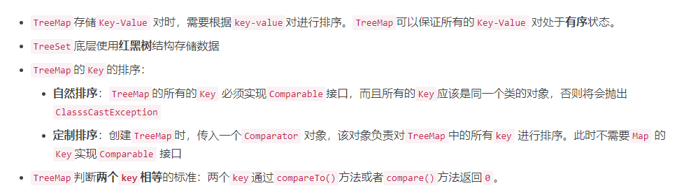

```java
public class User implements Comparable{
    private String name;
    private int age;

    public User() {
    }

    public User(String name, int age) {
        this.name = name;
        this.age = age;
    }

    public String getName() {
        return name;
    }

    public void setName(String name) {
        this.name = name;
    }

    public int getAge() {
        return age;
    }

    public void setAge(int age) {
        this.age = age;
    }

    @Override
    public String toString() {
        return "User{" +
                "name='" + name + '\'' +
                ", age=" + age +
                '}';
    }

    @Override
    public boolean equals(Object o) {
        System.out.println("User equals()....");
        if (this == o) return true;
        if (o == null || getClass() != o.getClass()) return false;

        User user = (User) o;

        if (age != user.age) return false;
        return name != null ? name.equals(user.name) : user.name == null;
    }

    @Override
    public int hashCode() { //return name.hashCode() + age;
        int result = name != null ? name.hashCode() : 0;
        result = 31 * result + age;
        return result;
    }

    //按照姓名从大到小排列,年龄从小到大排列
    @Override
    public int compareTo(Object o) {
        if(o instanceof User){
            User user = (User)o;
//            return -this.name.compareTo(user.name);
            int compare = -this.name.compareTo(user.name);
            if(compare != 0){
                return compare;
            }else{
                return Integer.compare(this.age,user.age);
            }
        }else{
            throw new RuntimeException("输入的类型不匹配");
        }

    }
}


import org.junit.Test;

import java.util.*;

public class TreeMapTest {

    /**
     * 向TreeMap中添加key-value，要求key必须是由同一个类创建的对象
     * 因为要按照key进行排序：自然排序 、定制排序
     */
    //自然排序
    @Test
    public void test(){
        TreeMap map = new TreeMap();
        User u1 = new User("Tom",23);
        User u2 = new User("Jerry",32);
        User u3 = new User("Jack",20);
        User u4 = new User("Rose",18);

        map.put(u1,98);
        map.put(u2,89);
        map.put(u3,76);
        map.put(u4,100);

        Set entrySet = map.entrySet();
        Iterator iterator1 = entrySet.iterator();
        while (iterator1.hasNext()){
            Object obj = iterator1.next();
            Map.Entry entry = (Map.Entry) obj;
            System.out.println(entry.getKey() + "---->" + entry.getValue());

        }
    }

    //定制排序
    @Test
    public void test2(){
        TreeMap map = new TreeMap(new Comparator() {
            @Override
            public int compare(Object o1, Object o2) {
                if(o1 instanceof User && o2 instanceof User){
                    User u1 = (User)o1;
                    User u2 = (User)o2;
                    return Integer.compare(u1.getAge(),u2.getAge());
                }
                throw new RuntimeException("输入的类型不匹配！");
            }
        });
        User u1 = new User("Tom",23);
        User u2 = new User("Jerry",32);
        User u3 = new User("Jack",20);
        User u4 = new User("Rose",18);

        map.put(u1,98);
        map.put(u2,89);
        map.put(u3,76);
        map.put(u4,100);

        Set entrySet = map.entrySet();
        Iterator iterator1 = entrySet.iterator();
        while (iterator1.hasNext()){
            Object obj = iterator1.next();
            Map.Entry entry = (Map.Entry) obj;
            System.out.println(entry.getKey() + "---->" + entry.getValue());

        }
    }
}

```


#### 6.9 Hashtable

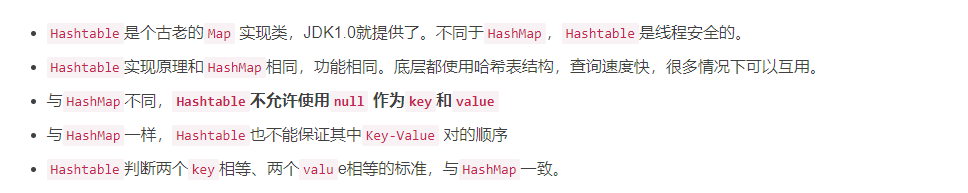


#### 6.10 Properties处理属性文件


1、新建jdbc.properties文件

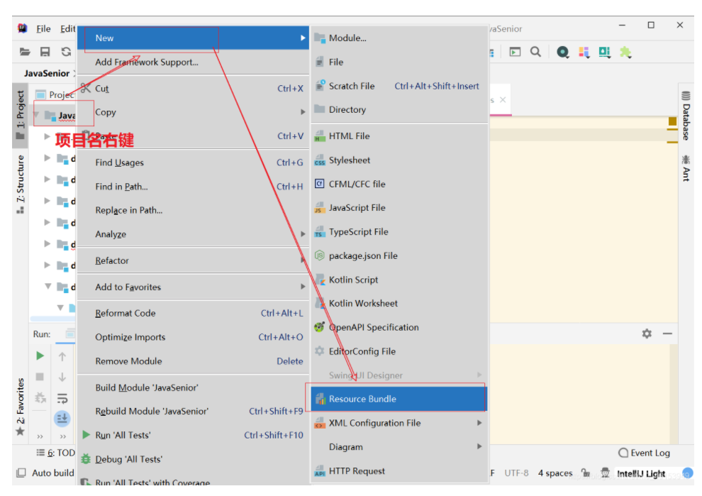

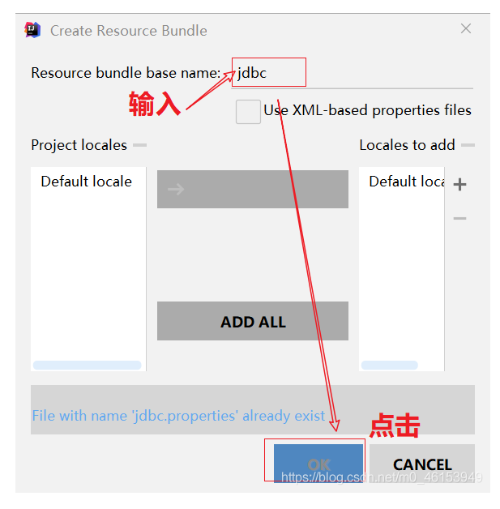

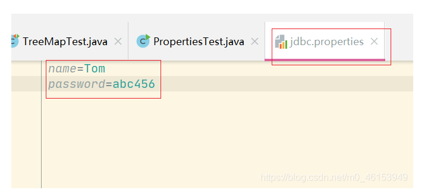

```java
import java.io.FileInputStream;
import java.io.IOException;
import java.util.Properties;

public class PropertiesTest {
    //Properties:常用来处理配置文件。key和value都是String类型
    public static void main(String[] args){
        //快捷键：ALT+Shift+Z
        FileInputStream fis = null;
        try {
            Properties pros = new Properties();
            fis = new FileInputStream("jdbc.properties");
            pros.load(fis); //加载流对应文件

            String name = pros.getProperty("name");
            String password = pros.getProperty("password");

            System.out.println("name = " + name + ",password = " + password);
        } catch (IOException e) {
            e.printStackTrace();
        } finally {
            if(fis != null){
                try {
                    fis.close();
                } catch (IOException e) {
                    e.printStackTrace();
                }
            }
        }
    }
}

```


### 07、Collections工具类

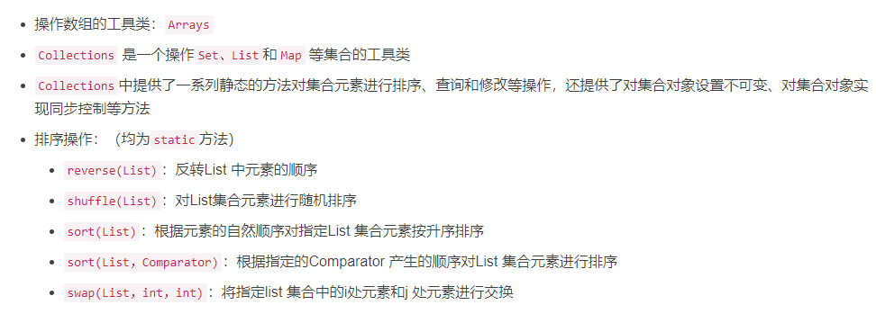

#### 7.1 Collections工具类常用方法的测试

```java
import org.junit.Test;

import java.util.ArrayList;
import java.util.Arrays;
import java.util.Collections;
import java.util.List;

/**
 * Collections:操作Collection、Map的工具类
 *
 * 面试题：Collection 和 Collections的区别？
 *       Collection是集合类的上级接口，继承于他的接口主要有Set 和List.
 *       Collections是针对集合类的一个帮助类，他提供一系列静态方法实现对各种集合的搜索、排序、线程安全化等操作.
 */
public class CollectionTest {
    /**
     * reverse(List)：反转 List 中元素的顺序
     * shuffle(List)：对 List 集合元素进行随机排序
     * sort(List)：根据元素的自然顺序对指定 List 集合元素按升序排序
     * sort(List，Comparator)：根据指定的 Comparator 产生的顺序对 List 集合元素进行排序
     * swap(List，int， int)：将指定 list 集合中的 i 索引处元素和 j 索引处元素进行交换
     *
     * Object max(Collection)：根据元素的自然顺序，返回给定集合中的最大元素
     * Object max(Collection，Comparator)：根据 Comparator 指定的顺序，返回给定集合中的最大元素
     * Object min(Collection)
     * Object min(Collection，Comparator)
     * int frequency(Collection，Object)：返回指定集合中指定元素的出现次数
     * void copy(List dest,List src)：将src中的内容复制到dest中
     * boolean replaceAll(List list，Object oldVal，Object newVal)：使用新值替换 List 对象的所有旧值
     *
     */

    @Test
    public void test(){
        List list = new ArrayList();
        list.add(123);
        list.add(43);
        list.add(765);
        list.add(765);
        list.add(765);
        list.add(-97);
        list.add(0);

        System.out.println(list);

//        Collections.reverse(list);
//        Collections.shuffle(list);
//        Collections.sort(list);
//        Collections.swap(list,1,2);
        int frequency = Collections.frequency(list, 123);

        System.out.println(list);
        System.out.println(frequency);
    }

    @Test
    public void test2(){
        List list = new ArrayList();
        list.add(123);
        list.add(43);
        list.add(765);
        list.add(-97);
        list.add(0);

        //报异常：IndexOutOfBoundsException("Source does not fit in dest")
//        List dest = new ArrayList();
//        Collections.copy(dest,list);
        //正确的：
        List dest = Arrays.asList(new Object[list.size()]);
        System.out.println(dest.size());//list.size();
        Collections.copy(dest,list);

        System.out.println(dest);

        /**
         * Collections 类中提供了多个 synchronizedXxx() 方法，
         * 该方法可使将指定集合包装成线程同步的集合，从而可以解决
         * 多线程并发访问集合时的线程安全问题
         */
        //返回的list1即为线程安全的List
        List list1 = Collections.synchronizedList(list);
    }
}

```


#### 7.2 补充：Enumeration(了解！！！)

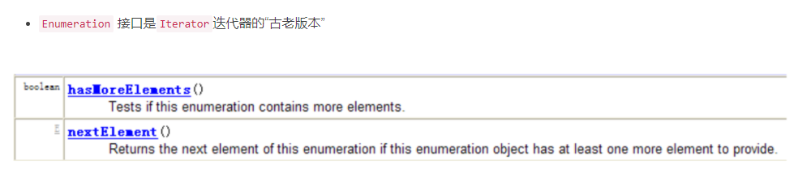

```java
Enumeration stringEnum = new StringTokenizer("a-b*c-d-e-g", "-");
    while(stringEnum.hasMoreElements()){
        Object obj= stringEnum.nextElement();System.out.println(obj); 
    }

```

