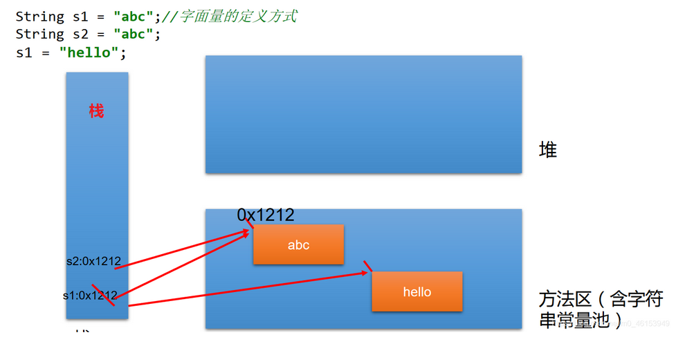
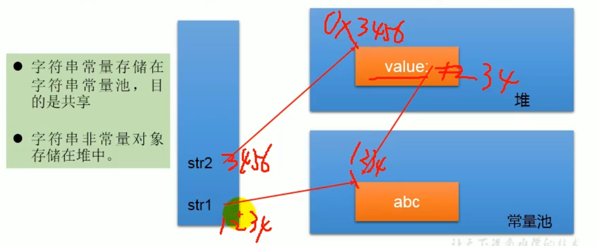
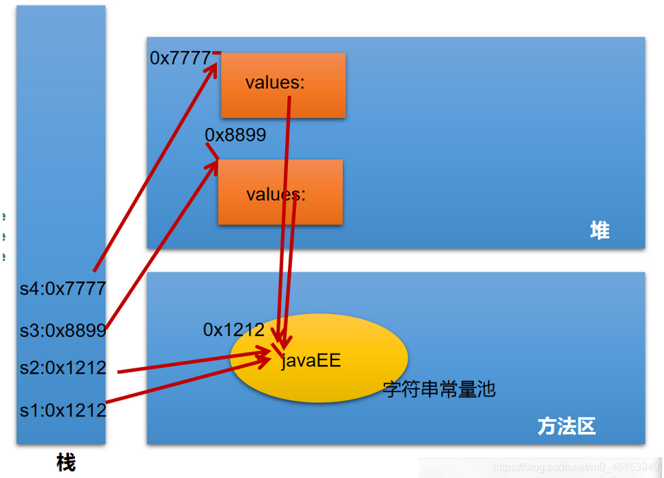
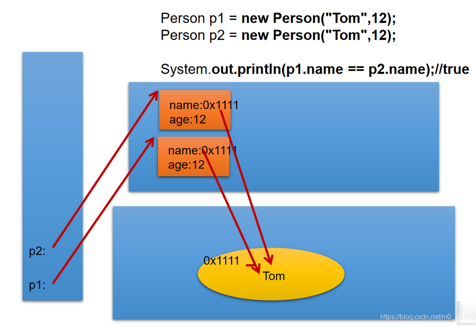
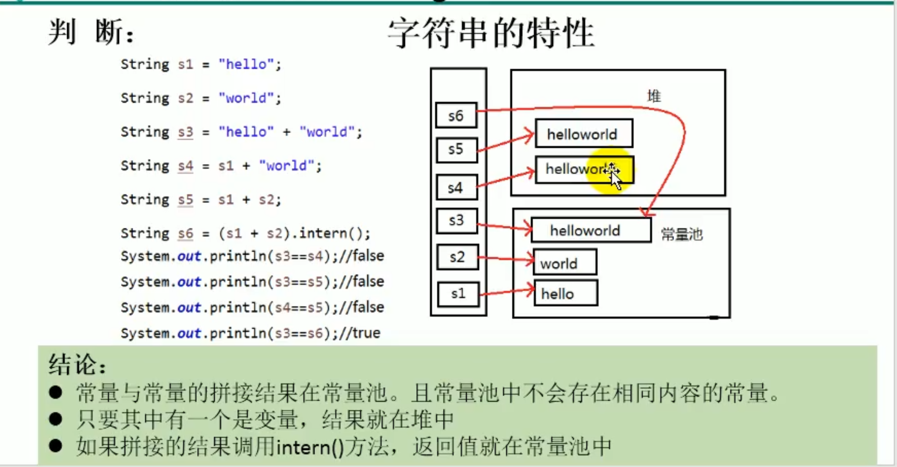
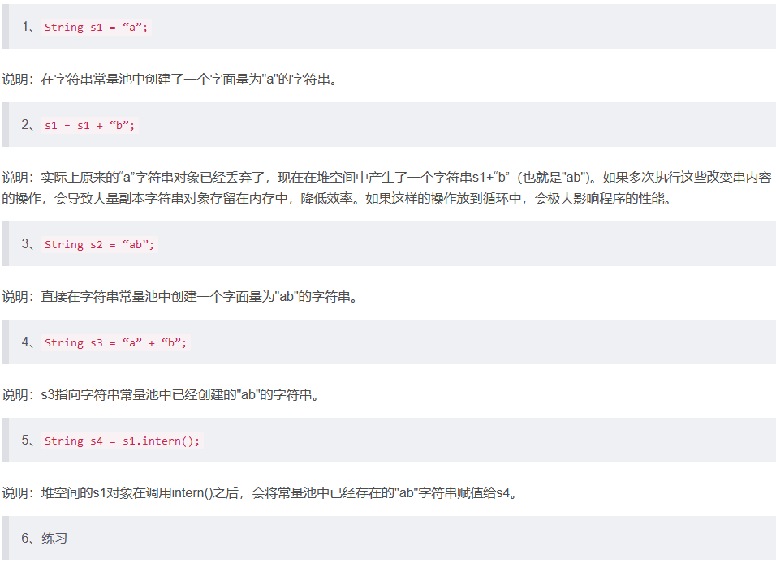
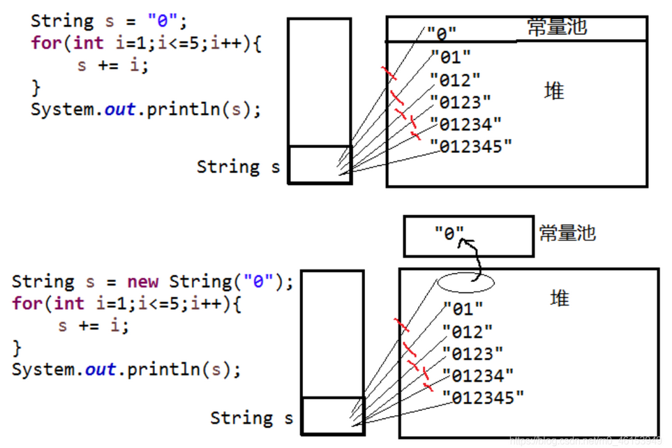

# Java Study Notes

# Commonly Used Class

### 01、字符串相关的类

#### 1.1 String类的概述

```java
import org.junit.Test;

/**
 * String的使用
 */
public class StringTest {

    /**
     * String:字符串，使用一对“”引起来表示。
     * 1.String声明为final的，不可被继承
     * 2.String实现了Serializable接口：表示字符串是支持序列化的。
     *         实现了Comparable接口：表示String可以比较大小
     * 3.String内部定义了final char[] value用于存储字符串数据
     * 4.String:代表不可变的字符序列。简称：不可变性。
     *      体现：
     *
     */
    @Test
    public void Test1(){

    }
}

```

#### 1.2 理解String的不可变性

```java
import org.junit.Test;

/**
 * String的使用
 */
public class StringTest {

    /**
     * String:字符串，使用一对“”引起来表示。
     * 1.String声明为final的，不可被继承
     * 2.String实现了Serializable接口：表示字符串是支持序列化的。
     *         实现了Comparable接口：表示String可以比较大小
     * 3.String内部定义了final char[] value用于存储字符串数据
     * 4.String:代表不可变的字符序列。简称：不可变性。
     *      体现：1.当对字符串重新赋值时，需要重写指定内存区域赋值，不能使用原有的value进行赋值。
     *           2.当对现有的字符串进行连接操作时，也需要重新指定内存区域赋值，不能使用原有的value进行赋值。
     *           3.当调用String的replace()方法修改指定字符或字符串时，也需要重新指定内存区域赋值，不能使用原有的value进行赋值。
     * 5.通过字面量的方式（区别于new）给一个字符串赋值，此时的字符串值声明在字符串常量池中。
     * 6.字符串常量池中是不会存储相同内容的字符串的。
     *
     */
    @Test
    public void Test1(){
        String s1 = "abc";  //字面量的定义方式
        String s2 = "abc";
        s1 = "hello";

        System.out.println(s1 == s2);//比较s1和s2的地址值

        System.out.println(s1);//hello
        System.out.println(s2);//abc

        System.out.println("*********************");

        String s3 = "abc";
        s3 += "def";
        System.out.println(s3);//abcdef

        System.out.println("**********************");

        String s4 = "abc";
        String s5 = s4.replace('a', 'm');
        System.out.println(s4);//abc
        System.out.println(s5);//mbc
    }
}

```



#### 1.3 String不同实例化方式的对比

##### 1、String对象的创建

```java
String str = "hello";

//本质上this.value = new char[0];
String  s1 = new String(); 

//this.value = original.value;
String  s2 = new String(String original); 

//this.value = Arrays.copyOf(value, value.length);
String  s3 = new String(char[] a);

String  s4 = new String(char[] a,int startIndex,int count);


```


##### **2、String str1 = “abc”;与String str2 = new String(“abc”);的区别？**

- 字符串常量存储在字符串常量池，目的是共享
- 字符串非常量对象存储在堆中。






```java
import org.junit.Test;

/**
 * String的使用
 */
public class StringTest {

    /**
     * String的实例化方式
     * 方式一：通过字面量定义的方式
     * 方式二：通过new + 构造器的方式
     *
     * 面试题：String s = new String("abc");方式创建对象，在内存中创建了几个对象？
     *      两个:一个是堆空间中new结构，另一个是char[]对应的常量池中的数据："abc"
     *
     */
    @Test
    public void test2(){
        //通过字面量定义的方式：此时的s1和s2的数据javaEE声明在方法区中的字符串常量池中。
        String s1 = "javaEE";
        String s2 = "javaEE";

        //通过new + 构造器的方式:此时的s3和s4保存的地址值，是数据在堆空间中开辟空间以后对应的地址值。
        String s3 = new String("javaEE");
        String s4 = new String("javaEE");

        System.out.println(s1 == s2);//true
        System.out.println(s1 == s3);//false
        System.out.println(s1 == s4);//false
        System.out.println(s3 == s4);//false

        System.out.println("***********************");
        Person p1 = new Person("Tom",12);
        Person p2 = new Person("Tom",12);

        System.out.println(p1.name.equals(p2.name));//true
        System.out.println(p1.name == p2.name);//true

        p1.name = "Jerry";
        System.out.println(p2.name);//Tom
    }
}

```

##### 3、Person类

```java
/**
 * @author subei
 * @create 2020-05-09 11:20
 */
public class Person {

    String name;
    int age;

    public Person(String name, int age) {
        this.name = name;
        this.age = age;
    }

    public Person() {

    }
}

```



#### 1.4 String不同拼接操作的对比

```java
import org.junit.Test;

/**
 * String的使用
 */
public class StringTest {

    /**
     * 结论
     *     1.常量与常量的拼接结果在常量池。且常量池中不会存在相同内容的常量。
     *     2.只要其中有一个是变量，结果就在堆中
     *     3.如果拼接的结果调用intern()方法，返回值就在常量池中
     *
     */
    @Test
    public void test4(){
        String s1 = "javaEEhadoop";
        String s2 = "javaEE";
        String s3 = s2 + "hadoop";
        System.out.println(s1 == s3);//false

        final String s4 = "javaEE";//s4:常量
        String s5 = s4 + "hadoop";
        System.out.println(s1 == s5);//true

    }

    @Test
    public void test3(){
        String s1 = "javaEE";
        String s2 = "hadoop";

        String s3 = "javaEEhadoop";
        String s4 = "javaEE" + "hadoop";
        String s5 = s1 + "hadoop";
        String s6 = "javaEE" + s2;
        String s7 = s1 + s2;

        System.out.println(s3 == s4);//true 只有字面量只要最后赋值结果都一样就一样
        System.out.println(s3 == s5);//false 有变量名参与的都不一样
        System.out.println(s3 == s6);//false
        System.out.println(s5 == s6);//false
        System.out.println(s3 == s7);//false
        System.out.println(s5 == s6);//false
        System.out.println(s5 == s7);//false
        System.out.println(s6 == s7);//false
		
        //intern方法强制返回常量池同名的地址值
        String s8 = s5.intern();//返回值得到的s8使用的常量值中已经存在的“javaEEhadoop”
        System.out.println(s3 == s8);//true
    }
}

```




##### 1.4.1、String使用陷阱





#### 1.5、String的一道面试题

```java
/**
 * 一道面试题
 */
public class StringTest {
    String str = new String("good");
    char[] ch = { 't', 'e', 's', 't' };

    public void change(String str, char ch[]) {
        str = "test ok";
        ch[0] = 'b';
    }
    public static void main(String[] args) {
        StringTest ex = new StringTest();
        ex.change(ex.str, ex.ch);
        System.out.println(ex.str);//good
        System.out.println(ex.ch);//best
    }
}

```


#### 1.7 String的常用方法1

```java
import org.junit.Test;

public class StringMethodTest {

    /**
     * int length()：返回字符串的长度：return value.length
     * char charAt(int index)：返回某索引处的字符return value[index]
     * boolean isEmpty()：判断是否是空字符串：return value.length==0
     * String toLowerCase()：使用默认语言环境，将String中的所有字符转换为小写
     * String toUpperCase()：使用默认语言环境，将String中的所有字符转换为大写
     * String trim()：返回字符串的副本，忽略前导空白和尾部空白
     * boolean equals(Object obj)：比较字符串的内容是否相同
     * boolean equals IgnoreCase(String anotherString)：与equals方法类似，忽略大小写
     * String concat(String str)：将指定字符串连接到此字符串的结尾。等价于用“+”
     * int compareTo(String anotherString)：比较两个字符串的大小
     * String substring(int beginIndex)：返回一个新的字符串，它是此字符串的从beginIndex开始截取到最后的一个子字符串。
     * String substring(int beginIndex,int endIndex)：返回一个新字符串，它是此字符串从beginIndex开始截取到endIndex(不包含)的一个子字符串。
     */
    @Test
    public void test2(){
        String s1 = "HelloWorld";
        String s2 = "helloworld";
        System.out.println(s1.equals(s2));//false
        System.out.println(s1.equalsIgnoreCase(s2));//true
        
        String s3 = "abc";
        String s4 = s3.concat("def");
        System.out.println(s4);//abcdef

        String s5 = "abc";
        String s6 = new String("abe");
        System.out.println(s5.compareTo(s6));//-2   //涉及到字符串的排序

        String s7 = "周围好吵啊";
        String s8 = s7.substring(2);
        System.out.println(s7);
        System.out.println(s8);

        String s9 = s7.substring(0, 2);
        System.out.println(s9);
    }

    @Test
    public void Test1(){
        String s1 = "helloworld";
        System.out.println(s1.length());
        System.out.println(s1.length());
        System.out.println(s1.charAt(0));
        System.out.println(s1.charAt(9));
//        System.out.println(s1.charAt(10));
//        s1 = "";
        System.out.println(s1.isEmpty());

        String s2 = s1.toLowerCase();
        System.out.println(s1);//s1不可变的，仍然为原来的字符串
        System.out.println(s2);//改成小写以后的字符串

        String s3 = "   he  llo   world   ";
        String s4 = s3.trim();
        System.out.println("-----" + s3 + "-----");
        System.out.println("-----" + s4 + "-----");
    }

}

```


#### 1.8 String的常用方法2

```java
import org.junit.Test;

public class StringMethodTest {

    /**
     * boolean endsWith(String suffix)：测试此字符串是否以指定的后缀结束
     * boolean startsWith(String prefix)：测试此字符串是否以指定的前缀开始
     * boolean startsWith(String prefix, int toffset)：测试此字符串从指定索引开始的子字符串是否以指定前缀开始
     *
     * boolean contains(CharSequence s)：当且仅当此字符串包含指定的 char 值序列时，返回 true
     * int indexOf(String str)：返回指定子字符串在此字符串中第一次出现处的索引
     * int indexOf(String str, int fromIndex)：返回指定子字符串在此字符串中第一次出现处的索引，从指定的索引开始
     * int lastIndexOf(String str)：返回指定子字符串在此字符串中最右边出现处的索引
     * int lastIndexOf(String str, int fromIndex)：返回指定子字符串在此字符串中最后一次出现处的索引，从指定的索引开始反向搜索
     *
     * 注：indexOf和lastIndexOf方法如果未找到都是返回-1
     */
    @Test
    public void test3(){
        String str1 = "helloworld";
        boolean b1 = str1.endsWith("rld");
        System.out.println(b1);//true

        boolean b2 = str1.startsWith("He");//case sensitive
        System.out.println(b2);//false

        boolean b3 = str1.startsWith("ll",2);
        System.out.println(b3);//true

        String str2 = "wor";//case sensitive
        System.out.println(str1.contains(str2));//true

        System.out.println(str1.indexOf("lo"));//3 首次出现的位置 找不到返回-1

        System.out.println(str1.indexOf("lo",5));//-1

        String str3 = "hellorworld";

        System.out.println(str3.lastIndexOf("or"));//7
        System.out.println(str3.lastIndexOf("or",6));//4 从右往左搜索

        //什么情况下，indexOf(str)和lastIndexOf(str)返回值相同？
        //情况一：存在唯一的一个str。情况二：不存在str
    }
}

```


#### 1.9 String的常用方法3

```java
import org.junit.Test;

public class StringMethodTest {

    /**
     * 替换：
     * String replace(char oldChar, char newChar)：返回一个新的字符串，它是通过用 newChar 替换此字符串中出现的所有 oldChar 得到的。
     * String replace(CharSequence target, CharSequence replacement)：使用指定的字面值替换序列替换此字符串所有匹配字面值目标序列的子字符串。
     * String replaceAll(String regex, String replacement)：使用给定的 replacement 替换此字符串所有匹配给定的正则表达式的子字符串。
     * String replaceFirst(String regex, String replacement)：使用给定的 replacement 替换此字符串匹配给定的正则表达式的第一个子字符串。
     *
     * 匹配:
     * boolean matches(String regex)：告知此字符串是否匹配给定的正则表达式。
     *
     * 切片：
     * String[] split(String regex)：根据给定正则表达式的匹配拆分此字符串。
     * String[] split(String regex, int limit)：根据匹配给定的正则表达式来拆分此字符串，最多不超过limit个，如果超过了，剩下的全部都放到最后一个元素中。
     *
     */
    @Test
    public void test4(){
        String str1 = "西藏布达拉宫欢迎您西藏";
        String str2 = str1.replace('西','东');

        System.out.println(str1);//西藏布达拉宫欢迎您西藏
        System.out.println(str2);//东藏布达拉宫欢迎您东藏

        String str3 = str1.replace("西藏", "南京");
        System.out.println(str3);//南京布达拉宫欢迎您南京

        System.out.println("*************************");
        String str = "12hello34world5java7891mysql456";
        //把字符串中的数字替换成,，如果结果中开头和结尾有，的话去掉
        String string = str.replaceAll("\\d+", ",").replaceAll("^,|,$", "");//把数字替换为，并将开头结尾的逗号去掉
        //hello,world,java,mysql
        System.out.println(string);

        System.out.println("*************************");
        str = "12345";
        //判断str字符串中是否全部有数字组成，即有1-n个数字组成
        boolean matches = str.matches("\\d+");
        System.out.println(matches);//true
        String tel = "0571-4534289";
        //判断这是否是一个杭州的固定电话
        boolean result = tel.matches("0571-\\d{7,8}");
        System.out.println(result);//true

        System.out.println("*************************");
        str = "hello|world|java";
        String[] strs = str.split("\\|");
        for (int i = 0; i < strs.length; i++) {
            System.out.println(strs[i]);
        }
        System.out.println();
        
        str2 = "hello.world.java";
        String[] strs2 = str2.split("\\.");
        for (int i = 0; i < strs2.length; i++) {
            System.out.println(strs2[i]);
        }
    }
}

```


#### 1.10 String与基本数据类型包装类的转换

```java
import org.junit.Test;

/**
 * 涉及到String类与其他结构之间的转换
 */
public class StringTest1 {

    /**
     * 复习
     *    String与基本数据类型、包装类之间的转换
     *
     *    String --> 基本数据类型、包装类：调用包装类的静态方法：parseXxx(str)
     *    基本数据类型、包装类 --> String:调用String重载的valueOf(xxx)
     */
    @Test
    public void test1(){
        String str1 = "123";
//        int num = (int)str1;//错误的
        int num = Integer.parseInt(str1);

        String str2 = String.valueOf(num);   //"123
        String str3 = num + "";

        System.out.println(str1 == str3);   //false
    }

}

```


#### 1.11 String与char[]之间的转换

```java
import org.junit.Test;

/**
 * 涉及到String类与其他结构之间的转换
 */
public class StringTest1 {

    /**
     * String 与 char[]之间的转换
     *
     * String --> char[]:调用String的toCharArray()
     * char[] --> String:调用String的构造器
     */
    @Test
    public void test2(){
        String str1 = "abc123"; //题目： a21cb3

        char[] charArray = str1.toCharArray();
        for (int i = 0; i < charArray.length; i++) {
            System.out.println(charArray[i]);
        }

        char[] arr = new char[]{'h','e','l','l','o'};
        String str2 = new String(arr);
        System.out.println(str2);
    }
}

```

