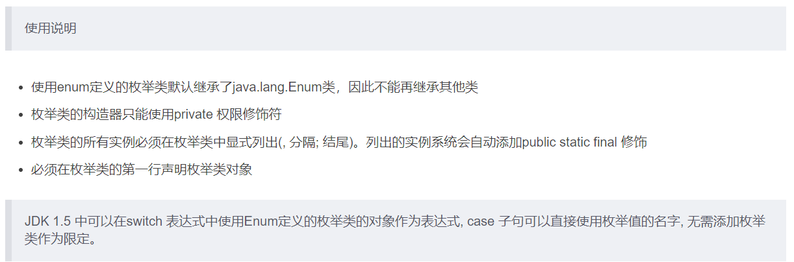

# Java Study Notes

## Enum & Annotation

### 01、枚举类的使用

#### 1.1 枚举类的理解


#### 1.2 自定义枚举类


```java
/**
 * 一、枚举类的使用
 * 1.枚举类的理解：类的对象只有有限个，确定的。我们称此类为枚举类。
 * 2.当需要定义一组常量时，强烈建议使用枚举类
 * 3.若枚举只有一个对象, 则可以作为一种单例模式的实现方式。
 *
 * 二、如何定义枚举类
 *     方式一：JDK1.5之前需要自定义枚举类
 *     方式二：JDK 1.5 新增的enum 关键字用于定义枚举类
 *
 */
public class SeasonTest {
    public static void main(String[] args) {
        Season spring = Season.SPRING;
        System.out.println(spring);
    }
}
//自定义枚举类
class Season{
    //1.声明Season对象的属性:private final修饰
    private final String seasonName;
    private final String seasonDesc;

    //2.私有化类的构造器,并给对象属性赋值
    private Season(String seasonName,String seasonDesc){
        this.seasonName = seasonName;
        this.seasonDesc = seasonDesc;
    }

    //3.提供当前枚举类的多个对象
    public static final Season SPRING = new Season("春天","万物复苏");
    public static final Season SUMMER = new Season("夏天","烈日炎炎");
    public static final Season AUTUMN = new Season("秋天","金秋送爽");
    public static final Season WINTER = new Season("冬天","白雪皑皑");

    //4.其他诉求：获取枚举类对象的属性
    public String getSeasonName() {
        return seasonName;
    }

    public String getSeasonDesc() {
        return seasonDesc;
    }

    //4.其他诉求1：提供toString()
    @Override
    public String toString() {
        return "Season{" +
                "seasonName='" + seasonName + '\'' +
                ", seasonDesc='" + seasonDesc + '\'' +
                '}';
    }
}

```

#### 1.3 使用enum关键字定义枚举类



```java
/**
 * 使用enum关键字定义枚举类
 * 说明：定义的枚举类默认继承于java.lang.Enum类
 */
public class SeasonTest1 {
    public static void main(String[] args) {
        Season1 summer = Season1.SUMMER;
        //toString():
        System.out.println(summer.toString());
        
        System.out.println(Season1.class.getSuperclass());
    }
}

//使用enum关键字枚举类
enum Season1{
    //1.提供当前枚举类的对象，多个对象之间用","隔开，末尾对象";"结束
    SPRING("春天","万物复苏"),
    SUMMER("夏天","烈日炎炎"),
    AUTUMN("秋天","金秋送爽"),
    WINTER("冬天","白雪皑皑");

    //2.声明Season对象的属性:private final修饰
    private final String seasonName;
    private final String seasonDesc;

    //3.私有化类的构造器,并给对象属性赋值
    private Season1(String seasonName,String seasonDesc){
        this.seasonName = seasonName;
        this.seasonDesc = seasonDesc;
    }

    //4.其他诉求：获取枚举类对象的属性
    public String getSeasonName() {
        return seasonName;
    }

    public String getSeasonDesc() {
        return seasonDesc;
    }

    //4.其他诉求1：提供toString()
//    @Override
//    public String toString() {
//        return "Season{" +
//                "seasonName='" + seasonName + '\'' +
//                ", seasonDesc='" + seasonDesc + '\'' +
//                '}';
//    }
}

```

#### 1.4 Enum类中的常用方法


```java
/**
 * 使用enum关键字定义枚举类
 * 说明：定义的枚举类默认继承于java.lang.Enum类
 *
 * 三、Enum类的常用方法
 *      values()方法：返回枚举类型的对象数组。该方法可以很方便地遍历所有的枚举值。
 *      valueOf(String str)：可以把一个字符串转为对应的枚举类对象。要求字符串必须是枚举类对象的“名字”。如不是，会有运行时异常：IllegalArgumentException。
 *      toString()：返回当前枚举类对象常量的名称
 */
public class SeasonTest1 {
    public static void main(String[] args) {
        Season1 summer = Season1.SUMMER;
        //toString():
        System.out.println(summer.toString());

//        System.out.println(Season1.class.getSuperclass());
        System.out.println("**************************");
        //values():返回所有的枚举类对象构成的数组
        Season1[] values = Season1.values();
        for(int i = 0;i < values.length;i++){
            System.out.println(values[i]);
        }
        System.out.println("****************************");
        Thread.State[] values1 = Thread.State.values();
        for(int i = 0;i < values1.length;i++){
            System.out.println(values1[i]);
        }

        //valueOf(String objName):返回枚举类中对象名是objName的对象。
        Season1 winter = Season1.valueOf("WINTER");
        //如果没有objName的枚举类对象，则抛异常：IllegalArgumentException
//        Season1 winter = Season1.valueOf("WINTER1");
        System.out.println(winter);

    }
}

//使用enum关键字枚举类
enum Season1{
    //1.提供当前枚举类的对象，多个对象之间用","隔开，末尾对象";"结束
    SPRING("春天","万物复苏"),
    SUMMER("夏天","烈日炎炎"),
    AUTUMN("秋天","金秋送爽"),
    WINTER("冬天","白雪皑皑");

    //2.声明Season对象的属性:private final修饰
    private final String seasonName;
    private final String seasonDesc;

    //3.私有化类的构造器,并给对象属性赋值
    private Season1(String seasonName,String seasonDesc){
        this.seasonName = seasonName;
        this.seasonDesc = seasonDesc;
    }

    //4.其他诉求：获取枚举类对象的属性
    public String getSeasonName() {
        return seasonName;
    }

    public String getSeasonDesc() {
        return seasonDesc;
    }

    //4.其他诉求1：提供toString()
//    @Override
//    public String toString() {
//        return "Season{" +
//                "seasonName='" + seasonName + '\'' +
//                ", seasonDesc='" + seasonDesc + '\'' +
//                '}';
//    }
}

```


#### 1.5 使用enum关键字定义的枚举类实现接口

```java
/**
 * 使用enum关键字定义枚举类
 * 说明：定义的枚举类默认继承于java.lang.Enum类
 *
 * 四、使用enum关键字定义的枚举类实现接口的情况
 *   情况一：实现接口，在enum类中实现抽象方法
 *   情况二：让枚举类的对象分别实现接口中的抽象方法
 */
public class SeasonTest1 {
    public static void main(String[] args) {
        //values():返回所有的枚举类对象构成的数组
        Season1[] values = Season1.values();
        for(int i = 0;i < values.length;i++){
            System.out.println(values[i]);
            values[i].show();
        }

        //valueOf(String objName):返回枚举类中对象名是objName的对象。
        Season1 winter = Season1.valueOf("WINTER");
        winter.show();
    }
}

interface Info{
    void show();
}

//使用enum关键字枚举类
enum Season1 implements Info{
    //1.提供当前枚举类的对象，多个对象之间用","隔开，末尾对象";"结束
    SPRING("春天","春暖花开"){
        @Override
        public void show() {
            System.out.println("一元复始、万物复苏");
        }
    },
    SUMMER("夏天","夏日炎炎"){
        @Override
        public void show() {
            System.out.println("蝉声阵阵、烈日当空");
        }
    },
    AUTUMN("秋天","秋高气爽"){
        @Override
        public void show() {
            System.out.println("天高气清、金桂飘香");
        }
    },
    WINTER("冬天","冰天雪地"){
        @Override
        public void show() {
            System.out.println("寒冬腊月、滴水成冰");
        }
    };

    //2.声明Season对象的属性:private final修饰
    private final String seasonName;
    private final String seasonDesc;

    //3.私有化类的构造器,并给对象属性赋值
    private Season1(String seasonName,String seasonDesc){
        this.seasonName = seasonName;
        this.seasonDesc = seasonDesc;
    }

    //4.其他诉求：获取枚举类对象的属性
    public String getSeasonName() {
        return seasonName;
    }

    public String getSeasonDesc() {
        return seasonDesc;
    }

    //4.其他诉求1：提供toString()
//    @Override
//    public String toString() {
//        return "Season{" +
//                "seasonName='" + seasonName + '\'' +
//                ", seasonDesc='" + seasonDesc + '\'' +
//                '}';
//    }

//    @Override
//    public void show() {
//        System.out.println("这是一个季节。");
//    }
}


```

### 02、注解的使用

#### 2.1 注解的理解

- 从JDK 5.0 开始, Java 增加了对元数据(MetaData) 的支持, 也就是Annotation(注解)
- Annotation 其实就是代码里的特殊标记, 这些标记可以在编译, 类加载, 运行时被读取, 并执行相应的处理。通过使用Annotation, 程序员可以在不改变原有逻辑的情况下, 在源文件中嵌入一些补充信息。代码分析工具、开发工具和部署工具可以通过这些补充信息进行验证或者进行部署。
- Annotation 可以像修饰符一样被使用, 可用于修饰包,类, 构造器, 方法, 成员变量, 参数, 局部变量的声明, 这些信息被保存在Annotation 的“name=value” 对中。
- 在JavaSE中，注解的使用目的比较简单，例如标记过时的功能，忽略警告等。在JavaEE/Android中注解占据了更重要的角色，例如用来配置应用程序的任何切面，代替JavaEE旧版中所遗留的繁冗代码和XML配置等。
- 未来的开发模式都是基于注解的，JPA是基于注解的，Spring2.5以上都是基于注解的，Hibernate3.x以后也是基于注解的，现在的Struts2有一部分也是基于注解的了，注解是一种趋势，一定程度上可以说：框架= 注解+ 反射+ 设计模式。


#### 2.2 Annotation的使用示例


```java
import java.util.ArrayList;
import java.util.Date;

/**
 * 注解的使用
 *
 * 1. 理解Annotation:
 * ① jdk 5.0 新增的功能
 *
 * ② Annotation 其实就是代码里的特殊标记, 这些标记可以在编译, 类加载, 运行时被读取, 并执行相应的处理。通过使用 Annotation,
 *    程序员可以在不改变原有逻辑的情况下, 在源文件中嵌入一些补充信息。
 *
 * ③在JavaSE中，注解的使用目的比较简单，例如标记过时的功能，忽略警告等。在JavaEE/Android
 *  中注解占据了更重要的角色，例如用来配置应用程序的任何切面，代替JavaEE旧版中所遗留的繁冗
 *  代码和XML配置等。
 *
 * 2. Annocation的使用示例
 *  示例一：生成文档相关的注解
 *  示例二：在编译时进行格式检查(JDK内置的三个基本注解)
 *      @Override: 限定重写父类方法, 该注解只能用于方法
 *      @Deprecated: 用于表示所修饰的元素(类, 方法等)已过时。通常是因为所修饰的结构危险或存在更好的选择
 *      @SuppressWarnings: 抑制编译器警告
 *
 *  示例三：跟踪代码依赖性，实现替代配置文件功能
 */
public class AnnotationTest {
    public static void main(String[] args) {
        Person p = new Student();
        p.walk();

        Date date = new Date(2020, 10, 11);
        System.out.println(date);

        @SuppressWarnings("unused")
        int num = 10;

//        System.out.println(num);

        @SuppressWarnings({ "unused", "rawtypes" })
        ArrayList list = new ArrayList();
    }
}

class Person{
    private String name;
    private int age;

    public Person() {
        super();
    }

    public Person(String name, int age) {
        this.name = name;
        this.age = age;
    }
    public void walk(){
        System.out.println("学习中……");
    }
    public void eat(){
        System.out.println("摸鱼中……");
    }
}

interface Info{
    void show();
}

class Student extends Person implements Info{

    @Override
    public void walk() {
        System.out.println("喷子走开");
    }

    @Override
    public void show() {

    }
}

```


#### 2.3 如何自定义注解


```java
public @interface MyAnnotation {

    String value();
}
/**
 * 注解的使用
 *
 *  3.如何自定义注解：参照@SuppressWarnings定义
 *      ① 注解声明为：@interface
 *      ② 内部定义成员，通常使用value表示
 *      ③ 可以指定成员的默认值，使用default定义
 *      ④ 如果自定义注解没有成员，表明是一个标识作用。
 *
 *      如果注解有成员，在使用注解时，需要指明成员的值。
 *      自定义注解必须配上注解的信息处理流程(使用反射)才有意义。
 *      自定义注解通过都会指明两个元注解：Retention、Target
 *
 */

@MyAnnotation(value = "hello")

```


#### 2.4 jdk中4个基本的元注解的使用1


```java
import java.lang.annotation.Retention;
import java.lang.annotation.RetentionPolicy;

@Retention(RetentionPolicy.SOURCE)
public @interface MyAnnotation {

    String value();

}
/**
 * 注解的使用
 *
 *   4.jdk 提供的4种元注解
 *     元注解：对现有的注解进行解释说明的注解
 *     Retention:指定所修饰的 Annotation 的生命周期：SOURCE\CLASS（默认行为）\RUNTIME
 *               只有声明为RUNTIME生命周期的注解，才能通过反射获取。
 *     Target:
 *     Documented:
 *     Inherited:
 *
 */
public class AnnotationTest {
    public static void main(String[] args) {

    }
}

@MyAnnotation(value = "hello")
class Person{
    private String name;
    private int age;

    public Person() {
        super();
    }

    @MyAnnotation(value = "jack")
    public Person(String name, int age) {
        this.name = name;
        this.age = age;
    }
    
    public void walk(){
        System.out.println("学习中……");
    }
    public void eat(){
        System.out.println("摸鱼中……");
    }
}

```


#### 2.5 jdk中4个基本的元注解的使用2


```java
import org.junit.Test;

import java.lang.annotation.Annotation;
import java.util.ArrayList;
import java.util.Date;

/**
 * 注解的使用
 *
 *   4.jdk 提供的4种元注解
 *     元注解：对现有的注解进行解释说明的注解
 *     Retention:指定所修饰的 Annotation 的生命周期：SOURCE\CLASS（默认行为）\RUNTIME
 *               只有声明为RUNTIME生命周期的注解，才能通过反射获取。
 *     Target:用于指定被修饰的 Annotation 能用于修饰哪些程序元素
 *     *******出现的频率较低*******
 *     Documented:表示所修饰的注解在被javadoc解析时，保留下来。
 *     Inherited:被它修饰的 Annotation 将具有继承性。
 *     
 * 5.通过反射获取注解信息 ---到反射内容时系统讲解
 */
public class AnnotationTest {
    public static void main(String[] args) {

    }

    @Test
    public void testGetAnnotation(){
        Class clazz = Student.class;
        Annotation[] annotations = clazz.getAnnotations();
        for(int i = 0;i < annotations.length;i++){
            System.out.println(annotations[i]);
        }
    }
}

@MyAnnotation(value = "hello")
class Person{
    private String name;
    private int age;

    public Person() {
        super();
    }

    @MyAnnotation
    public Person(String name, int age) {
        this.name = name;
        this.age = age;
    }

    @MyAnnotation
    public void walk(){
        System.out.println("学习中……");
    }
    public void eat(){
        System.out.println("摸鱼中……");
    }
}


@Inherited
@Retention(RetentionPolicy.RUNTIME)
@Target({TYPE, FIELD, METHOD, PARAMETER, CONSTRUCTOR, LOCAL_VARIABLE,TYPE_PARAMETER,TYPE_USE})
public @interface MyAnnotation {
    String value() default "book";
}

```


#### 2.6 利用反射获取注解信息


#### 2.7 jdk8新特性：可重复注解


```java
import java.lang.annotation.Annotation;

/**
 * 注解的使用
 *
 * 6.jdk 8 中注解的新特性：可重复注解、类型注解
 *
 *   6.1可重复注解：① 在MyAnnotation上声明@Repeatable，成员值为MyAnnotations.class
 *                ② MyAnnotation的Target和Retention等元注解与MyAnnotations相同。
 *
 *
 * @author subei
 * @create 2020-05-11 11:19
 */
public class AnnotationTest {
    public static void main(String[] args) {
    }
}

@MyAnnotation(value = "hi")
@MyAnnotation(value = "abc")
//jdk 8之前的写法：
//@MyAnnotations({@MyAnnotation(value="hi"),@MyAnnotation(value="hi")})

import java.lang.annotation.Retention;
import java.lang.annotation.RetentionPolicy;
import java.lang.annotation.Target;

import static java.lang.annotation.ElementType.*;

@Retention(RetentionPolicy.RUNTIME)
@Target({TYPE, FIELD, METHOD, PARAMETER, CONSTRUCTOR, LOCAL_VARIABLE})
public @interface MyAnnotations {

    MyAnnotation[] value();
}

import java.lang.annotation.*;
import static java.lang.annotation.ElementType.*;

@Repeatable(MyAnnotations.class)
@Retention(RetentionPolicy.RUNTIME)
@Target({TYPE, FIELD, METHOD, PARAMETER, CONSTRUCTOR, LOCAL_VARIABLE,TYPE_PARAMETER,TYPE_USE})
public @interface MyAnnotation {

    String value() default "hello";

}

```


#### 2.8 jdk8新特性：类型注解


```java
import java.util.ArrayList;

/**
 * 注解的使用
 *
 * 6.jdk 8 中注解的新特性：可重复注解、类型注解
 *
 *   6.1可重复注解：① 在MyAnnotation上声明@Repeatable，成员值为MyAnnotations.class
 *                ② MyAnnotation的Target和Retention等元注解与MyAnnotations相同。
 *
 *   6.2类型注解：
 *      ElementType.TYPE_PARAMETER 表示该注解能写在类型变量的声明语句中（如：泛型声明）。
 *      ElementType.TYPE_USE 表示该注解能写在使用类型的任何语句中。
 *
 */
public class AnnotationTest {
 
}


class Generic<@MyAnnotation T>{

    public void show() throws @MyAnnotation RuntimeException{

        ArrayList<@MyAnnotation String> list = new ArrayList<>();

        int num = (@MyAnnotation int) 10L;
    }

}


import java.lang.annotation.*;

import static java.lang.annotation.ElementType.*;

@Retention(RetentionPolicy.RUNTIME)
@Target({TYPE, FIELD, METHOD, PARAMETER, CONSTRUCTOR, LOCAL_VARIABLE,TYPE_PARAMETER,TYPE_USE})
public @interface MyAnnotation {

    String value() default "hello";

}

```

