# Java Study Notes

## 01.Flow Control

### 1.1 流程控制概述

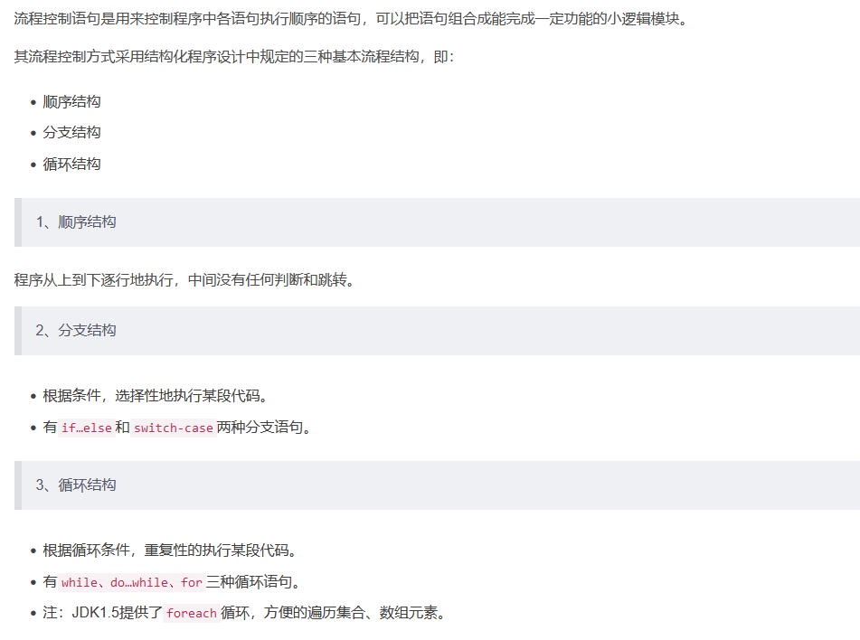

### 1.2 顺序结构

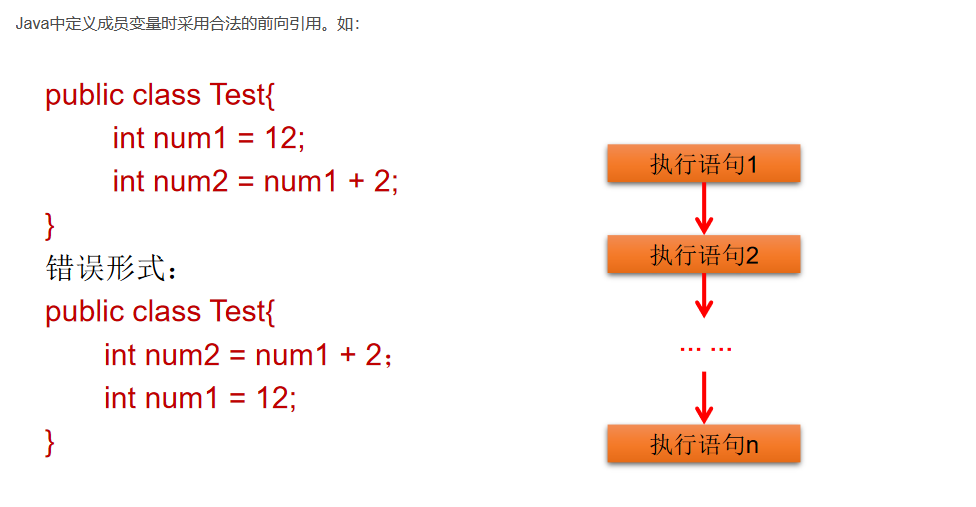

### 1.3 分支结构

#### 1.3.1 if-else

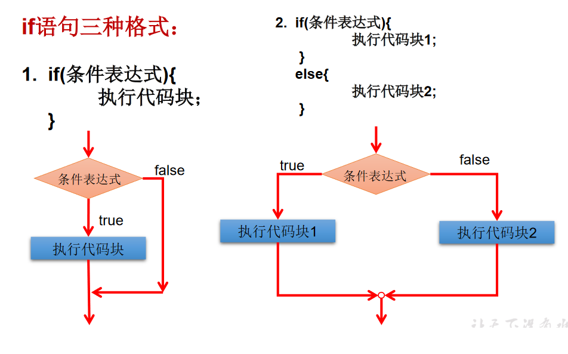

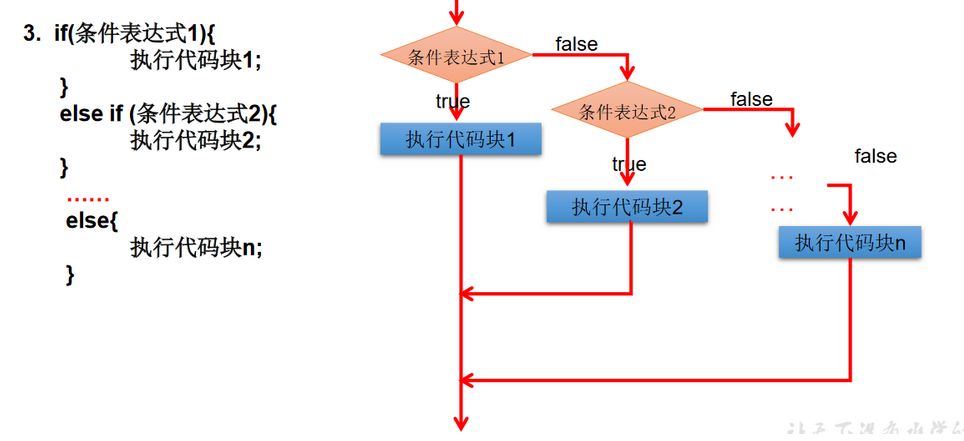

```java
/*
分支结构中的if-else（条件判断结构）
一、三种结构
第一种：
if(条件表达式){
	执行表达式
}

第二种：二选一
if(条件表达式){
	执行表达式1
}else{
	执行表达式2
}

第三种：多选一
if(条件表达式){
	执行表达式1
}else if{
	执行表达式2
}else if(条件表达式){
	执行表达式3
}
...
else{
	执行表达式n
}

*/
class IfTest{
	public static void main(String[] args){
		//举例1
		int heartBeats = 75;
		if(heartBeats < 60 || heartBeats > 100){
			System.out.println("需要进一步做检查");
		}
		System.out.println("检查结束");

		//举例2
		int age = 23;
		if(age < 18){
			System.out.println("你还可以看动画片");
		}else{
			System.out.println("你可以看科技电影了");
		}

		//举例3
		if(age < 0){
			System.out.println("你输入的数据不合适");
		}else if(age < 18){
			System.out.println("你还是个青少年");
		}else if(age < 35){
			System.out.println("你还是个青壮年");
		}else if(age < 60){
			System.out.println("你还是个中年");
		}else if(age < 120){
			System.out.println("你进入老年了");
		}else{
			System.out.println("你成仙了");
		}
	}
}

```

#### 1.3.2 Scanner类

```java
/*
如何从键盘获取不同类型的变量，需要使用Scanner类

具体步骤：
1.导包：import java.util.Scanner;
2.Scanner的实例化;
3.调用Scanner类的相关方法，来获取指定的变量。
*/
import java.util.Scanner;

class ScannerTest{
	public static void main(String[] args){
		//声明一个Scanner
		Scanner scan = new Scanner(System.in);

		int num = scan.nextInt();

		System.out.println(num);
        
        System.out.println("请输入你的姓名：");
		String name = scan.next();
		System.out.println(name);

		System.out.println("请输入你的年龄：");
		int age = scan.nextInt();
		System.out.println(age);

		System.out.println("请输入你的体重：");
		double weight = scan.nextDouble();
		System.out.println(weight);

		System.out.println("你是否单身？(true/false)");
		boolean isLove = scan.nextBoolean();
		System.out.println(isLive);

		//char型的获取，Scanner没有提供相关方法，只能获取一个字符串
		System.out.println("请输入你的性别：(男/女)");
		String gender = scan.next();
		char genderChar = gender.charAt(0);
		System.out.println(genderChar);
	}
}

```

#### 1.3.1 练习

```java
/*
岳小鹏参加Java考试，他和父亲岳不群达成承诺：
如果：成绩为100分时，奖励一辆BMW；
成绩为(80，99]时，奖励一台iphone xs max；
当成绩为[60,80]时，奖励一个iPad；
其它时，什么奖励也没有。
请从键盘输入岳小鹏的期末成绩，并加以判断

说明：
1.else结构是可选的。
2.针对于条件表达式：
	① 如果多个条件表达式之间的关系是“互斥”关系(或没有交集的关系),哪个判断和执行语句声明在上面还是下面，无所谓；
	② 如果多个条件表达式之间是有交集的关系，需要根据实际情况，需要考虑实际情况，考虑清楚应该将哪个结构声明在上面。
	③ 如果多个条件表达式之间有包含的关系，通常情况下，需要将范围小的声明在范围大的上面。否则，范围小的就没机会运行。
*/
import java.util.Scanner;
class IFTest02{
	public static void main(String[] args){
		Scanner scan = new Scanner(System.in);
		System.out.println("请输入岳小鹏的成绩：");
		int score = scan.nextInt();

		if(score == 100){
			System.out.println("奖励一辆BMW");
		}else if(score >80 && score <=99){
			System.out.println("奖励一台iphone xs max");
		}else if(score >= 60 && score <= 80){
			System.out.println("奖励一个iPad");
		}else{
			System.out.println("奖励？学习去！！！");
		}
	}
}

/*
编写程序：由键盘输入三个整数分别存入变量num1、num2、num3，
对它们进行排序(使用if-else if-else),并且从小到大输出。


1.if-else可嵌套
2.执行语句只有一行时，{}可省略，但不建议
*/
import java.util.Scanner;

class Sorting{
	public static void main(String[] args){
		//Scanner实例化
		Scanner scan = new Scanner(System.in);
		System.out.println("请输入第一个整数：");
		int num1 = scan.nextInt();
		System.out.println("请输入第二个整数：");
		int num2 = scan.nextInt();
		System.out.println("请输入第三个整数：");
		int num3 = scan.nextInt();

		int MaxNumber = 0;
		if(num1 >= num2 ){
			if(num3 >= num1){
				System.out.println(num2 + "," + num1 + "," + num3);
			}else if(num3 <= num2){
				System.out.println(num3 + "," + num2 + "," + num1);
			}else{
				System.out.println(num2 + "," + num3 + "," + num1);
			}
		}else{
			if(num3 >= num2){
				System.out.println(num1 + "," + num2 + "," + num3);
			}else if(num3 <= num1){
				System.out.println(num3 + "," + num1 + "," + num2);
			}else{
				System.out.println(num1 + "," + num3 + "," + num2);
			}
		}
	}
}

/*
我家的狗5岁了，5岁的狗相当于人类多大呢？
其实，狗的前两年每一年相当于人类的10.5岁，之后每增加一年就增加四岁。
那么5岁的狗相当于人类多少年龄呢？应该是：10.5 + 10.5 + 4 + 4 + 4 = 33岁。
如果用户输入负数，请显示一个提示信息。

*/
import java.util.Scanner;

class DogYear{
	public static void main(String[] args) {
		Scanner scan = new Scanner(System.in);
		System.out.println("请输入狗的年龄：");
		double dyear = scan.nextDouble();
        if(dyear > 0 && dyear <= 2){
            System.out.println("相当于人" + dyear * 10.5 + "岁");
        }else{
            dyear = 21 + (dyear-2) * 4;
            System.out.println("相当于人" + dyear + "岁");
        }
    }
}

/*
假设你想开发一个玩彩票的游戏，程序随机地产生一个两位数的彩票，
提示用户输入一个两位数，然后按照下面的规则判定用户是否能赢。
1)如果用户输入的数匹配彩票的实际顺序，奖金10 000美元。
2)如果用户输入的所有数字匹配彩票的所有数字，但顺序不一致，奖金3 000美元。
3)如果用户输入的一个数字仅满足顺序情况下匹配彩票的一个数字，奖金1 000美元。
4)如果用户输入的一个数字仅满足非顺序情况下匹配彩票的一个数字，奖金500美元。
5)如果用户输入的数字没有匹配任何一个数字，则彩票作废。
提示：使用(int)(Math.random() * 90  + 10)产生随机数。
Math.random() : [0,1)  * 90 [0,90) + 10 [10,100)[10,99]

*/
import java.util.Scanner;

class CaiTest{
	public static void main(String[] args){
		//1、随机产生一个两位数
		//System.out.println(Math.random());//产生[0,1)
		int number = (int)(Math.random()*90 + 10);//得到[10,99]，即[10,100)
		//System.out.println(number);
		
		int numberShi = number/10;
		int numberGe = number%10;
		
		//2、用户输入一个两位数
		Scanner input = new Scanner(System.in);
		System.out.print("请输入一个两位数：");
		int guess = input.nextInt();
		
		int guessShi = guess/10;
		int guessGe = guess%10;

        if(number == guess){
             System.out.println("获得10000美元");
        }else if(numberShi == guessGe && numberGe == guessShi){
             System.out.println("获得3000美元");
        }else if(numberShi == guessShi || numberGe == guessGe)){
             System.out.println("获得1000美元");
        }else if(numberShi == guessGe || numberGe == numberShi){
             System.out.println("获得500美元");
        }else{
             System.out.println("彩票作废");
        }
    }
}

/*
大家都知道，男大当婚，女大当嫁。
那么女方家长要嫁女儿，当然要提出一定的条件：高：180cm以上；
富：财富1千万以上；帅：是。如果这三个条件同时满足，则：“我一定要嫁给他!!!”
如果三个条件有为真的情况，则：“嫁吧，比上不足，比下有余。”
如果三个条件都不满足，则：“不嫁！”

*/
import java.util.Scanner;

class GaoFuTest{
	public static void main(String[] args){
		Scanner scan = new Scanner(System.in);

		System.out.println("请输入你的身高：(cm)");
		int height = scan.nextInt();
		System.out.println("请输入你的财富：(千万)");
		double weight = scan.nextDouble();
//		System.out.println("请输入你是否帅：(true/false)");
//		boolean isHandSome = scan.nextBoolean();

//		if(height >= 180 && weight >= 1 && isHandSome){
//			System.out.println("我一定要嫁给他!!!");
//		}else if(height >= 180 || weight >= 1 || isHandSome){
//			System.out.println("嫁吧，比上不足，比下有余。");
//		}else{
//			System.out.println("不嫁！");
//		}

		//方式二
		System.out.println("请输入你是否帅: (是or否)");
		String isHandsome = scan.next();

		if(height >= 100 && weight >= 1 && isHandsome.equals("是")){
			System.out.println("我一定要嫁给他!!!");
		}else if(height >= 180 || weight >= 1 || isHandsome.equals("是")){
			System.out.println("嫁吧，比上不足，比下有余。");
		}else{
			System.out.println("不嫁！");
		}
	}
}

```

#### 1.3.3 switch-case

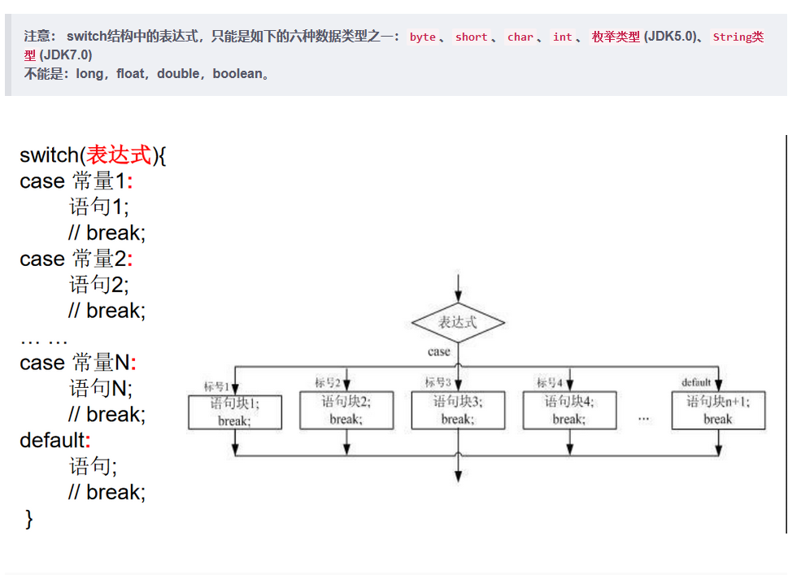

```java
/*
分支结构之二：switch-case

1.格式
switch(表达式){
case 常量1:
	执行语句1;
	//break;
case 常量2:
	执行语句2;
	//break;

...

default:
	执行语句n:
	//break;
}

2.说明:
① 根据switch表达式中的值，依次匹配各个case中的常量。一旦匹配成功，进入相应case结构中，执行相关语句。
  当调用完执行语句后，则仍然继续向下执行其他case语句，直到遇到break关键字或末尾结束为止。

② break, 可以使用switch-case结构中，表示一旦执行到此关键字，就跳出switch-case结构。

③ switch结构中的表达式，只能是如下的六种数据类型之一：byte、short、char、int、枚举类型(JDK5.0)、String类型(JDK7.0)
④ case 之后只能声明常量，不能声明范围。

⑤ break关键字是可选的。optional
⑥ default：相当于if-else结构中的else。
			default 结构是可选的，而且位置是灵活的，但没有break的话会继续运行。
			
说明:
1凡是可以使用switch-case的结构,都可以转换为if-else。反之,不成立。
2.我们写分支结构时,当发现既可以使用switch-case,〔(同时,switch中表达式的取值情况不太多),
又可以使用，我们优先选择使用switch-case。原因:switch-case执行效率稍高。
*/

class SwitchTest{
	public static void main(String[] args){

		int number = 2;
		switch(number){
		case 0:
			System.out.println("zero");
			break;
		case 1:
			System.out.println("one");
			break;
		case 2:
			System.out.println("twe");
			break;
		case 3:
			System.out.println("three");
			break;
		default:
			System.out.println("other");
			break;
		}

		//*********************************
		//运行报错，不能运行boolean类型
/*		boolean isHandSome = true;
		switch(isHandSome){
		case true:
			System.out.println("可乐吗？？");
			break;
		case false:
			System.out.println("薯条吗？？");
			break;
		default:
			System.out.println("输入有误！！！");
		}
*/
		//*********************************
		String season= "summer";
		switch(season) {
		case"spring":
			System.out.println("春暖花开");
			break;
		case"summer":
			System.out.println("夏日炎炎");
			break;
		case"autumn":
			System.out.println("秋高气爽");
			break;
		case"winter":
			System.out.println("冬雪皑皑");
			break;
		default:
			System.out.println("季节输入有误");
			break;
		}

		//**************************************
		//运行报错
/*		int age = 10;
		switch(age){			
		case age > 18:
			System.out.println("成年了");
			break;
		default:
			System.out.println("未成年");
		}	*/
	}
}

```

#### 1.3.3 练习

```java
/*
对学生成绩大于60分的，输出“合格”。低于60分的，输出“不合格”。

说明：如果switch-case语句中多个相同语句，可以进行合并。
*/
class  SwitchTest1{
	public static void main(String[] args){
		int score = 78;
		//方案一
		switch(score / 10){
		case 0:
		case 1:
		case 2:
		case 3:
		case 4:
		case 5:
			System.out.println("不合格");
			break;
		case 6:
		case 7:
		case 8:
		case 9:
		case 10:
			System.out.println("合格");
			break;
		}

		//更优的解法
		switch(score /60){
		case 0:
			System.out.println("不及格");
			break;
		case 1:
			System.out.println("合格");
			break;
		}
	}
}


/*
编写程序：从键盘上输入2020年的“month”和“day”，
要求通过程序输出输入的日期为2019年的第几天。
2 15 : 31 + 15

5 7: 31 + 28 +31 +30 + 7
...
说明：break在switch-case中是可选的。
*/
import java.util.Scanner;
class DayTest{
	public static void main(String[] args) {
		Scanner scan = new Scanner(System.in);
		System.out.println("请输入2020年的month");
		int month = scan.nextInt();
		System.out.println("请输入2020年的day");
		int day = scan.nextInt();

		//定义一个变量来保存天数
		int sumDays = 0;
		switch(month){
		case 12:
			sumDays += 30;
		case 11:
			sumDays += 31;
		case 10:
			sumDays += 30;
		case 9:
			sumDays += 31;
		case 8:
			sumDays += 31;
		case 7:
			sumDays += 30;
		case 6:
			sumDays += 31;
		case 5:
			sumDays += 30;
		case 4:
			sumDays += 31;
		case 3:
			sumDays += 29;
		case 2:
			sumDays += 31;
		case 1:
			sumDays += day;//这里一定不能写sumDays = day，不然最后一步就会直接赋值，前功尽弃
		}

		System.out.println("2020年" + month + "月" + day + "日是当年的第" + sumDays + "天");
	}
}

/*
从键盘分别输入年、月、日，判断这一天是当年的第几天注：判断一年是否是闰年的标准：
1）可以被4整除，但不可被100整除或
2）可以被400整除
(year % 4 == 0 && year % 100 != 0) || year %400 == 0)

说明:
1凡是可以使用switch-case的结构,都可以转换为if-else。反之,不成立。
2.我们写分支结构时,当发现既可以使用switch-case,〔(同时,switch中表达式的取值情况不太多),
又可以使用，我们优先选择使用switch-case。原因:switch-case执行效率稍高。

*/
import java.util.Scanner;
class YearDayTest{
	public static void main(String[] args) {
		Scanner scan = new Scanner(System.in);
		System.out.println("请输入year");
		int year = scan.nextInt();
		System.out.println("请输入month");
		int month = scan.nextInt();
		System.out.println("请输入day");
		int day = scan.nextInt();

		//定义一个变量来保存天数
		int sumDays = 0;
		switch(month){
		case 12:
			sumDays += 30;
		case 11:
			sumDays += 31;
		case 10:
			sumDays += 30;
		case 9:
			sumDays += 31;
		case 8:
			sumDays += 31;
		case 7:
			sumDays += 30;
		case 6:
			sumDays += 31;
		case 5:
			sumDays += 30;
		case 4:
			sumDays += 31;
		case 3:
			//判断是否为闰年
			if((year % 4 == 0 && year % 100 != 0) || year %400 == 0){
				sumDays += 29;
			}else{
				sumDays += 28;
			}
		case 2:
			sumDays += 31;
		case 1:
			sumDays += day;
		}

		System.out.println(year + "年" + month + "月" + day + "日是当年的第" + sumDays + "天");
	}
}

```


### 1.4 循环结构

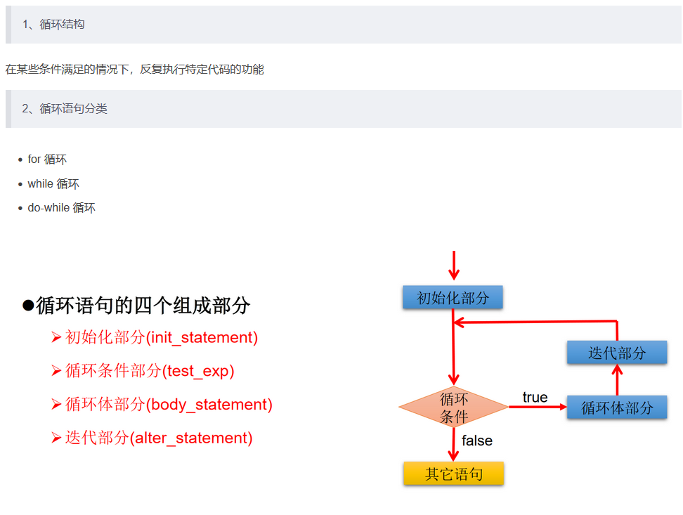

#### 1.4.1 for loop

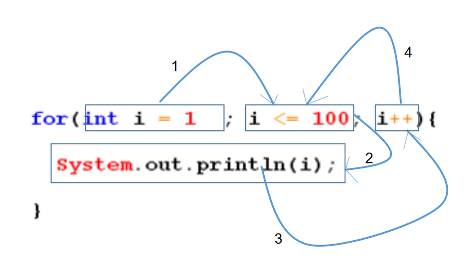

```java
/*
For循环结构的使用
一、循环结构的四个要素
① 初始化条件
② 循环条件---必须是boolean
③ 循环体
④ 迭代条件

二、for循环的结构
for(①;②;④){
	③
}

执行过程：①-②-③-④-②-③-④-②-③-④-.....-②

说明：
②循环条件部分为boolean类型表达式，当值为false时，退出循环
①初始化部分可以声明多个变量，但必须是同一个类型，用逗号分隔
④可以有多个变量更新，用逗号分隔

*/
class ForTest{
	public static void main(String[] args){
		for(int i=0;i < 5 ;i++){
			System.out.println("Hello World!");
		}

		//练习：
		int num = 1;
		for(System.out.print('a');num <= 3;System.out.print('c'),num++){
			System.out.print('b');
		}//abcbcbc
        //***执行过程：①-②-③-④-②-③-④-②-③-④-.....-②***

		//遍历100以内的偶数,获取所有偶数的和,输出偶数的个数
		int sum = 0;	//记录所有偶数的和
		int count = 0;
		for(int i = 1;i <= 100;i++){
			if(i %2 == 0){
				System.out.println(i);
				sum += i;
				count++;
			}
		}
		System.out.println("100以内的偶数的和：" + sum);
		System.out.println("个数为：" + count);
	}
}

```

#### 1.4.1 练习

```java
/*
编写程序从1循环到150，并在每行打印一个值，
另外在每个3的倍数行上打印出“foo”,
在每个5的倍数行上打印“biz”,
在每个7的倍数行上打印输出“baz”。

*/
class ForTest1{
	public static void main(String[] args){
		
		for(int i = 1;i <= 150;i++ ){
			System.out.print(i + " ");//用print确保在同一行
			if(i % 3 == 0){
				System.out.print("foo ");
			}
			if(i % 5 == 0){
				System.out.print("biz ");
			}
			if(i % 7 == 0){
				System.out.print("baz ");
			}

			//换行
			System.out.println();
		}
	}
}

/*
输入两个正整数m和n，求其最大公约数和最小公倍数。
比如：12和20的最大公约数是4，最小公倍数是60。说明：break关键字的使用

*/
import java.util.Scanner;
class GnumberTest{
	public static void main(String[] args){
		Scanner scan = new Scanner(System.in);
		System.out.println("请输入m:");
		int m = scan.nextInt();
		System.out.println("请输入n:");
		int n = scan.nextInt();
		//获取m和n的较大值
		int max = (m > n) ? m : n;
		//获取m和n的最小值
		int min = (m < n) ? m : n;
		
		//求最大公约数
		for(int i = min;i >= 1;i--){
			if(m % i == 0 && n % i == 0){
				System.out.println("m和n的最大公约数：" + i);
				break;
			}
		}

		//求最小公倍数
		for(int i = max;i <= m * n;i++){
			if( i % m == 0 && i % n == 0){
				System.out.println("m和n的最小公倍数是：" + i);
				break;
			}
		}
	}
}

/*
输出所有的水仙花数，所谓水仙花数是指一个3位数，其各个位上数字立方和等于其本身。
例如：153 = 1*1*1 + 3*3*3 + 5*5*5

*/
class ForTest2{
	public static void main(String[] args){
		for(int i = 100;i <= 999;i++){
			int a = i / 100;	//获取百位
			int b = i % 100 /10;	//获取十位
			int c = i % 10;	//获取个位
			if(a*a*a + b*b*b + c*c*c == i){
				System.out.println("此数值为满足条件的水仙花数:" + i);
			}
		}
	}
}

```

#### 1.4.2 while loop

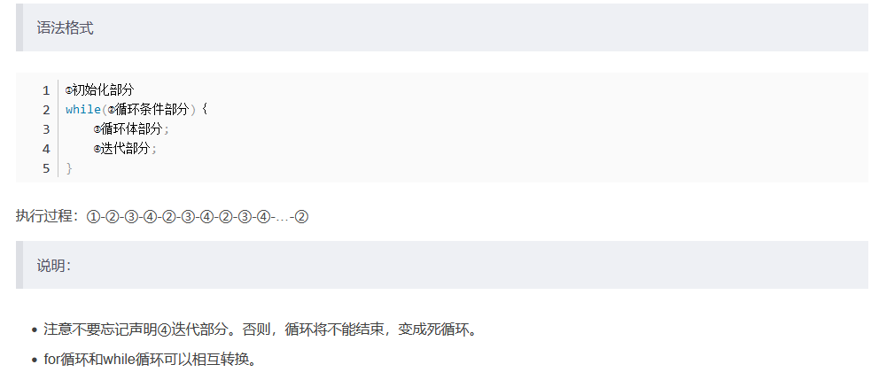

```java
/*
While循环结构的使用
一、循环结构的四个要素
① 初始化条件
② 循环条件
③ 循环体
④ 迭代条件

二、while循环的结构
①初始化部分
while(②循环条件部分)｛
    ③循环体部分;
    ④迭代部分;
}

执行过程： ① - ② - ③ - ④ - ② -  ③ - ④ - ... - ② 

说明：
1.写while循环千万要小心不要丢了迭代条件。一旦丢了，就可能导致死循环！
2.写程序要避免死循环。
3.能用while循环的，可以用for循环，反之亦然。二者可以相互转换。
区别：for循环和while循环的初始化条件部分的作用范围不同。

算法：有限性。
*/
class WhileTest{
	public static void main(String[] args){
		//遍历100以内的所有偶数
		int i = 1;
		while(i <= 100){
			if(i % 2 == 0){
				System.out.println(i);
			}
			i++;
		}
	}
}

```

#### 1.4.3 do while loop

```java
/*
do-while循环结构的使用
一、循环结构的四个要素
① 初始化条件
② 循环条件 --->是boolean类型
③ 循环体
④ 迭代条件

二、do-while循环的结构
①
do{
	③;
	④;
}while(②);

执行过程：① - ③ - ④ - ② - ① - ③ - ④ - ... - ②
 
说明：
1.do-while循环至少执行一次循环体。
2.开发中for, while使用更多

*/

class DoWhileTest{
	public static void main(String[] args){
		//遍历100以内的所有偶数,并计算所有偶数的和和偶数的个数
		int number = 1;
		int sum = 0;	//记录总和
		int count = 0;	//记录个数
		do{
			if(number % 2 == 0){
				System.out.println(number);
				sum += number;
				count++;
			}
			number++;
		}while(number <= 100);

		System.out.println("总和为：" + sum);
		System.out.println("个数为：" + count);

		//*********************************
		int numb = 10;
		while(numb > 10){
			System.out.println("hello:while");//不会执行
			numb--;
		}

		int numb2 = 10;
		do{
			System.out.println("hello：do-while");//会执行
			numb2--;
		}while(numb2 > 10);
        
        //***能执行多次时二者输出相同***
	}
}

```

#### 1.4.2 练习

```java
/*
从键盘读入个数不确定的整数，并判断读入的正数和负数的个数，输入为0时结束程序。

说明：
1.不在循环条件部分限制次数的结构：while(true) , for(;;)
2.结束循环的几种方式：
	方式一：循环条件部分返回false;
	方式二：在循环体中，执行break;
*/
import java.util.Scanner;
class XunTest{
	public static void main(String[] args) {
		Scanner scan = new Scanner(System.in);//scanner对象只用创建一次，不用放在循环内
		int Positive = 0;	//正数个数
		int Negative = 0;	//负数个数
		while(true){
			int number = scan.nextInt();
			if(number > 0){
				Positive++;
			}else if(number < 0){
				Negative++;
			}else{
				//一旦执行，跳出循环。
				break;
			}	
		}

		System.out.println("正数的个数：" + Positive);
		System.out.println("负数的个数：" + Negative);
	}
}

```

#### 1.4.4 嵌套循环

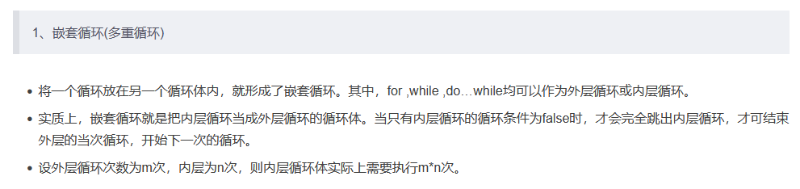

```java
/*
嵌套循环的使用
1.嵌套循环：将一个循环结构A声明在另一个循环结构B的循环体中，就构成了嵌套循环

2.
外层循环：循环结构B
内层循环：循环结构A
3.说明
① 内层循环遍历一遍，只相当于外层循环循环体执行了一次
② 假设外层循环需要执行m次，内层循环需要执行n次。此时内层循环的循环体一共执行了m * n次

4.技巧
外层循环控制行数，内层循环控制列数
*/
class  ForForTest{
	public static void main(String[] args) {
		//******
		for(int i = 1;i <= 6;i++){
			System.out.print("*");
		}
		System.out.println();//换行

		/*
		******
		******
		******
		******
		*/
		for(int i = 1;i <= 4;i++){  
			for(int j = 1;j <= 6;j++){  
				System.out.print('*');
			}
			System.out.println();	//换行
		}
		/*
		*
		**
		***
		****
		*****
		*/
		for(int i = 1;i <= 5;i++){  //控制行数
			for(int j = 1;j <= i;j++){  //控制列数
				System.out.print("*");
			}
			System.out.println();
		}
		/*
		*****
		****
		***
		**
		*
		*/
		for(int i = 1;i <= 5;i++){
			for(int j = 1;j <= 6-i;j++){
				System.out.print("*");
			}
			System.out.println();
		}

		/*
		*
		**
		***
		****
		*****
		****
		***
		**
		*
		*/
		for(int i = 1;i <= 5;i++){
			for(int j = 1;j <= i;j++){
				System.out.print("*");
			}
			System.out.println();
		}

		for(int i = 1;i <= 4;i++){
			for(int j = 1;j <= 5-i;j++){
				System.out.print("*");
			}
			System.out.println();
		}

    }
}

```

#### 1.4.4 练习

```java
		//九九乘法表
		for(int i = 1;i <= 9;i++){
			for(int j = 1;j <= i;j++){
				System.out.print(i + "*" + j + "=" + i*j + " ");
			}
			System.out.println();	//换行
		}

/*
100以内的所有质数
质数：素数，只能被1和它本身整除的自然数。

最小的质数是：2
*/
class PrimeNuberTest{
	public static void main(String[] args){
		boolean isFlag = true;	//标识是否被除尽，一旦除尽，修改其值。放外面更高效

		for(int i = 2;i <= 100;i++){	//遍历100以内的自然数
            //boolean isFlag = true; //放这里每次有质数出现时就会被重置，但每次都会重新创建变量
			for(int j =2;j < i;j++){	//j:被i去除
				if(i % j == 0){	//i被j除尽
					isFlag = false;
				}
			}
			if(isFlag == true){
				System.out.println(i);
			}

			//重置isFlag
			isFlag = true;
		}
	}
}

//优化
/*
100000以内的所有质数
质数：素数，只能被1和它本身整除的自然数。

最小的质数是：2
*/

class PrimeNuberTest{
	public static void main(String[] args){
		boolean isFlag = true;	//标识是否被除尽，一旦除尽，修改其值。
		int count = 0;	//记录质数的个数

		//获取当前时间举例1970-01-01 00:00:00 的毫秒数
		long start = System.currentTimeMillis();

		for(int i = 2;i <= 100000;i++){	//遍历100以内的自然数
			//优化2：对本身是质数的自然数有效 5447---> 11
		//	for(int j =2;j < i;j++){	//j:被i去除
			for(int j =2;j <= Math.sqrt(i);j++){	//***j:被i的开方去除***
				if(i % j == 0){	//i被j除尽
					isFlag = false;
					break;	//***优化一：只对本身非质数的自然数是有效的。*** 一旦被除尽了，后面的数就不需要试了，这个数肯定不是质数
				}
			}
			if(isFlag == true){
			//	System.out.println(i);
				count++;
			}

			//重置isFlag
			isFlag = true;
		}

		//获取当前时间举例1970-01-01 00:00:00 的毫秒数
		long end = System.currentTimeMillis();

		System.out.println("质数的个数:" + count);
		System.out.println("所花费的时间为:" + (end - start));	//16843 --> 5447	优化一
	}
}

```

#### 1.4.5 break & continue

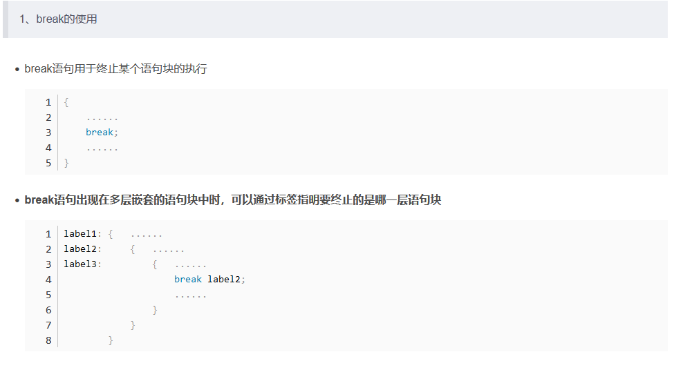

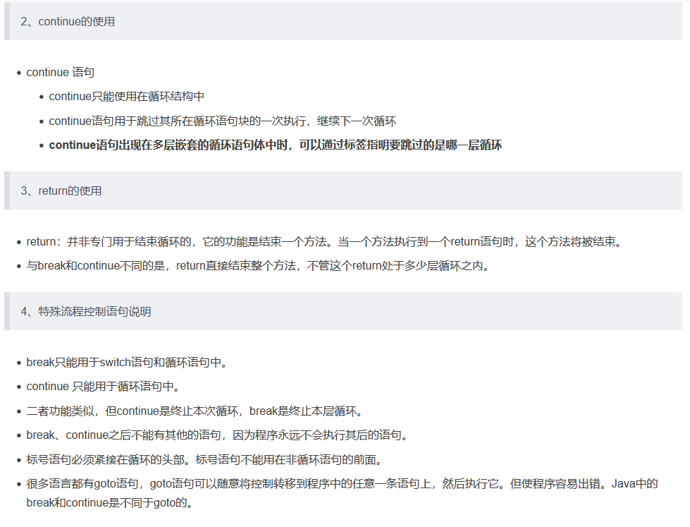

```java
/*
break和countinue关键字的使用
				使用范围			循环中使用的作用(不同点)	   相同点
break:			switch-case			结束当前循环				关键字后面不能声明执行语句
				循环结构中


countinue:		循环结构中			结束当次循环				 关键字后面不能声明执行语句

*/
class BreakContinueTest{
	public static void main(String[] args){
		
		for(int i = 1;i <= 10;i++){
			if(i % 4 == 0){
			//	break;	//1、2、3
				continue;	//1、2、3、5、6、7、9、10
			//	System.out.println("该吃饭了！！！");//会直接报编译错误
			}
		//	System.out.println(i);
		}
		//********************************
		label:for(int i = 1;i <= 4;i++){
			
				for(int j = 1;j <= 10; j++){
					if(i % 4 == 0){
				      //break;	//默认跳出包裹此关键字最近的一层的循环
                        /*
                        123
                        123
                        123
                        123
                        */
                   
                      //break label;//可结束指定层循环
                      //123
                        
						continue;
                        /*
                        123567910
                        123567910
                        123567910
                        123567910
                        */
                        
                      //continue label
                        /*
                        123123123123
                        */
					}
					System.out.print(j);
				}
				System.out.println();
		}
	}
}

```

#### 1.4.4 质数练习再优化

```java
/*
100000以内的所有质数
质数：素数，只能被1和它本身整除的自然数。

最小的质数是：2
*/

class PrimeNuberTest{
	public static void main(String[] args){
	
		int count = 0;	//记录质数的个数

		//获取当前时间举例1970-01-01 00:00:00 的毫秒数
		long start = System.currentTimeMillis();

		label:for(int i = 2;i <= 100000;i++){	//遍历100以内的自然数
			for(int j =2;j <= Math.sqrt(i);j++){	//***j:被i的开方去除***
				if(i % j == 0){	
					continue label;
				}
			}

				count++;

		}

		//获取当前时间举例1970-01-01 00:00:00 的毫秒数
		long end = System.currentTimeMillis();

		System.out.println("质数的个数:" + count);
		System.out.println("所花费的时间为:" + (end - start));	//16843 --> 5447	优化一
	}
}
```

