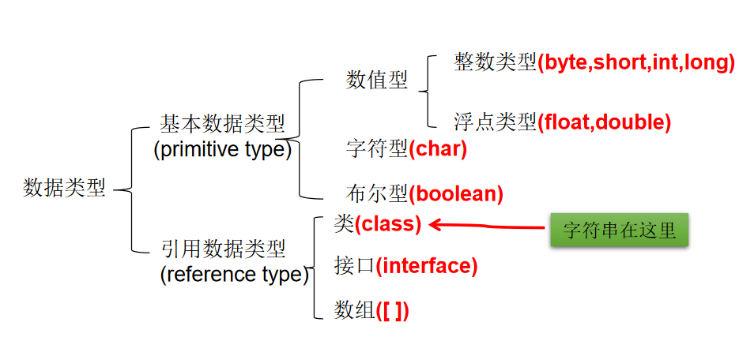

# Java Study Notes

## Java Basic Syntax

### 01.Keywords and Reserved Words

#### 1.1keyword

special words with special meaning for special use in Java, all lowercased


#### 1.2 reserved words

```java
//current version of Java don't use, but reserved for future updates
goto
const
```

### 02.Identifier

#### 2.1 what is an identifier

wherever you can give it a name


#### 2.2 identifier naming rules

- composed with a-z, A-Z, 0-9, _, $
- must not begin with numbers
- must not use keywords or reserved words
- case sensitive 
- must not include a " "/space in between


#### 2.3 Java naming rules

- package: xxxyyyzzz all lowercased
- class, interface: XxxYyyZzz capitalized
- variable, method: xxxYyyZzz camel case, first word lowercased, the rest capitalized
- constant: XXX_YYY_ZZZ all caps, use _ to connect between word. eg. MAX_VALUE

```java
class IdentifierTest{
	public static void main(String[] args){
		int myNumber = 1001;
        int 学号 = 1002；
	}
}

/*
pay attention:
1. give meaningful names to improve readability
2. java uses unicode, you can write in other languages, but not recommended
*/
```


### 03.Variable

#### 3.1 declaration & use

- definition

  1. it is a storage address in the memory

  2. it's variable under the same type

  3. it's the most basic storage unit, including type, name, and value

  4.  format: type name = value

     ```java
     int example = 100;
     ```

     

- what's it for

  1. to store data in the memory

- be careful

  1. must declare first, then use
  2. function under a scope {}
  3. must not have same named variables under the same scope

- variable types (==String is a class==)

  

  

#### 3.2 primitive types

##### 3.2.1 Integer: byte, short, int, long


##### 3.2.2 floating-point: float, double


##### 3.2.3 character value


- defined between a single quotation '' for declaring a character or as a escape character such as '\n', '\t' (tab) 

##### 3.2.4 boolean type


- ```java
  /*
  \\n will display \n in the context
  \" stress\" will display "stress"
  */
  ```

#### 3.3 computation rules

##### 3.3.1 type coercion


##### 3.3.2 type cast


```java
short s = 5;
s = s-2; //判断：no
byte b = 3;
b = b + 4;//判断：no
b = (byte)(b+4);//判断：yes
char c = ‘a’;
int i = 5;
float d = .314F;
double result = c+i+d; //判断：yes
byte b = 5;
short s = 3;
short t = s + b;//判断：no


//1. 编码情况
//数小时可以不加L，引文int < long
//但过大时需注明L结尾
long l = 123456;
System.out.println(l);
//编译失败：过大的整数
//long l1 = 452367894586235;
long l1 = 452367894586235L;

//**************************
//编译失败
//float f1 = 12.3;
		
//2. 编码情况2:
//整型变量，默认类型为int型
//浮点型变量，默认类型为double型，所以float必须加F注明，d
byte b = 12;
byte b1 = b + 1;	//编译失败
		
float f1 = b + 12.3;	//编译失败
	
```

