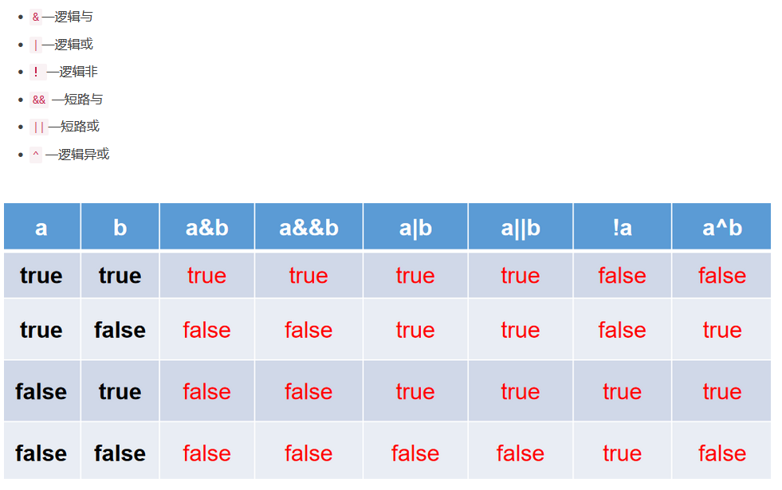

# Java Study Notes

## 01.Java Operators

### 1.1 Operators


#### 1.1.1 算术运算符/arithmetic operator


```java
/*
运算符之一：算术运算符
+ - * / % (前)++ (后)++ (前)-- (后)-- 

*/
class Day3Test{
	public static void main(String[] args) {

		//除号：/
		int num1 = 12;
		int num2 = 5;
		int resule1 = num1 / num2;
		System.out.println(resule1);	//2

		int result2 = num1 / num2 * num2;
		System.out.println(result2);//10

		double result3 = num1 / num2;//后面先算出来是int
		System.out.println(result3);	//2.0

		double result4 = num1 / num2 + 0.0;	//2.0
		double result5 = num1 / (num2 + 0.0);	//2.4
		double result6 = (double)num1 / num2;	//2.4
		double result7 = (double)(num1 / num2);	//2.0
		System.out.println(result5);
		System.out.println(result6);

		// %：取余运算
		//***结果的符号与被模数的符号相同***
		int m1 = 12;
		int n1 = 5;
		System.out.println("m1 % n1 = " + m1 % n1);//2

		int m2 = -12;
		int n2 = 5;
		System.out.println("m2 % n2 = " + m2 % n2);//-2

		int m3 = 12;
		int n3 = -5;
		System.out.println("m3 % n3 = " + m3 % n3);//2

		int m4 = -12;
		int n4 = -5;
		System.out.println("m4 % n4 = " + m4 % n4);//-2

		//(前)++ : 先自增1，后运算，赋值也是运算
		//(后)++ ：先运算，后自增1
		int a1 = 10;
		int b1 = ++a1;
		System.out.println("a1 = " + a1 + ",b1 = " + b1);//a1 11, b1 11

        int a2 = 10;
		int b2 = a2++;
		System.out.println("a2 = " + a2 + ",b2 = " + b2);//a2 11, b2 10

		int a3 = 10;
		a3++;	//a3++/++a3之后a3都变为了11
		int b3 = a3;

		//***注意点：***
		short s1 = 10;
		//s1 = s1 + 1;	//编译失败
//		s1 = (short)(s1 + 1);	//正确的
		s1++;	//***自增1不会改变本身变量的数据类型，故运行效率比起上面一行更高***
		System.out.println(s1);

		//问题：
		byte bb1 = 127;
		bb1++;
		System.out.println("bb1 = " + bb1);//-128

		//(前)-- :先自减1，后运算
		//(后)-- ：先运算，后自减1

		int a4 = 10;
		int b4 = a4--;	//int b4 = --a4;
		System.out.println("a4 = " + a4 + ",b4 = " + b4);//a4 9, b4 10
	}
}

```

#### 练习1.1.1

```java
/*
练习：随意给出一个三位数的整数，打印显是它的个位数，十位数，百位数的值。
格式如下：
数字xxx的情况如下：
个位数：
十位数：
百位数：

例如：
数字153的情况如下：
个位数：3
十位数：5
百位数：1

*/
class AriExer{
	public static void main(String[] args){
		int num = 187;
		System.out.println("百位数：" + num / 100);
		System.out.println("十位数：" + num % 100 / 10);//num / 10 % 10
		System.out.println("个位数：" + num % 10);
	}
}

```

#### 1.1.2 赋值运算符/assignment operator


```java
/*
运算符之二：赋值运算符
+= -= *= /= 

*/
class SetValueTest{
	public static void main(String[] args) {
		//赋值符号：=
		int i1 = 10;
		int j1 = 10;

		int i2,j2;
		//连续赋值
		i2 = j2 = 10;

		int i3 = 10,j3 = 20;//注意中间用逗号不是分号

		//***********************
		int num1 = 10;
		num1 += 2;	//num1 = num1 + 2;
		System.out.println(num1);	//12
		
		int num2 = 12;
		num2 %= 5;	//num2 = num2 % 5;
		System.out.println(num2);//2

		short s1 = 10;
		//s1 = s1 + 2;	//编译失败
		s1 += 2;	//结论：不会改变变量本身的数据类型
		System.out.println(s1);

		//开发中，如果希望变量实现+2的操作，有几种方法？？？(int num = 10)
		//方式一：num = num + 2;
		//方式二：num += 2;(推荐) 代码量少且不会改变数据类型

		//开发中，如果希望变量实现+1的操作，有几种方法？？？(int num = 10)
		//方式一：num = num + 1;
		//方式二：num += 1;
		//方式三：num++;(推荐)
	}
}

```

#### 1.1.2练习：

```java
//练习1：
int i = 1;
i *= 0.1;
System.out.println(i);//0，因为还是int，故截断
i++;
System.out.println(i);//1

//练习2：
int m = 2;
int n1 = 3;
n1 *= m++; 
System.out.println("m=" + m);	//3
System.out.println("n1=" + n1);	//6

//练习3：
int n = 10;
n += (n++) + (++n);//n = n + (n++) + (++n), 10 + 10 + 12
System.out.println(n);	//32

```

#### 1.1.3 比较运算符/comparison operator


- 比较运算符的结果都是`boolean`型，也就是要么是true，要么是false。

```java
/*
运算符之三：比较运算符
==  !=  > < >= <= instanceof

结论：
1.比较运算符的结果是boolean类型
2.区分 == 和 = 

*/
class CompareTest{
	public static void main(String[] args){
		int i = 10;
		int j = 20;
		System.out.println(i == j);	//false
		System.out.println(i = j);	//20

		boolean b1 = true;
		boolean b2 = false;
		System.out.println(b2 == b1);	//false
		System.out.println(b2 = b1);	//true
	}
}

```

#### 1.1.4 逻辑运算符/logical operator



- 逻辑运算符用于连接布尔型表达式，在Java中不可以写成3<x<6，应该写成x>3 & x<6 。
- “`&`”和“`&&`”的区别：
  - 单`&`时，左边无论真假，右边都进行运算；
  - 双`&`时，如果左边为真，右边参与运算，如果左边为假，那么右边不参与运算。
- “`|`”和“`||`”的区别同理，`||`表示：当左边为真，右边不参与运算。
- 异或(`^`)与或( `|` )的不同之处是：当左右都为true时，结果为false。理解：异或，追求的是“异”! 只要不一样就返回true

```java
/*
运算符之四：逻辑运算符
& && | || ！ ^

说明：
1. 逻辑与运算符操作的都是boolean类型的变量，前后是数字的是位运算符

*/
class LogicTest{
	public static void main(String[] args){
		//区分& 与 &&
		//相同点1：& 与 && 的运算结果都相同
		//相同点2：当符号左边是true时，二者都会执行符号右边的运算
		//不同点：当符号左边是false时，&继续执行符号
		//开发中，推荐使用&&
		boolean b1 = false;
		int num1 = 10;
		if(b1 & (num1++ > 0)){//***此处会继续运算num1++***
			System.out.println("我现在在北京");
		}else{
			System.out.println("我现在在南京");
		}
		System.out.println("num1 = " + num1);//11

		boolean b2 = false;
		int num2 = 10;
		if(b2 && (num2++ > 0)){//短路了，后面的num2++b
			System.out.println("我现在在北京");
		}else{
			System.out.println("我现在在南京");
		}
		System.out.println("num2 = " + num2);//10

		//区分：| 与 ||
		//相同点1：| 与 || 的运算结果都相同
		//相同点2：当符号左边是false时，二者都会执行符号右边的运算
		//不同点3：当符号左边是true时，|继续执行符号右边的运算，而||不再执行符号右边的运算
		//开发中，推荐使用||
		boolean b3 = true;
		int num3 = 10;
		if(b3 | (num3++ > 0)){
			System.out.println("我现在在南京");
		}else{
			System.out.println("我现在在北京");
		}
		System.out.println("num3 = " + num3);

		boolean b4 = true;
		int num4 = 10;
		if(b4 || (num4++ > 0)){
			System.out.println("我现在在南京");
		}else{
			System.out.println("我现在在北京");
		}
		System.out.println("num4 = " + num4);
	}
}

```

#### 1.1.5 位运算符/bitwise operators


- 左移几位就相当于原数乘上2的几次幂


- 1=true，0=false
- & 上下都是1时会得1，有0就是0
- | 只要有1就是1
- ^ 只要上下不一样就是1

```java
/*
运算符之五：位运算符(了解)

结论：
1.位运算符操作的都是整型的数据变量
2.<< : 在一定范围内，每向左移一位，相当于 * 2
  >> : 在一定范围内，每向右移一位，相当于 / 2
3.复数同理
面试题：最高效的计算2 * 8 ？	2 << 3 或 8 << 1
*/
class BitTest{
	public static void main(String[] args){
		int i = 21;
//		i = -21;
		System.out.println("i << 2 :" + (i << 2));//84 = 21 * 2 ^ 2
		System.out.println("i << 3 :" + (i << 3));//168 = 21 * 2 ^ 3
		System.out.println("i << 20 :" + (i << 20));
		System.out.println("i << 27 :" + (i << 27));//-1476395008 最高位为1了
        
        
		int m = 12;
		int n = 5;
		System.out.println("m & n :" + (m & n));//4
		System.out.println("m & n :" + (m | n));//13
		System.out.println("m & n :" + (m ^ n));//9
        
        
		//练习：交换两个变量的值
		int num1 = 10;
		int num2 = 20;

		//方式一：定义临时变量
	//	int tent = num1;
	//	num1 = num2;
	//	num2 = tent;

		//方式二：
		//好处：不用定义临时变量
		//弊端：①相加可能超出存储范围 ② 有局限性：只适用于数值类型
//		num1 = num1 + num2;
//		num2 = num1 - num2;
//		num1 = num1 - num2;

		//方式三：使用位运算
		num1 = num1 ^ num2;
		num2 = num1 ^ num2;
		num1 = num1 ^ num2;
        
        m1 = 13;
        n1 = 5;
        m1 ^ n1 = 8;
        8 ^ n1 = 8 ^ 5 = 13 = m1;

		System.out.println("num1 = " + num1 + ",num2 = " + num2);
	}
}

```

#### 1.1.6 三元运算符/ternary operator


```java
/*
运算符之六：三元运算符
1.结构：(条件表达式)？表达式1 : 表达式2
2. 说明
① 条件表达式的结果为boolean类型
② 根据条件表达式真或假，决定执行表达式1，还是表达式2.
  如果表达式为true,则执行表达式1
  如果表达式为false,则执行表达式2
③ 表达式1 和表达式2要求是一致的。
④ 三元运算符是可以嵌套的
3. 凡是可以使用三元运算的地方，都是可以改写if-else。
   反之，则不一定成立！！！
   二者都行时用三元
*/
class SanTest{
	public static void main(String[] args) {
		//获取两个整数的最大值
		int m = 12;
		int n = 5;
		int max = (m > n)? m : n;
		System.out.println(max);//12

		double num = (m > n) ? 2 : 1.0;//表达式1和2需要能统一为一个类型
		//(m > n) ? 2 : "n大";	//编译错误

		//****************************************
		String str = (m > n) ? "m大" : ((m == n)? "m和n相等" : "n大");//嵌套
		System.out.println(str);

		//****************************************
		//获取三个数中的最大值
		int n1 = 12;
		int n2 = 30;
		int n3 = -43;

		int max1 = (n1 > n2) ? n1 : n2;
		int max2 = (max1 > n3) ? max1 : n3;
		System.out.println("三个数中的最大值是：" + max2);

		//此方法：pass，可读性太差
		int max3 = (((n1 > n2)? n1 : n2) > n3) ?((n1 > n2) ? n1 : n2) : n3;
		System.out.println("三个数中的最大值是：" + max3);

		//改写成if-else
		if(m > n){
			System.out.println(m);
		}else{
			System.out.println(n);
		}
	}
}

```

### 1.2 运算优先级


- 谨记加（）解决一切烦恼
